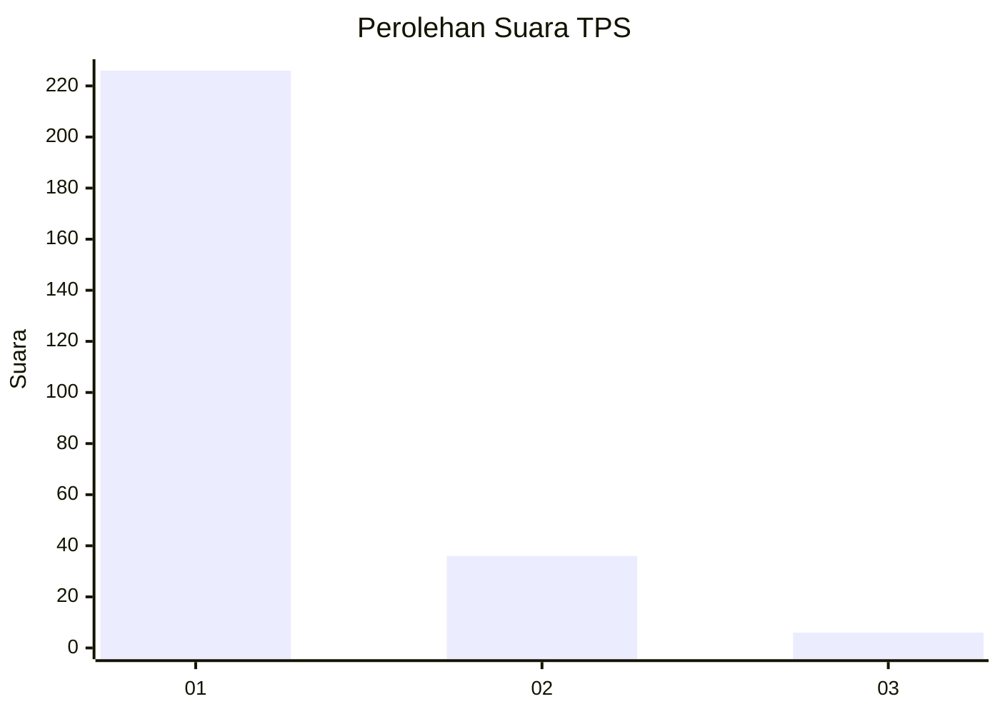
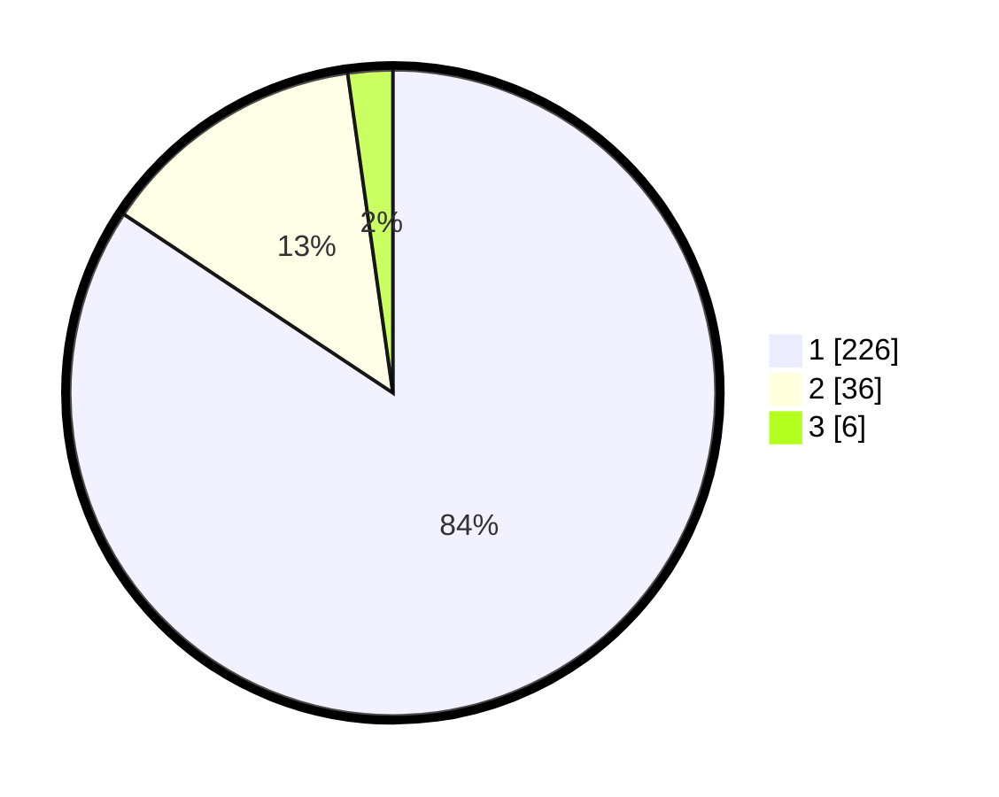

# Hasil

## Grafik

## Tabel

| No. | Nama Paslon    | Suara | Suara (raw) | Persentase |
|:--- |:-------------- | -----:| -----------:| ----------:|
| 1   | ANIES MUHAIMIN | 226   | [226][p-1]  | 84,33      |
| 2   | PRABOWO GIBRAN | 36    | [36][p-2]   | 13,43      |
| 3   | GANJAR MAHFUD  | 6     | [6][p-3]    | 2,24       |

[p-1]: https://github.com/gigit-pemilu/pemilu-2024-35-jawa-timur/blob/main/pilpres/hitung-suara/sub/35-jawa-timur/sub/28-pamekasan/sub/10-waru/sub/2010-waru-barat/sub/019-tps/sub/paslon-1.txt
[p-2]: https://github.com/gigit-pemilu/pemilu-2024-35-jawa-timur/blob/main/pilpres/hitung-suara/sub/35-jawa-timur/sub/28-pamekasan/sub/10-waru/sub/2010-waru-barat/sub/019-tps/sub/paslon-2.txt
[p-3]: https://github.com/gigit-pemilu/pemilu-2024-35-jawa-timur/blob/main/pilpres/hitung-suara/sub/35-jawa-timur/sub/28-pamekasan/sub/10-waru/sub/2010-waru-barat/sub/019-tps/sub/paslon-3.txt

## Foto C Plano

https://sirekap-obj-formc.kpu.go.id/7537/pemilu/ppwp/35/28/10/20/10/3528102010019-20240215-090903--4969c949-556f-4026-86a9-ff9bc2be2f24.jpg

https://sirekap-obj-formc.kpu.go.id/7537/pemilu/ppwp/35/28/10/20/10/3528102010019-20240215-085854--50392a2e-6087-4edf-ba6e-4acfa9204993.jpg

https://sirekap-obj-formc.kpu.go.id/7537/pemilu/ppwp/35/28/10/20/10/3528102010019-20240215-090725--d57c31a8-3549-4ee5-9aad-c180a5932ea9.jpg

## Metadata

| Key        | Value               |
| ---------- | ------------------- |
| Time Stamp | 2024-02-25 16:00:00 |

