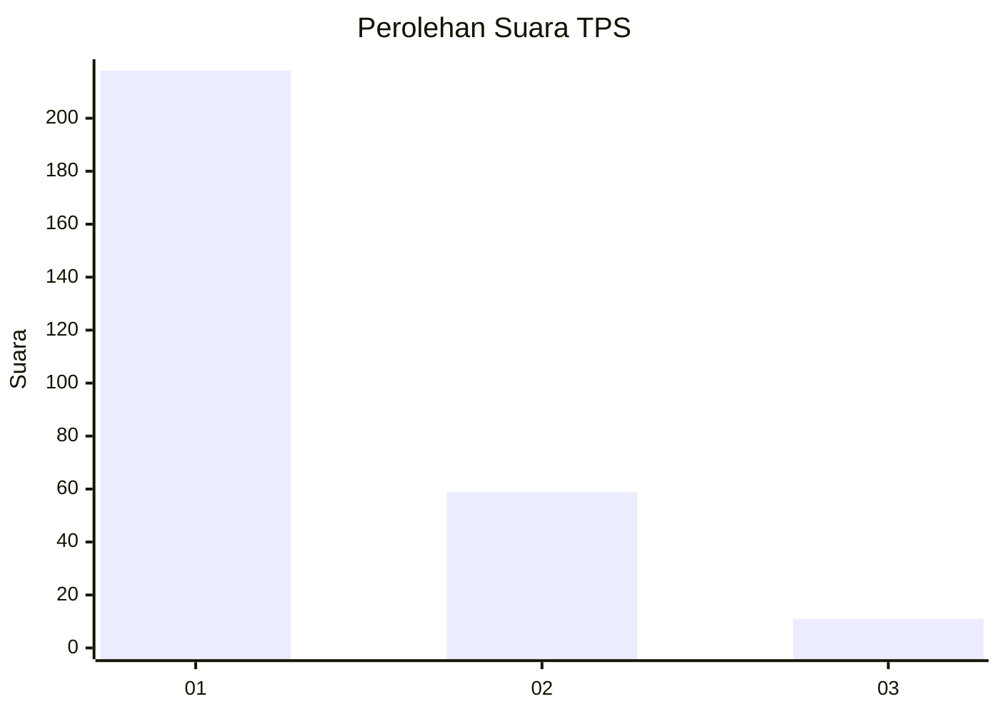
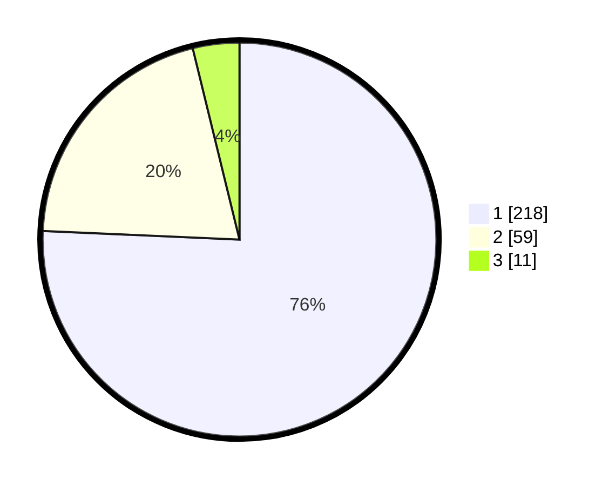

# Hasil

## Grafik

## Tabel

| No. | Nama Paslon    | Suara | Suara (raw) | Persentase |
|:--- |:-------------- | -----:| -----------:| ----------:|
| 1   | ANIES MUHAIMIN | 218   | [218][p-1]  | 75,69      |
| 2   | PRABOWO GIBRAN | 59    | [59][p-2]   | 20,49      |
| 3   | GANJAR MAHFUD  | 11    | [11][p-3]   | 3,82       |

[p-1]: https://github.com/gigit-pemilu/pemilu-2024/blob/main/pilpres/hitung-suara/sub/35-jawa-timur/sub/28-pamekasan/sub/10-waru/sub/2010-waru-barat/sub/022-tps/sub/paslon-1.txt
[p-2]: https://github.com/gigit-pemilu/pemilu-2024/blob/main/pilpres/hitung-suara/sub/35-jawa-timur/sub/28-pamekasan/sub/10-waru/sub/2010-waru-barat/sub/022-tps/sub/paslon-2.txt
[p-3]: https://github.com/gigit-pemilu/pemilu-2024/blob/main/pilpres/hitung-suara/sub/35-jawa-timur/sub/28-pamekasan/sub/10-waru/sub/2010-waru-barat/sub/022-tps/sub/paslon-3.txt

## Foto C Plano

https://sirekap-obj-formc.kpu.go.id/a0d5/pemilu/ppwp/35/28/10/20/10/3528102010022-20240214-211156--45a94873-b2fb-4574-8002-baacd7a2e9dd.jpg

https://sirekap-obj-formc.kpu.go.id/a0d5/pemilu/ppwp/35/28/10/20/10/3528102010022-20240214-211309--7776ce81-39a9-4a8b-94b3-6408db01fb7a.jpg

https://sirekap-obj-formc.kpu.go.id/a0d5/pemilu/ppwp/35/28/10/20/10/3528102010022-20240214-211426--5edc3453-6725-4f94-8485-dc3cf51d4242.jpg

## Metadata

| Key        | Value               |
| ---------- | ------------------- |
| Time Stamp | 2024-02-15 22:30:27 |

