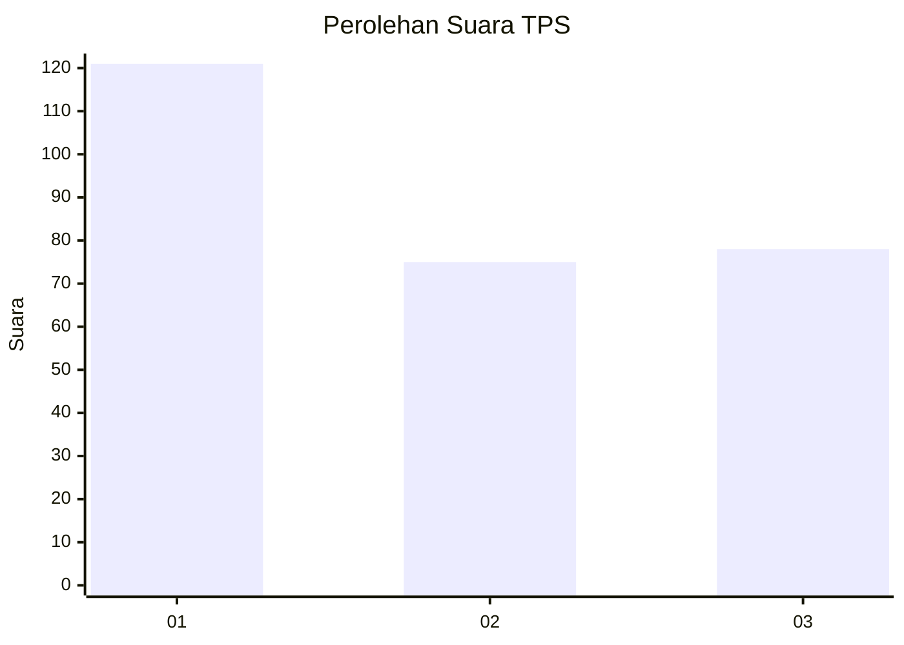
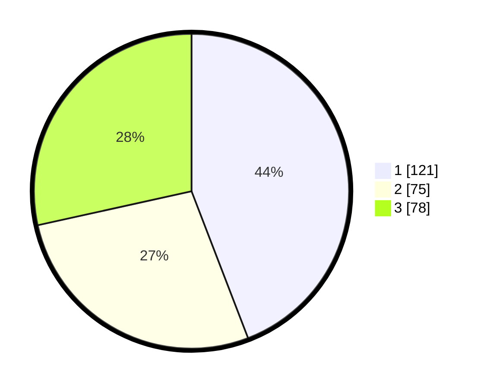

# Hasil

## Grafik

## Tabel

| No. | Nama Paslon    | Suara | Suara (raw) | Persentase |
|:--- |:-------------- | -----:| -----------:| ----------:|
| 1   | ANIES MUHAIMIN | 121   | [121][p-1]  | 44,16      |
| 2   | PRABOWO GIBRAN | 75    | [75][p-2]   | 27,37      |
| 3   | GANJAR MAHFUD  | 78    | [78][p-3]   | 28,47      |

[p-1]: https://github.com/gigit-pemilu/pemilu-2024/blob/main/pilpres/hitung-suara/sub/35-jawa-timur/sub/28-pamekasan/sub/10-waru/sub/2012-tagangser-laok/sub/001-tps/sub/paslon-1.txt
[p-2]: https://github.com/gigit-pemilu/pemilu-2024/blob/main/pilpres/hitung-suara/sub/35-jawa-timur/sub/28-pamekasan/sub/10-waru/sub/2012-tagangser-laok/sub/001-tps/sub/paslon-2.txt
[p-3]: https://github.com/gigit-pemilu/pemilu-2024/blob/main/pilpres/hitung-suara/sub/35-jawa-timur/sub/28-pamekasan/sub/10-waru/sub/2012-tagangser-laok/sub/001-tps/sub/paslon-3.txt

## Foto C Plano

https://sirekap-obj-formc.kpu.go.id/06bf/pemilu/ppwp/35/28/10/20/12/3528102012001-20240215-052548--84358fb4-26da-4e1f-b8f0-daa9f9134803.jpg

https://sirekap-obj-formc.kpu.go.id/06bf/pemilu/ppwp/35/28/10/20/12/3528102012001-20240215-052723--0db3d82b-11ee-481f-b434-c8616a3b3be4.jpg

https://sirekap-obj-formc.kpu.go.id/06bf/pemilu/ppwp/35/28/10/20/12/3528102012001-20240215-052826--4e6dced5-88fc-455b-b2fc-281ed217b3f4.jpg

## Metadata

| Key        | Value               |
| ---------- | ------------------- |
| Time Stamp | 2024-02-24 22:31:28 |

