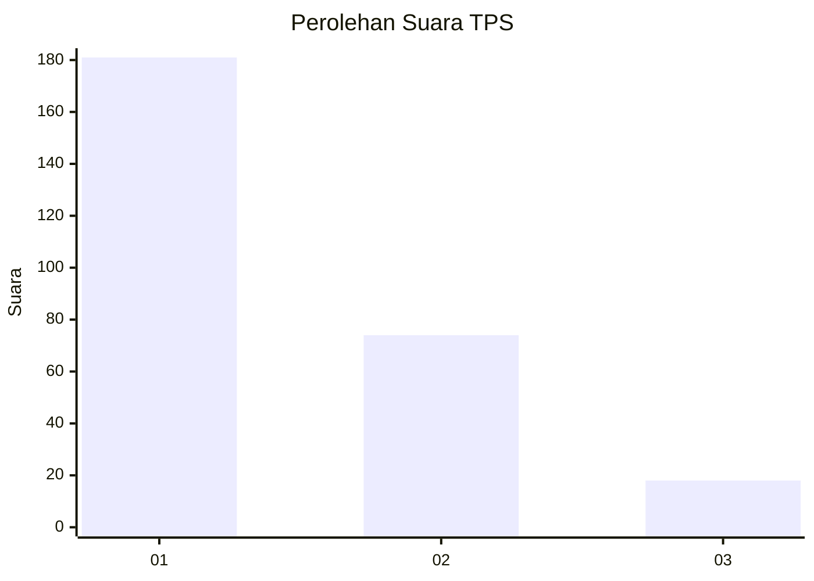
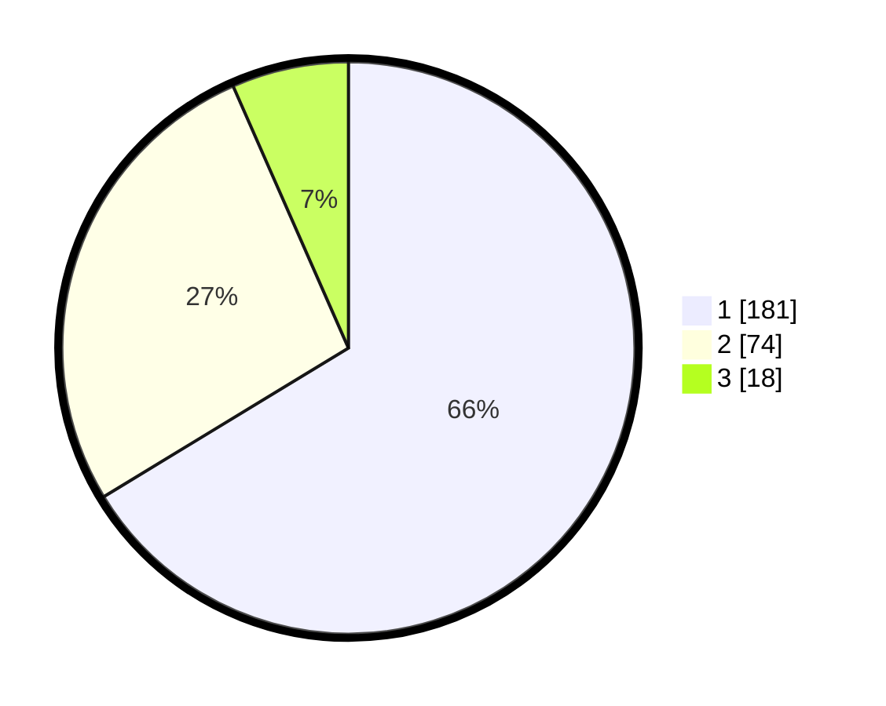

# Hasil

## Grafik

## Tabel

| No. | Nama Paslon    | Suara | Suara (raw) | Persentase |
|:--- |:-------------- | -----:| -----------:| ----------:|
| 1   | ANIES MUHAIMIN | 181   | [181][p-1]  | 66,30      |
| 2   | PRABOWO GIBRAN | 74    | [74][p-2]   | 27,11      |
| 3   | GANJAR MAHFUD  | 18    | [18][p-3]   | 6,59       |

[p-1]: https://github.com/gigit-pemilu/pemilu-2024-35-jawa-timur/blob/main/pilpres/hitung-suara/sub/35-jawa-timur/sub/28-pamekasan/sub/10-waru/sub/2012-tagangser-laok/sub/005-tps/sub/paslon-1.txt
[p-2]: https://github.com/gigit-pemilu/pemilu-2024-35-jawa-timur/blob/main/pilpres/hitung-suara/sub/35-jawa-timur/sub/28-pamekasan/sub/10-waru/sub/2012-tagangser-laok/sub/005-tps/sub/paslon-2.txt
[p-3]: https://github.com/gigit-pemilu/pemilu-2024-35-jawa-timur/blob/main/pilpres/hitung-suara/sub/35-jawa-timur/sub/28-pamekasan/sub/10-waru/sub/2012-tagangser-laok/sub/005-tps/sub/paslon-3.txt

## Foto C Plano

https://sirekap-obj-formc.kpu.go.id/d040/pemilu/ppwp/35/28/10/20/12/3528102012005-20240215-141014--7d2f9649-f46e-4b3f-bfb9-a2fbc9dcb17d.jpg

https://sirekap-obj-formc.kpu.go.id/d040/pemilu/ppwp/35/28/10/20/12/3528102012005-20240215-080458--37daf4af-e5e2-4ccc-888d-bda912883f9e.jpg

https://sirekap-obj-formc.kpu.go.id/d040/pemilu/ppwp/35/28/10/20/12/3528102012005-20240215-080557--d3dec9cf-a4a0-4ab2-acee-c74acfae9afc.jpg

## Metadata

| Key        | Value               |
| ---------- | ------------------- |
| Time Stamp | 2024-02-15 19:30:26 |

