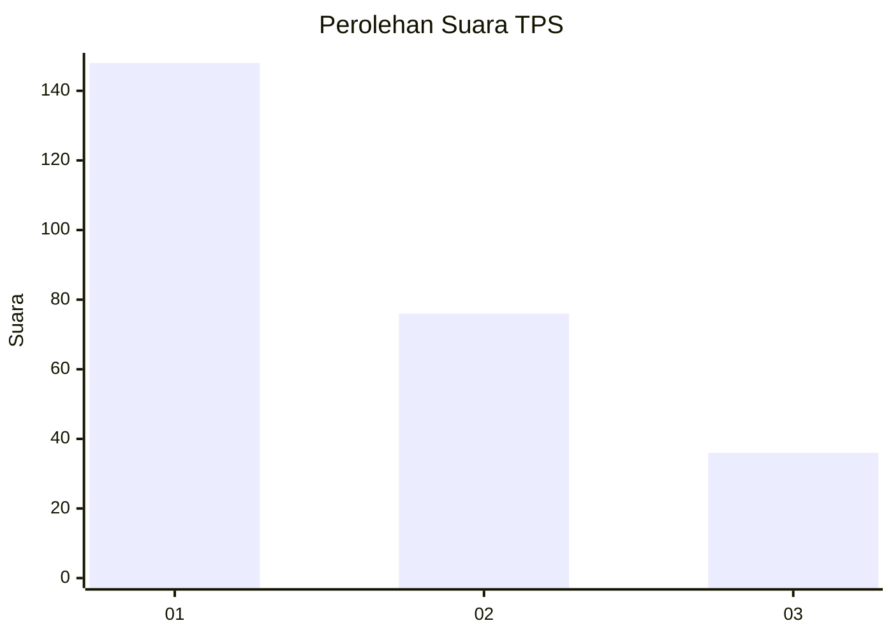
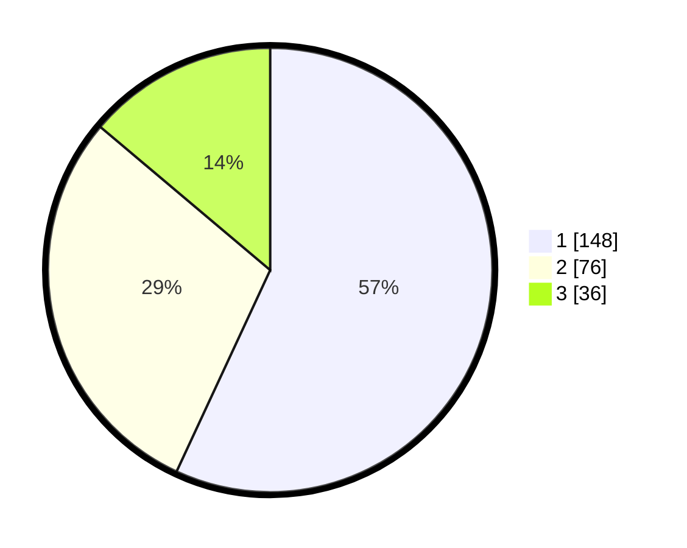

# Hasil

## Grafik

## Tabel

| No. | Nama Paslon    | Suara | Suara (raw) | Persentase |
|:--- |:-------------- | -----:| -----------:| ----------:|
| 1   | ANIES MUHAIMIN | 148   | [148][p-1]  | 56,92      |
| 2   | PRABOWO GIBRAN | 76    | [76][p-2]   | 29,23      |
| 3   | GANJAR MAHFUD  | 36    | [36][p-3]   | 13,85      |

[p-1]: https://github.com/gigit-pemilu/pemilu-2024/blob/main/pilpres/hitung-suara/sub/35-jawa-timur/sub/28-pamekasan/sub/10-waru/sub/2012-tagangser-laok/sub/007-tps/sub/paslon-1.txt
[p-2]: https://github.com/gigit-pemilu/pemilu-2024/blob/main/pilpres/hitung-suara/sub/35-jawa-timur/sub/28-pamekasan/sub/10-waru/sub/2012-tagangser-laok/sub/007-tps/sub/paslon-2.txt
[p-3]: https://github.com/gigit-pemilu/pemilu-2024/blob/main/pilpres/hitung-suara/sub/35-jawa-timur/sub/28-pamekasan/sub/10-waru/sub/2012-tagangser-laok/sub/007-tps/sub/paslon-3.txt

## Foto C Plano

https://sirekap-obj-formc.kpu.go.id/e1c9/pemilu/ppwp/35/28/10/20/12/3528102012007-20240214-235632--f18dce06-fe4f-4a47-a07f-866a44921ad8.jpg

https://sirekap-obj-formc.kpu.go.id/e1c9/pemilu/ppwp/35/28/10/20/12/3528102012007-20240214-235836--1160f010-8cc7-4fa0-8dae-2be0fc63e83d.jpg

https://sirekap-obj-formc.kpu.go.id/e1c9/pemilu/ppwp/35/28/10/20/12/3528102012007-20240214-235803--a9309c4a-7b51-4294-8b50-ad7c1729c90c.jpg

## Metadata

| Key        | Value               |
| ---------- | ------------------- |
| Time Stamp | 2024-02-26 12:00:00 |

