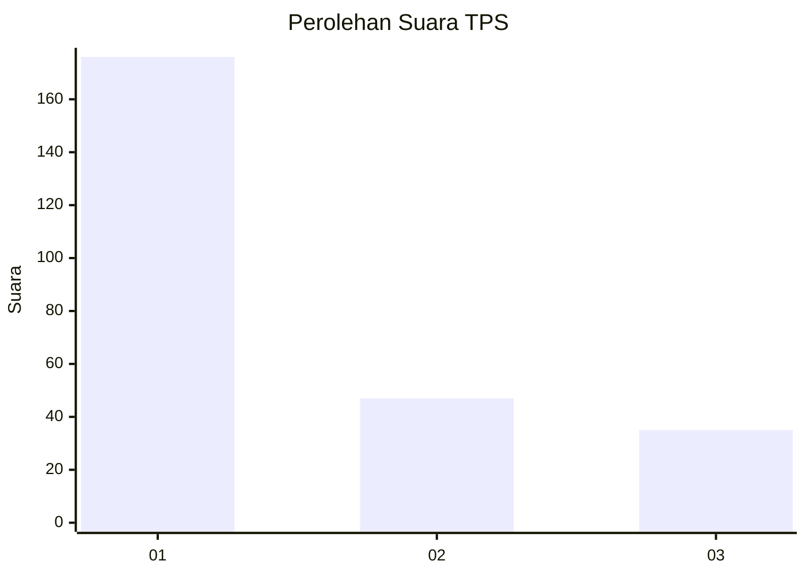
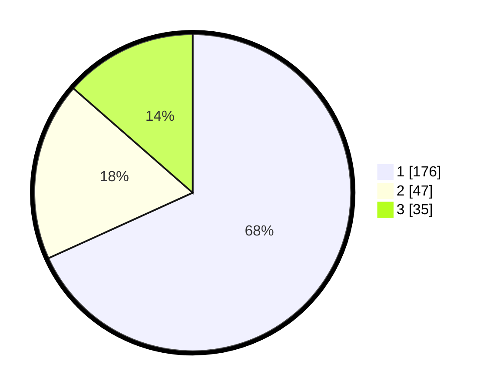

# Hasil

## Grafik

## Tabel

| No. | Nama Paslon    | Suara | Suara (raw) | Persentase |
|:--- |:-------------- | -----:| -----------:| ----------:|
| 1   | ANIES MUHAIMIN | 176   | [176][p-1]  | 68,22      |
| 2   | PRABOWO GIBRAN | 47    | [47][p-2]   | 18,22      |
| 3   | GANJAR MAHFUD  | 35    | [35][p-3]   | 13,57      |

[p-1]: https://github.com/gigit-pemilu/pemilu-2024/blob/main/pilpres/hitung-suara/sub/35-jawa-timur/sub/28-pamekasan/sub/10-waru/sub/2012-tagangser-laok/sub/010-tps/sub/paslon-1.txt
[p-2]: https://github.com/gigit-pemilu/pemilu-2024/blob/main/pilpres/hitung-suara/sub/35-jawa-timur/sub/28-pamekasan/sub/10-waru/sub/2012-tagangser-laok/sub/010-tps/sub/paslon-2.txt
[p-3]: https://github.com/gigit-pemilu/pemilu-2024/blob/main/pilpres/hitung-suara/sub/35-jawa-timur/sub/28-pamekasan/sub/10-waru/sub/2012-tagangser-laok/sub/010-tps/sub/paslon-3.txt

## Foto C Plano

https://sirekap-obj-formc.kpu.go.id/1b9a/pemilu/ppwp/35/28/10/20/12/3528102012010-20240215-114738--ca0bce9a-1461-42d3-995d-d3553b949ff2.jpg

https://sirekap-obj-formc.kpu.go.id/1b9a/pemilu/ppwp/35/28/10/20/12/3528102012010-20240215-114830--ec317c2c-8f8a-47aa-b3db-305ee8941eec.jpg

https://sirekap-obj-formc.kpu.go.id/1b9a/pemilu/ppwp/35/28/10/20/12/3528102012010-20240215-114920--a289cae3-8f1c-4ad7-88e7-606593303c2f.jpg

## Metadata

| Key        | Value               |
| ---------- | ------------------- |
| Time Stamp | 2024-02-25 15:00:00 |

