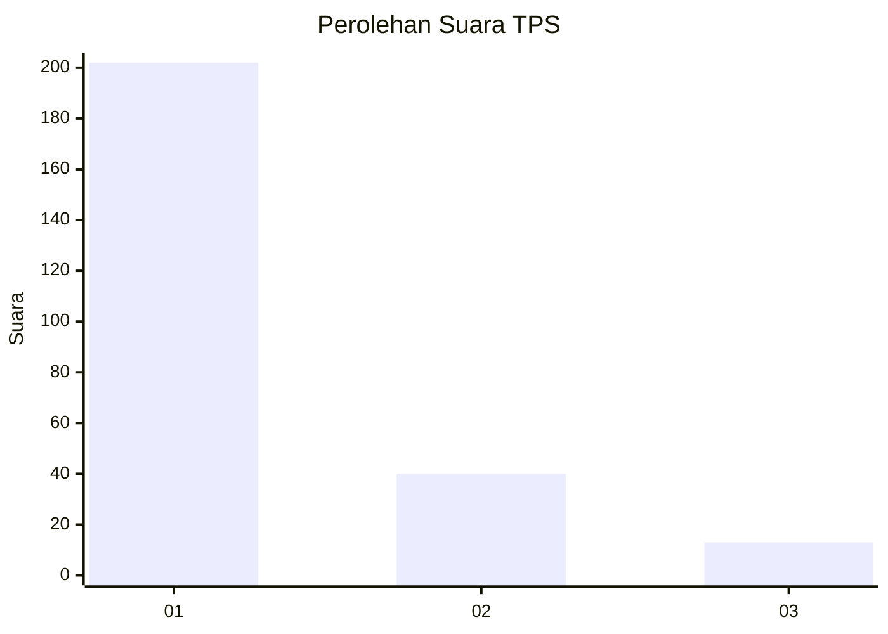
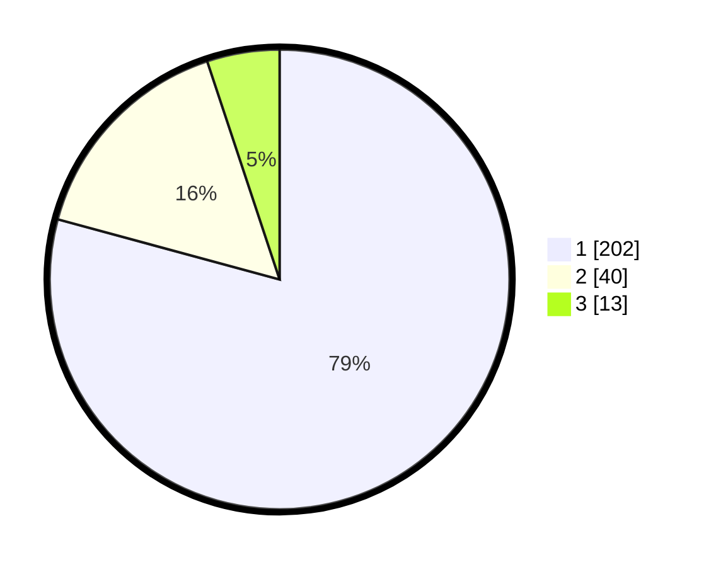

# Hasil

## Grafik

## Tabel

| No. | Nama Paslon    | Suara | Suara (raw) | Persentase |
|:--- |:-------------- | -----:| -----------:| ----------:|
| 1   | ANIES MUHAIMIN | 202   | [202][p-1]  | 79,22      |
| 2   | PRABOWO GIBRAN | 40    | [40][p-2]   | 15,69      |
| 3   | GANJAR MAHFUD  | 13    | [13][p-3]   | 5,10       |

[p-1]: https://github.com/gigit-pemilu/pemilu-2024-35-jawa-timur/blob/main/pilpres/hitung-suara/sub/35-jawa-timur/sub/28-pamekasan/sub/10-waru/sub/2012-tagangser-laok/sub/011-tps/sub/paslon-1.txt
[p-2]: https://github.com/gigit-pemilu/pemilu-2024-35-jawa-timur/blob/main/pilpres/hitung-suara/sub/35-jawa-timur/sub/28-pamekasan/sub/10-waru/sub/2012-tagangser-laok/sub/011-tps/sub/paslon-2.txt
[p-3]: https://github.com/gigit-pemilu/pemilu-2024-35-jawa-timur/blob/main/pilpres/hitung-suara/sub/35-jawa-timur/sub/28-pamekasan/sub/10-waru/sub/2012-tagangser-laok/sub/011-tps/sub/paslon-3.txt

## Foto C Plano

https://sirekap-obj-formc.kpu.go.id/eb4b/pemilu/ppwp/35/28/10/20/12/3528102012011-20240215-091944--eecd0a63-2b0c-4453-bc10-610525b4886d.jpg

https://sirekap-obj-formc.kpu.go.id/eb4b/pemilu/ppwp/35/28/10/20/12/3528102012011-20240215-092230--5349559b-adc5-4d48-9d8e-dc5e9bf1ec60.jpg

https://sirekap-obj-formc.kpu.go.id/eb4b/pemilu/ppwp/35/28/10/20/12/3528102012011-20240215-092356--77d5d9e3-16e3-4b19-8075-05d51cb5afd9.jpg

## Metadata

| Key        | Value               |
| ---------- | ------------------- |
| Time Stamp | 2024-02-25 15:00:00 |

