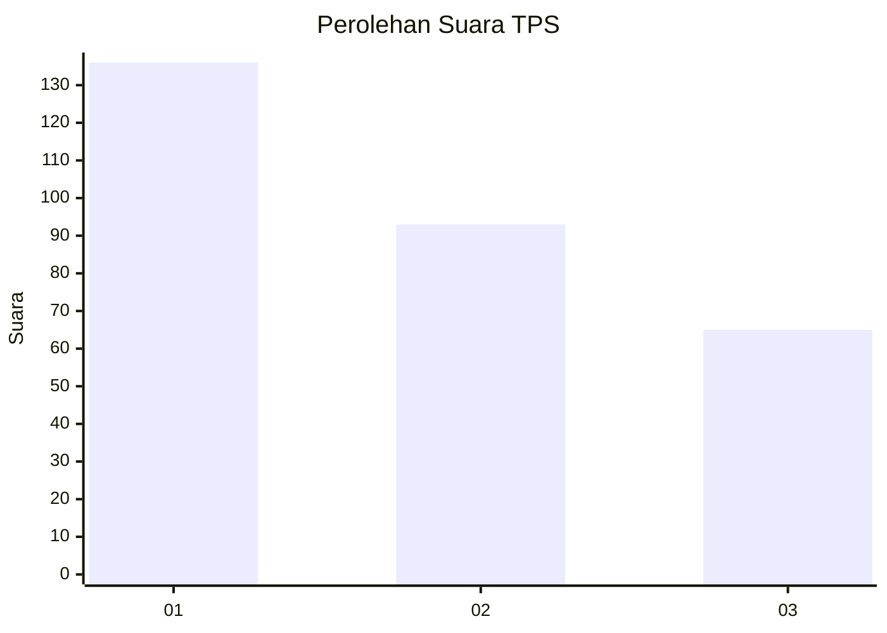
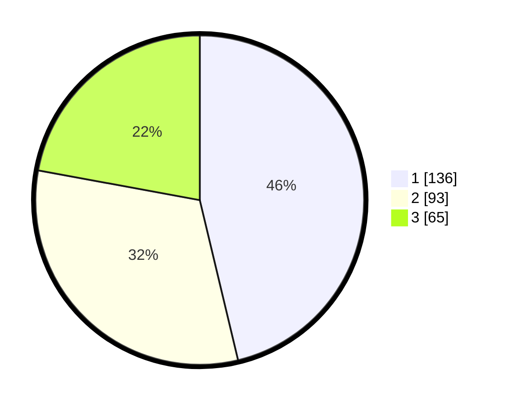

# Hasil

## Grafik

## Tabel

| No. | Nama Paslon    | Suara | Suara (raw) | Persentase |
|:--- |:-------------- | -----:| -----------:| ----------:|
| 1   | ANIES MUHAIMIN | 136   | [136][p-1]  | 46,26      |
| 2   | PRABOWO GIBRAN | 93    | [93][p-2]   | 31,63      |
| 3   | GANJAR MAHFUD  | 65    | [65][p-3]   | 22,11      |

[p-1]: https://github.com/gigit-pemilu/pemilu-2024-35-jawa-timur/blob/main/pilpres/hitung-suara/sub/35-jawa-timur/sub/28-pamekasan/sub/10-waru/sub/2012-tagangser-laok/sub/012-tps/sub/paslon-1.txt
[p-2]: https://github.com/gigit-pemilu/pemilu-2024-35-jawa-timur/blob/main/pilpres/hitung-suara/sub/35-jawa-timur/sub/28-pamekasan/sub/10-waru/sub/2012-tagangser-laok/sub/012-tps/sub/paslon-2.txt
[p-3]: https://github.com/gigit-pemilu/pemilu-2024-35-jawa-timur/blob/main/pilpres/hitung-suara/sub/35-jawa-timur/sub/28-pamekasan/sub/10-waru/sub/2012-tagangser-laok/sub/012-tps/sub/paslon-3.txt

## Foto C Plano

https://sirekap-obj-formc.kpu.go.id/f6ac/pemilu/ppwp/35/28/10/20/12/3528102012012-20240217-082236--fe15568d-631a-4fc4-99ae-364c44dffd4a.jpg

https://sirekap-obj-formc.kpu.go.id/f6ac/pemilu/ppwp/35/28/10/20/12/3528102012012-20240214-233119--a238ef6f-6ac5-4866-a4ca-05d21d5543a6.jpg

https://sirekap-obj-formc.kpu.go.id/f6ac/pemilu/ppwp/35/28/10/20/12/3528102012012-20240214-233241--e4713602-af26-48a8-90fe-e2fc7f9474cf.jpg

## Metadata

| Key        | Value               |
| ---------- | ------------------- |
| Time Stamp | 2024-02-17 08:30:03 |

