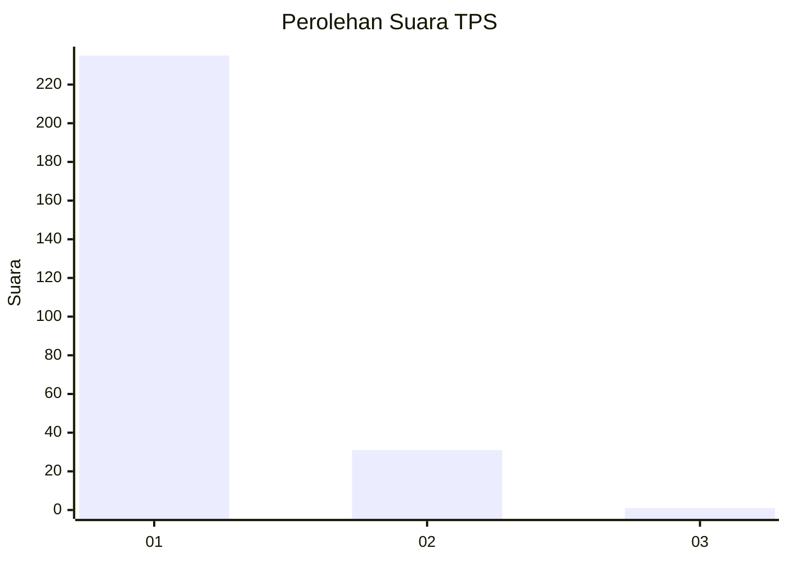
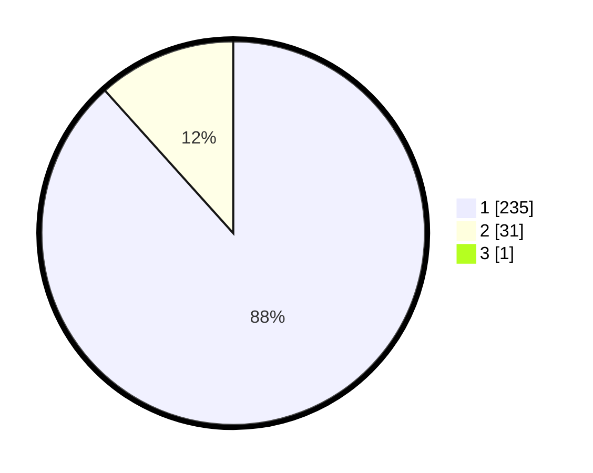

# Hasil

## Grafik

## Tabel

| No. | Nama Paslon    | Suara | Suara (raw) | Persentase |
|:--- |:-------------- | -----:| -----------:| ----------:|
| 1   | ANIES MUHAIMIN | 235   | [235][p-1]  | 88,01      |
| 2   | PRABOWO GIBRAN | 31    | [31][p-2]   | 11,61      |
| 3   | GANJAR MAHFUD  | 1     | [1][p-3]    | 0,37       |

[p-1]: https://github.com/gigit-pemilu/pemilu-2024/blob/main/pilpres/hitung-suara/sub/35-jawa-timur/sub/28-pamekasan/sub/11-batumarmar/sub/2001-bujur-barat/sub/003-tps/sub/paslon-1.txt
[p-2]: https://github.com/gigit-pemilu/pemilu-2024/blob/main/pilpres/hitung-suara/sub/35-jawa-timur/sub/28-pamekasan/sub/11-batumarmar/sub/2001-bujur-barat/sub/003-tps/sub/paslon-2.txt
[p-3]: https://github.com/gigit-pemilu/pemilu-2024/blob/main/pilpres/hitung-suara/sub/35-jawa-timur/sub/28-pamekasan/sub/11-batumarmar/sub/2001-bujur-barat/sub/003-tps/sub/paslon-3.txt

## Foto C Plano

https://sirekap-obj-formc.kpu.go.id/637d/pemilu/ppwp/35/28/11/20/01/3528112001003-20240215-094953--c3638a62-9565-47cd-af65-9c869098c402.jpg

https://sirekap-obj-formc.kpu.go.id/637d/pemilu/ppwp/35/28/11/20/01/3528112001003-20240215-095324--e6f93c05-59a3-434f-8bef-b5d9edadda8c.jpg

https://sirekap-obj-formc.kpu.go.id/637d/pemilu/ppwp/35/28/11/20/01/3528112001003-20240215-095401--3aff0600-477e-4e66-bb1d-a40b05f0aa5d.jpg

## Metadata

| Key        | Value               |
| ---------- | ------------------- |
| Time Stamp | 2024-02-17 16:52:47 |

