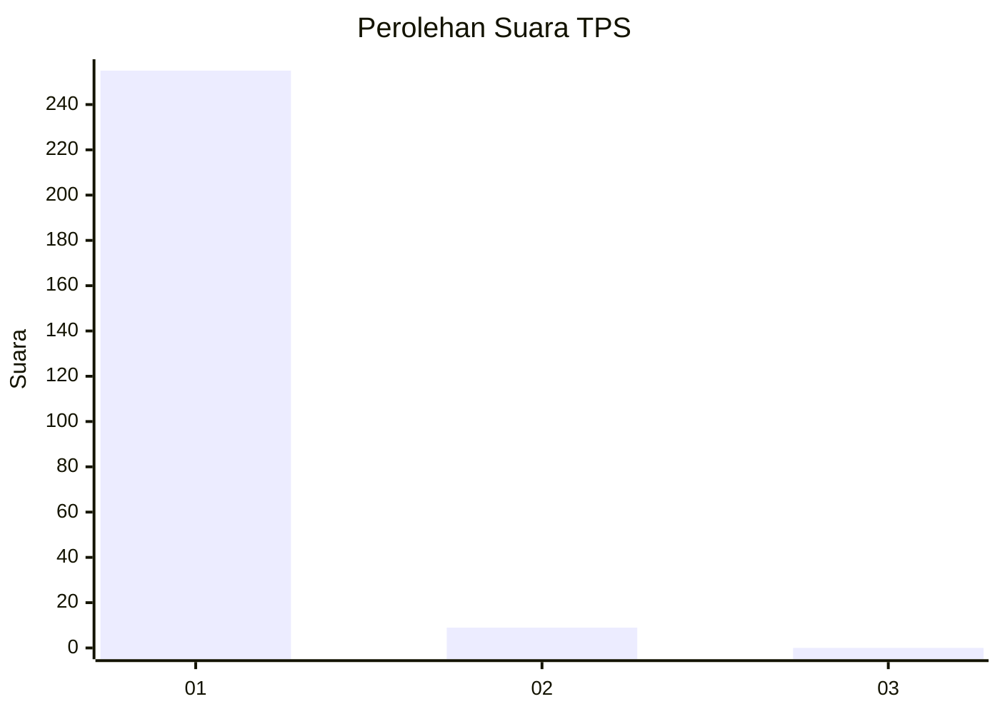
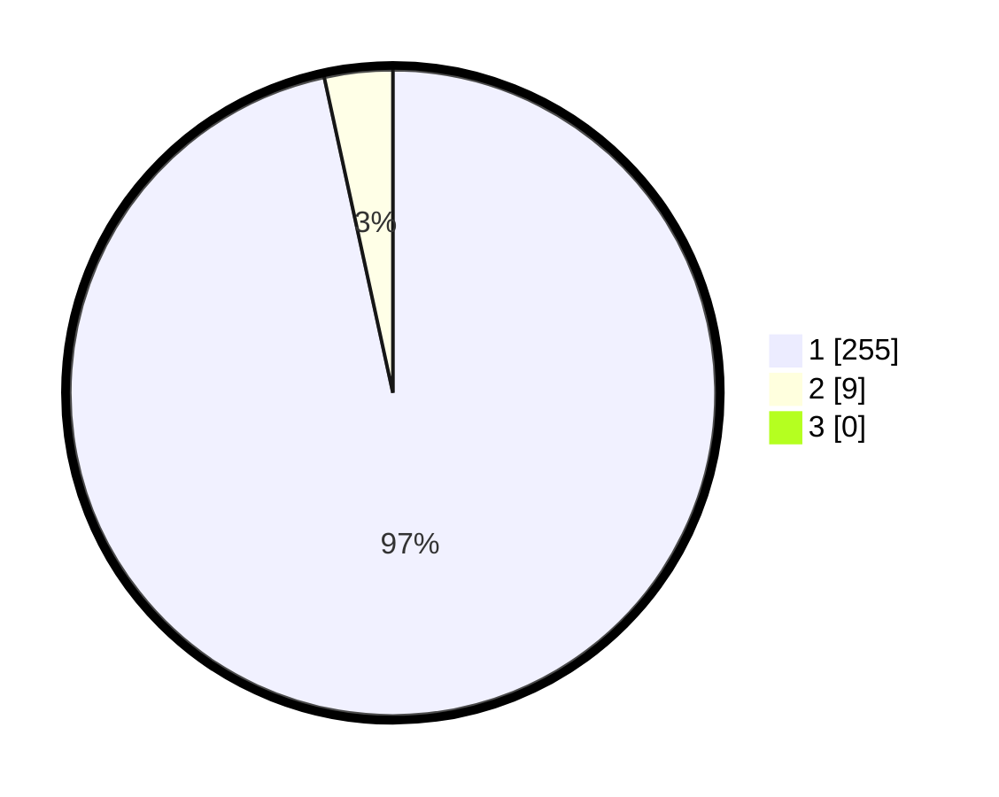

# Hasil

## Grafik

## Tabel

| No. | Nama Paslon    | Suara | Suara (raw) | Persentase |
|:--- |:-------------- | -----:| -----------:| ----------:|
| 1   | ANIES MUHAIMIN | 255   | [255][p-1]  | 96,59      |
| 2   | PRABOWO GIBRAN | 9     | [9][p-2]    | 3,41       |
| 3   | GANJAR MAHFUD  | 0     | [0][p-3]    | 0,00       |

[p-1]: https://github.com/gigit-pemilu/pemilu-2024-35-jawa-timur/blob/main/pilpres/hitung-suara/sub/35-jawa-timur/sub/28-pamekasan/sub/11-batumarmar/sub/2001-bujur-barat/sub/008-tps/sub/paslon-1.txt
[p-2]: https://github.com/gigit-pemilu/pemilu-2024-35-jawa-timur/blob/main/pilpres/hitung-suara/sub/35-jawa-timur/sub/28-pamekasan/sub/11-batumarmar/sub/2001-bujur-barat/sub/008-tps/sub/paslon-2.txt
[p-3]: https://github.com/gigit-pemilu/pemilu-2024-35-jawa-timur/blob/main/pilpres/hitung-suara/sub/35-jawa-timur/sub/28-pamekasan/sub/11-batumarmar/sub/2001-bujur-barat/sub/008-tps/sub/paslon-3.txt

## Foto C Plano

https://sirekap-obj-formc.kpu.go.id/cdb2/pemilu/ppwp/35/28/11/20/01/3528112001008-20240216-135402--8ec09c14-bdf5-4fb2-a1a0-92ff8937a75a.jpg

https://sirekap-obj-formc.kpu.go.id/cdb2/pemilu/ppwp/35/28/11/20/01/3528112001008-20240216-134913--e1bc1084-ad16-46d9-a714-1bb7d0b28cda.jpg

https://sirekap-obj-formc.kpu.go.id/cdb2/pemilu/ppwp/35/28/11/20/01/3528112001008-20240216-134939--5ffb2fe4-1897-434c-a7d5-0b54adc70081.jpg

## Metadata

| Key        | Value               |
| ---------- | ------------------- |
| Time Stamp | 2024-02-24 22:31:28 |

