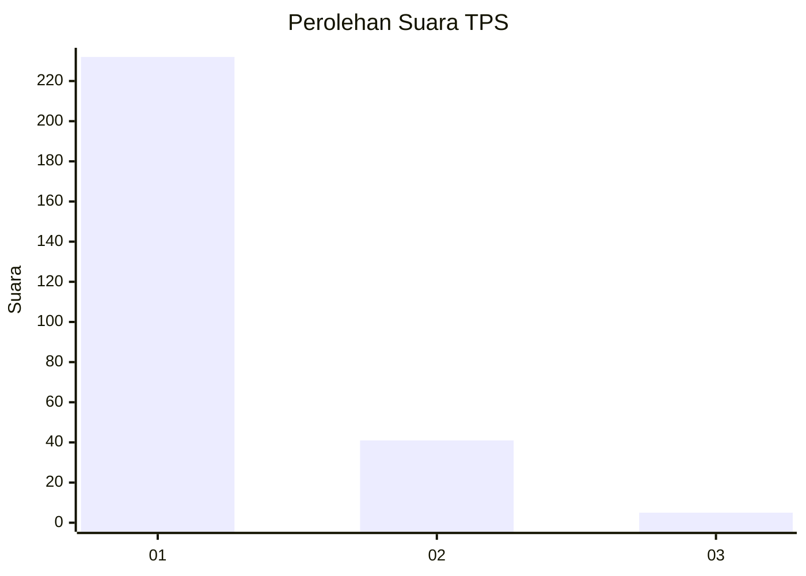
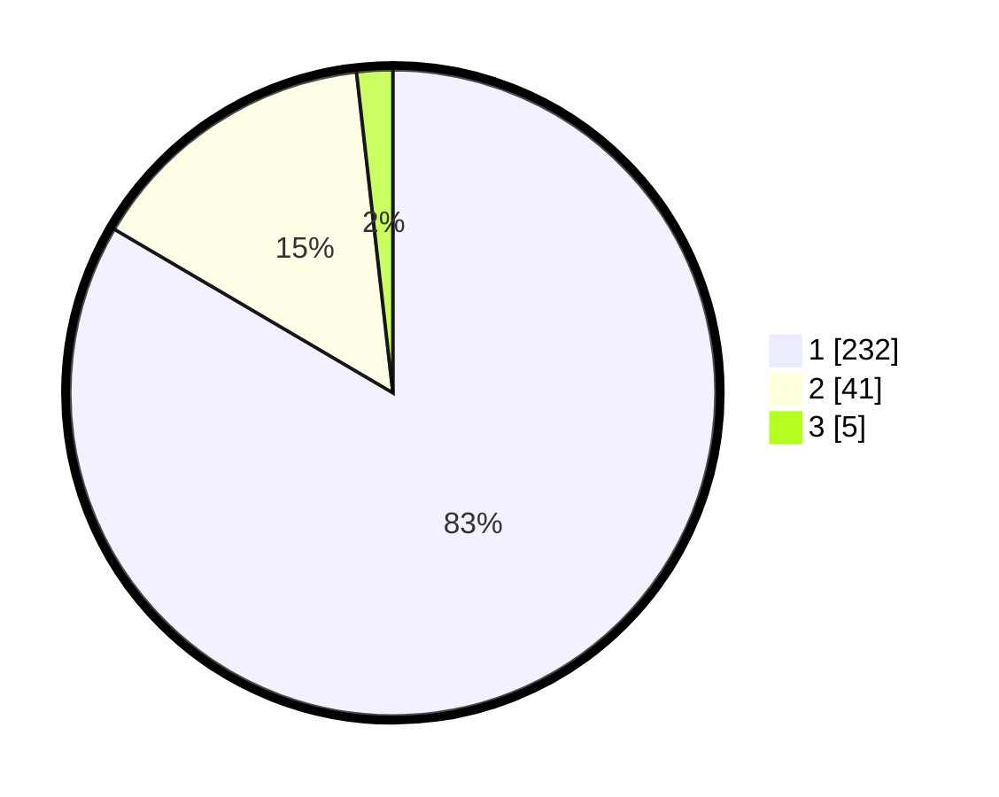

# Hasil

## Grafik

## Tabel

| No. | Nama Paslon    | Suara | Suara (raw) | Persentase |
|:--- |:-------------- | -----:| -----------:| ----------:|
| 1   | ANIES MUHAIMIN | 232   | [232][p-1]  | 83,45      |
| 2   | PRABOWO GIBRAN | 41    | [41][p-2]   | 14,75      |
| 3   | GANJAR MAHFUD  | 5     | [5][p-3]    | 1,80       |

[p-1]: https://github.com/gigit-pemilu/pemilu-2024/blob/main/pilpres/hitung-suara/sub/35-jawa-timur/sub/28-pamekasan/sub/11-batumarmar/sub/2001-bujur-barat/sub/009-tps/sub/paslon-1.txt
[p-2]: https://github.com/gigit-pemilu/pemilu-2024/blob/main/pilpres/hitung-suara/sub/35-jawa-timur/sub/28-pamekasan/sub/11-batumarmar/sub/2001-bujur-barat/sub/009-tps/sub/paslon-2.txt
[p-3]: https://github.com/gigit-pemilu/pemilu-2024/blob/main/pilpres/hitung-suara/sub/35-jawa-timur/sub/28-pamekasan/sub/11-batumarmar/sub/2001-bujur-barat/sub/009-tps/sub/paslon-3.txt

## Foto C Plano

https://sirekap-obj-formc.kpu.go.id/22bc/pemilu/ppwp/35/28/11/20/01/3528112001009-20240215-163223--1ceea41b-22d2-4ddb-8e28-ad7f686ca61b.jpg

https://sirekap-obj-formc.kpu.go.id/22bc/pemilu/ppwp/35/28/11/20/01/3528112001009-20240215-163446--87b847f3-025b-4c36-b3c3-6db5550312e4.jpg

https://sirekap-obj-formc.kpu.go.id/22bc/pemilu/ppwp/35/28/11/20/01/3528112001009-20240215-163841--0962416f-8004-4414-a159-08828323fa0d.jpg

## Metadata

| Key        | Value               |
| ---------- | ------------------- |
| Time Stamp | 2024-02-17 16:52:47 |

