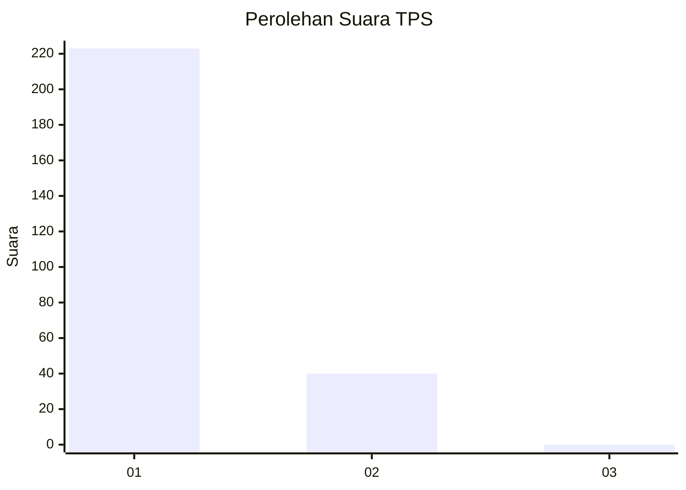
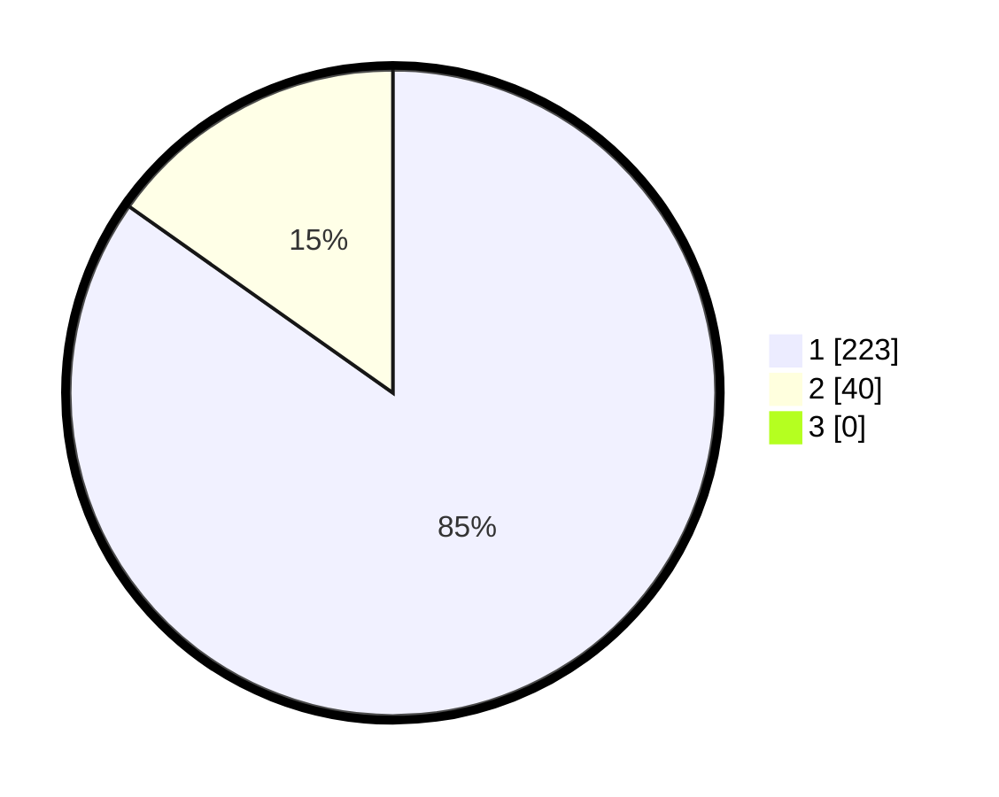

# Hasil

## Grafik

## Tabel

| No. | Nama Paslon    | Suara | Suara (raw) | Persentase |
|:--- |:-------------- | -----:| -----------:| ----------:|
| 1   | ANIES MUHAIMIN | 223   | [223][p-1]  | 84,79      |
| 2   | PRABOWO GIBRAN | 40    | [40][p-2]   | 15,21      |
| 3   | GANJAR MAHFUD  | 0     | [0][p-3]    | 0,00       |

[p-1]: https://github.com/gigit-pemilu/pemilu-2024-35-jawa-timur/blob/main/pilpres/hitung-suara/sub/35-jawa-timur/sub/28-pamekasan/sub/11-batumarmar/sub/2001-bujur-barat/sub/011-tps/sub/paslon-1.txt
[p-2]: https://github.com/gigit-pemilu/pemilu-2024-35-jawa-timur/blob/main/pilpres/hitung-suara/sub/35-jawa-timur/sub/28-pamekasan/sub/11-batumarmar/sub/2001-bujur-barat/sub/011-tps/sub/paslon-2.txt
[p-3]: https://github.com/gigit-pemilu/pemilu-2024-35-jawa-timur/blob/main/pilpres/hitung-suara/sub/35-jawa-timur/sub/28-pamekasan/sub/11-batumarmar/sub/2001-bujur-barat/sub/011-tps/sub/paslon-3.txt

## Foto C Plano

https://sirekap-obj-formc.kpu.go.id/b55f/pemilu/ppwp/35/28/11/20/01/3528112001011-20240215-112750--78cecf31-c8b2-41a5-8328-49cae504149c.jpg

https://sirekap-obj-formc.kpu.go.id/b55f/pemilu/ppwp/35/28/11/20/01/3528112001011-20240215-112651--5695bcfd-9915-45c5-933e-d0b6f103b4cb.jpg

https://sirekap-obj-formc.kpu.go.id/b55f/pemilu/ppwp/35/28/11/20/01/3528112001011-20240215-113151--0cc8bf0f-80dd-49cf-ae6b-e56c2eb4ec69.jpg

## Metadata

| Key        | Value               |
| ---------- | ------------------- |
| Time Stamp | 2024-02-17 16:52:47 |

