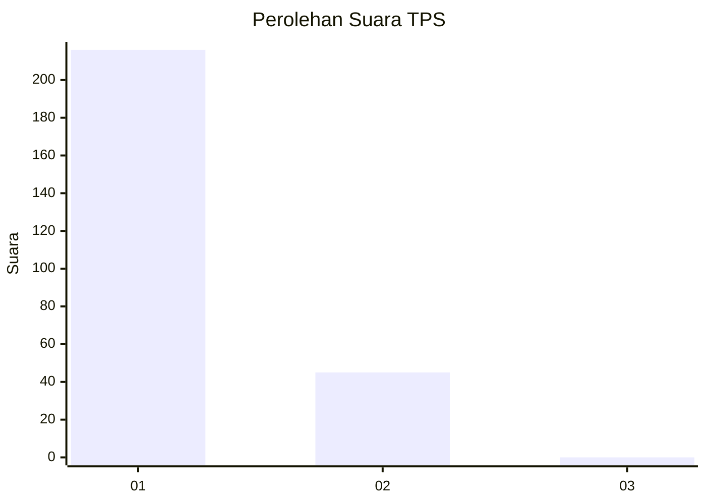
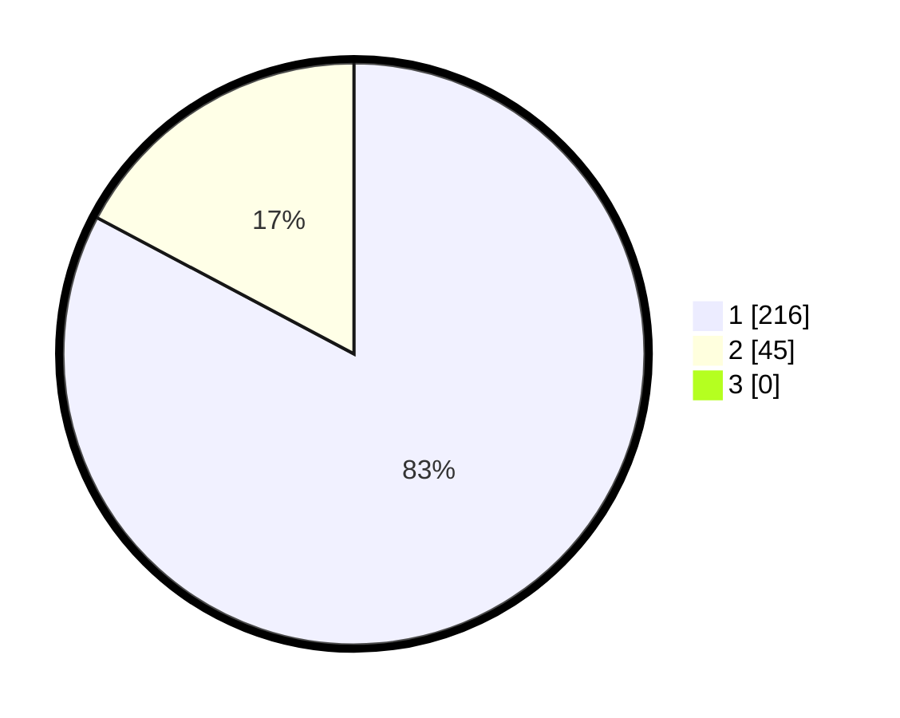

# Hasil

## Grafik

## Tabel

| No. | Nama Paslon    | Suara | Suara (raw) | Persentase |
|:--- |:-------------- | -----:| -----------:| ----------:|
| 1   | ANIES MUHAIMIN | 216   | [216][p-1]  | 82,76      |
| 2   | PRABOWO GIBRAN | 45    | [45][p-2]   | 17,24      |
| 3   | GANJAR MAHFUD  | 0     | [0][p-3]    | 0,00       |

[p-1]: https://github.com/gigit-pemilu/pemilu-2024/blob/main/pilpres/hitung-suara/sub/35-jawa-timur/sub/28-pamekasan/sub/11-batumarmar/sub/2001-bujur-barat/sub/012-tps/sub/paslon-1.txt
[p-2]: https://github.com/gigit-pemilu/pemilu-2024/blob/main/pilpres/hitung-suara/sub/35-jawa-timur/sub/28-pamekasan/sub/11-batumarmar/sub/2001-bujur-barat/sub/012-tps/sub/paslon-2.txt
[p-3]: https://github.com/gigit-pemilu/pemilu-2024/blob/main/pilpres/hitung-suara/sub/35-jawa-timur/sub/28-pamekasan/sub/11-batumarmar/sub/2001-bujur-barat/sub/012-tps/sub/paslon-3.txt

## Foto C Plano

https://sirekap-obj-formc.kpu.go.id/0d9f/pemilu/ppwp/35/28/11/20/01/3528112001012-20240215-090729--8393683a-9a53-4e2f-b6b8-56171fae3026.jpg

https://sirekap-obj-formc.kpu.go.id/0d9f/pemilu/ppwp/35/28/11/20/01/3528112001012-20240215-090848--bf87347b-19e3-499c-bb4a-d398839d677a.jpg

https://sirekap-obj-formc.kpu.go.id/0d9f/pemilu/ppwp/35/28/11/20/01/3528112001012-20240215-090948--350f639f-5496-47b3-9d48-ba66a6dc3be8.jpg

## Metadata

| Key        | Value               |
| ---------- | ------------------- |
| Time Stamp | 2024-02-17 16:52:47 |

