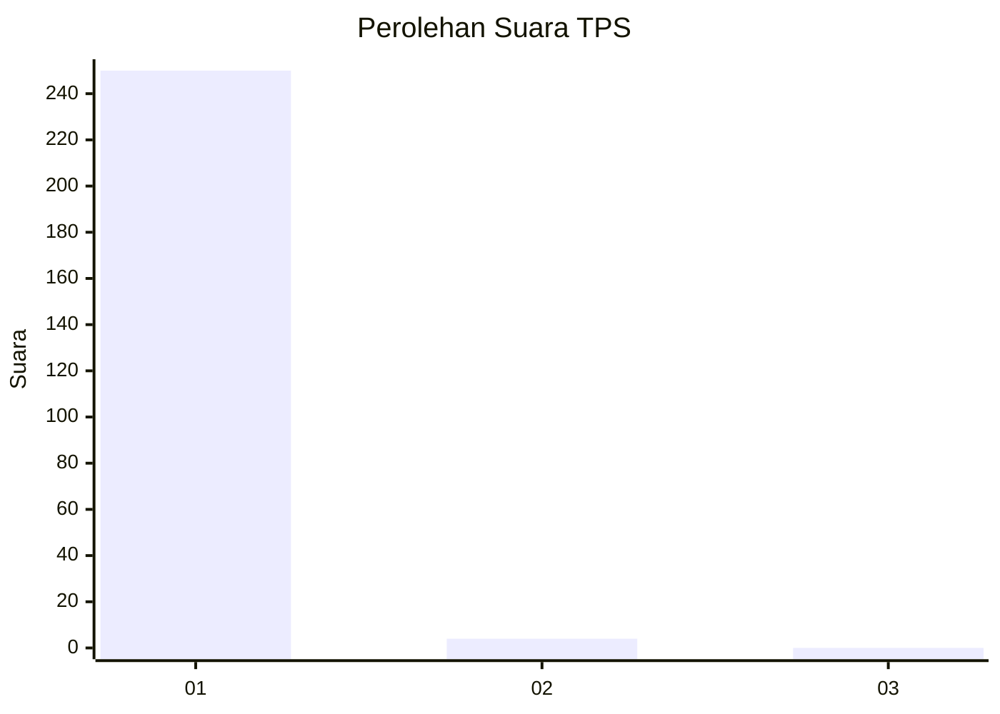
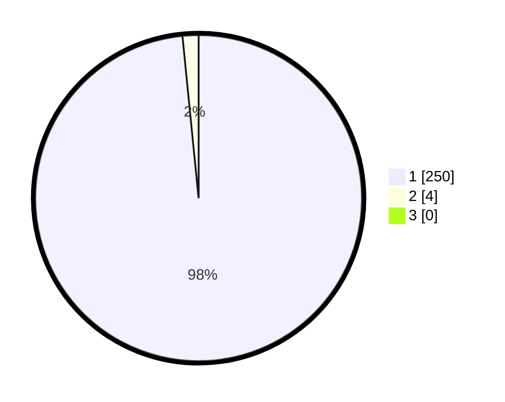

# Hasil

## Grafik

## Tabel

| No. | Nama Paslon    | Suara | Suara (raw) | Persentase |
|:--- |:-------------- | -----:| -----------:| ----------:|
| 1   | ANIES MUHAIMIN | 250   | [250][p-1]  | 98,43      |
| 2   | PRABOWO GIBRAN | 4     | [4][p-2]    | 1,57       |
| 3   | GANJAR MAHFUD  | 0     | [0][p-3]    | 0,00       |

[p-1]: https://github.com/gigit-pemilu/pemilu-2024-35-jawa-timur/blob/main/pilpres/hitung-suara/sub/35-jawa-timur/sub/28-pamekasan/sub/11-batumarmar/sub/2001-bujur-barat/sub/013-tps/sub/paslon-1.txt
[p-2]: https://github.com/gigit-pemilu/pemilu-2024-35-jawa-timur/blob/main/pilpres/hitung-suara/sub/35-jawa-timur/sub/28-pamekasan/sub/11-batumarmar/sub/2001-bujur-barat/sub/013-tps/sub/paslon-2.txt
[p-3]: https://github.com/gigit-pemilu/pemilu-2024-35-jawa-timur/blob/main/pilpres/hitung-suara/sub/35-jawa-timur/sub/28-pamekasan/sub/11-batumarmar/sub/2001-bujur-barat/sub/013-tps/sub/paslon-3.txt

## Foto C Plano

https://sirekap-obj-formc.kpu.go.id/8bf7/pemilu/ppwp/35/28/11/20/01/3528112001013-20240215-104851--3af6cec0-b390-461b-a5af-dade63f1b882.jpg

https://sirekap-obj-formc.kpu.go.id/8bf7/pemilu/ppwp/35/28/11/20/01/3528112001013-20240215-105035--db0c386f-1c4a-422f-a9c6-981f1f5d8fb6.jpg

https://sirekap-obj-formc.kpu.go.id/8bf7/pemilu/ppwp/35/28/11/20/01/3528112001013-20240215-105134--7e226e91-a8ee-4f32-a70b-11e281e4b92e.jpg

## Metadata

| Key        | Value               |
| ---------- | ------------------- |
| Time Stamp | 2024-02-17 16:52:47 |

