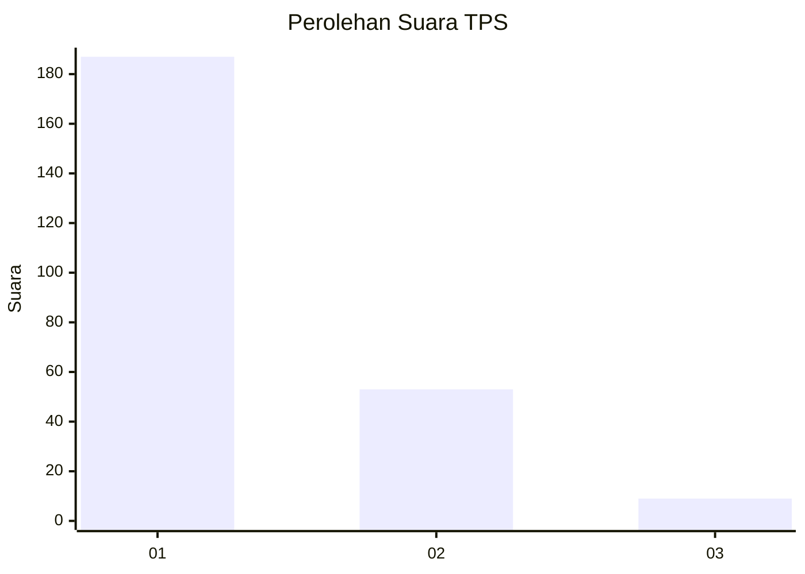
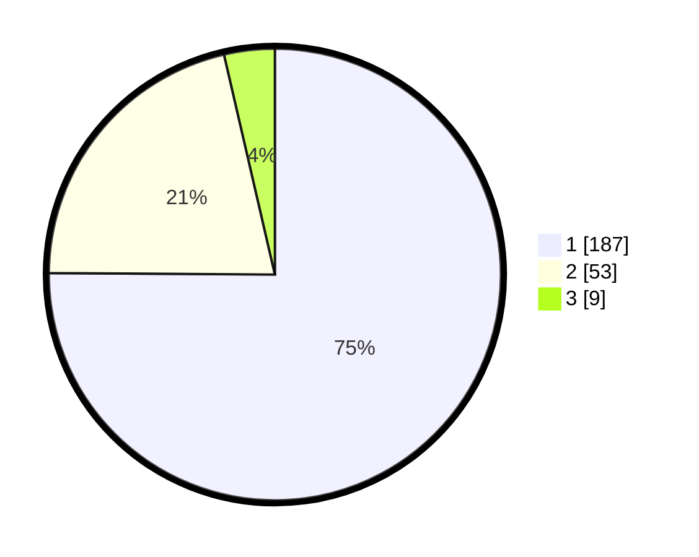

# Hasil

## Grafik

## Tabel

| No. | Nama Paslon    | Suara | Suara (raw) | Persentase |
|:--- |:-------------- | -----:| -----------:| ----------:|
| 1   | ANIES MUHAIMIN | 187   | [187][p-1]  | 75,10      |
| 2   | PRABOWO GIBRAN | 53    | [53][p-2]   | 21,29      |
| 3   | GANJAR MAHFUD  | 9     | [9][p-3]    | 3,61       |

[p-1]: https://github.com/gigit-pemilu/pemilu-2024/blob/main/pilpres/hitung-suara/sub/35-jawa-timur/sub/28-pamekasan/sub/11-batumarmar/sub/2001-bujur-barat/sub/014-tps/sub/paslon-1.txt
[p-2]: https://github.com/gigit-pemilu/pemilu-2024/blob/main/pilpres/hitung-suara/sub/35-jawa-timur/sub/28-pamekasan/sub/11-batumarmar/sub/2001-bujur-barat/sub/014-tps/sub/paslon-2.txt
[p-3]: https://github.com/gigit-pemilu/pemilu-2024/blob/main/pilpres/hitung-suara/sub/35-jawa-timur/sub/28-pamekasan/sub/11-batumarmar/sub/2001-bujur-barat/sub/014-tps/sub/paslon-3.txt

## Foto C Plano

https://sirekap-obj-formc.kpu.go.id/64b8/pemilu/ppwp/35/28/11/20/01/3528112001014-20240215-084907--a2c5cbcc-0514-4f74-91bc-93f409d9f2cd.jpg

https://sirekap-obj-formc.kpu.go.id/64b8/pemilu/ppwp/35/28/11/20/01/3528112001014-20240215-085049--1c576065-4ce8-4946-b5c6-66b0f62d8004.jpg

https://sirekap-obj-formc.kpu.go.id/64b8/pemilu/ppwp/35/28/11/20/01/3528112001014-20240215-085155--0352126c-d17b-4b4a-9bc5-790b3f76f5d7.jpg

## Metadata

| Key        | Value               |
| ---------- | ------------------- |
| Time Stamp | 2024-02-17 16:52:47 |

