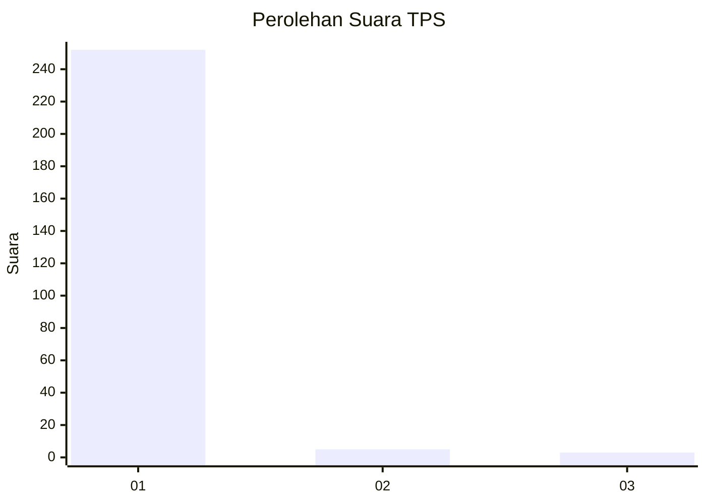
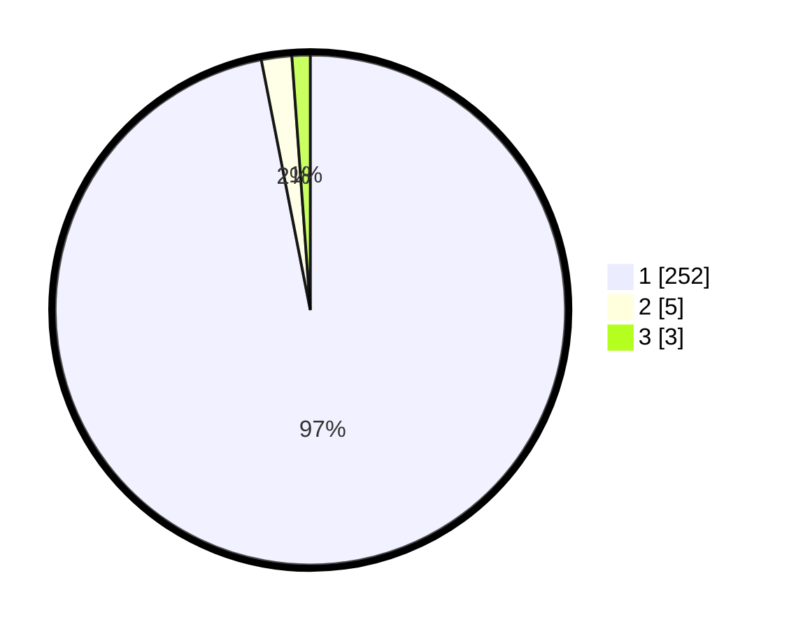

# Hasil

## Grafik

## Tabel

| No. | Nama Paslon    | Suara | Suara (raw) | Persentase |
|:--- |:-------------- | -----:| -----------:| ----------:|
| 1   | ANIES MUHAIMIN | 252   | [252][p-1]  | 96,92      |
| 2   | PRABOWO GIBRAN | 5     | [5][p-2]    | 1,92       |
| 3   | GANJAR MAHFUD  | 3     | [3][p-3]    | 1,15       |

[p-1]: https://github.com/gigit-pemilu/pemilu-2024-35-jawa-timur/blob/main/pilpres/hitung-suara/sub/35-jawa-timur/sub/28-pamekasan/sub/11-batumarmar/sub/2001-bujur-barat/sub/016-tps/sub/paslon-1.txt
[p-2]: https://github.com/gigit-pemilu/pemilu-2024-35-jawa-timur/blob/main/pilpres/hitung-suara/sub/35-jawa-timur/sub/28-pamekasan/sub/11-batumarmar/sub/2001-bujur-barat/sub/016-tps/sub/paslon-2.txt
[p-3]: https://github.com/gigit-pemilu/pemilu-2024-35-jawa-timur/blob/main/pilpres/hitung-suara/sub/35-jawa-timur/sub/28-pamekasan/sub/11-batumarmar/sub/2001-bujur-barat/sub/016-tps/sub/paslon-3.txt

## Foto C Plano

https://sirekap-obj-formc.kpu.go.id/f578/pemilu/ppwp/35/28/11/20/01/3528112001016-20240215-101921--c6d38cc8-928e-4332-8722-2fd5dcc4f040.jpg

https://sirekap-obj-formc.kpu.go.id/f578/pemilu/ppwp/35/28/11/20/01/3528112001016-20240215-091758--7aeae96a-4017-4359-9ef5-c791f2843df1.jpg

https://sirekap-obj-formc.kpu.go.id/f578/pemilu/ppwp/35/28/11/20/01/3528112001016-20240215-102142--12840529-10a6-46f2-9dc3-b405c60b7d49.jpg

## Metadata

| Key        | Value               |
| ---------- | ------------------- |
| Time Stamp | 2024-02-17 16:52:47 |

