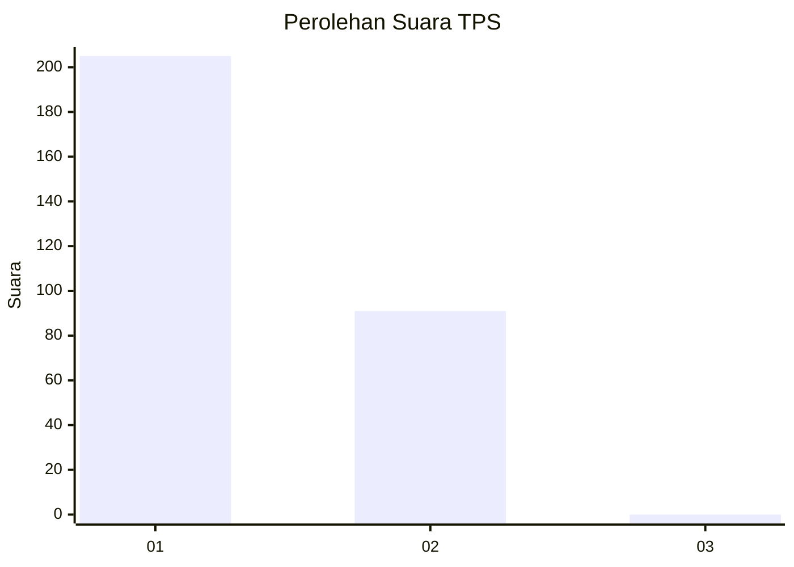
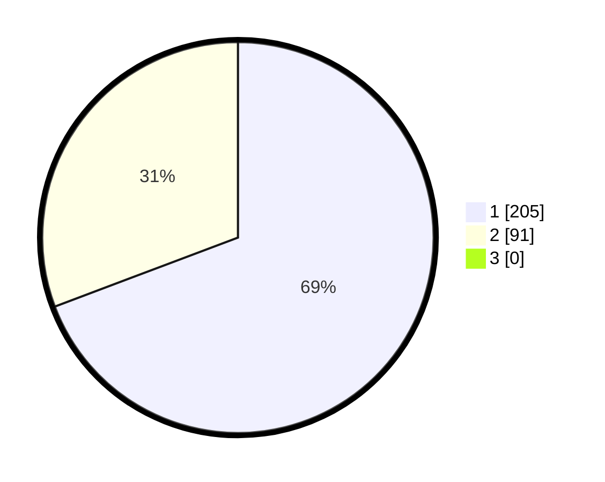

# Hasil

## Grafik

## Tabel

| No. | Nama Paslon    | Suara | Suara (raw) | Persentase |
|:--- |:-------------- | -----:| -----------:| ----------:|
| 1   | ANIES MUHAIMIN | 205   | [205][p-1]  | 69,26      |
| 2   | PRABOWO GIBRAN | 91    | [91][p-2]   | 30,74      |
| 3   | GANJAR MAHFUD  | 0     | [0][p-3]    | 0,00       |

[p-1]: https://github.com/gigit-pemilu/pemilu-2024-35-jawa-timur/blob/main/pilpres/hitung-suara/sub/35-jawa-timur/sub/28-pamekasan/sub/11-batumarmar/sub/2001-bujur-barat/sub/020-tps/sub/paslon-1.txt
[p-2]: https://github.com/gigit-pemilu/pemilu-2024-35-jawa-timur/blob/main/pilpres/hitung-suara/sub/35-jawa-timur/sub/28-pamekasan/sub/11-batumarmar/sub/2001-bujur-barat/sub/020-tps/sub/paslon-2.txt
[p-3]: https://github.com/gigit-pemilu/pemilu-2024-35-jawa-timur/blob/main/pilpres/hitung-suara/sub/35-jawa-timur/sub/28-pamekasan/sub/11-batumarmar/sub/2001-bujur-barat/sub/020-tps/sub/paslon-3.txt

## Foto C Plano

https://sirekap-obj-formc.kpu.go.id/06b4/pemilu/ppwp/35/28/11/20/01/3528112001020-20240215-084828--cf232059-66a3-4858-87d6-1b8f4b2bc11c.jpg

https://sirekap-obj-formc.kpu.go.id/06b4/pemilu/ppwp/35/28/11/20/01/3528112001020-20240215-084948--cecff7b8-85b3-4eed-99d6-75a13ccbb3fa.jpg

https://sirekap-obj-formc.kpu.go.id/06b4/pemilu/ppwp/35/28/11/20/01/3528112001020-20240215-085040--043193aa-0a34-45ee-b61a-4a6608577191.jpg

## Metadata

| Key        | Value               |
| ---------- | ------------------- |
| Time Stamp | 2024-02-17 16:52:47 |

