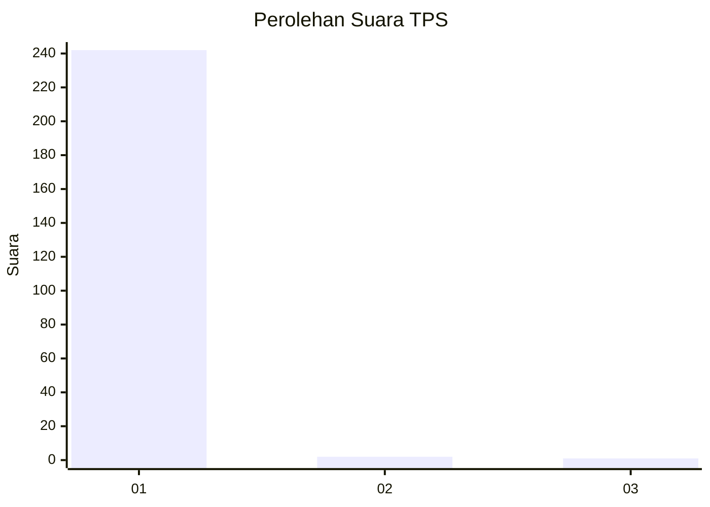
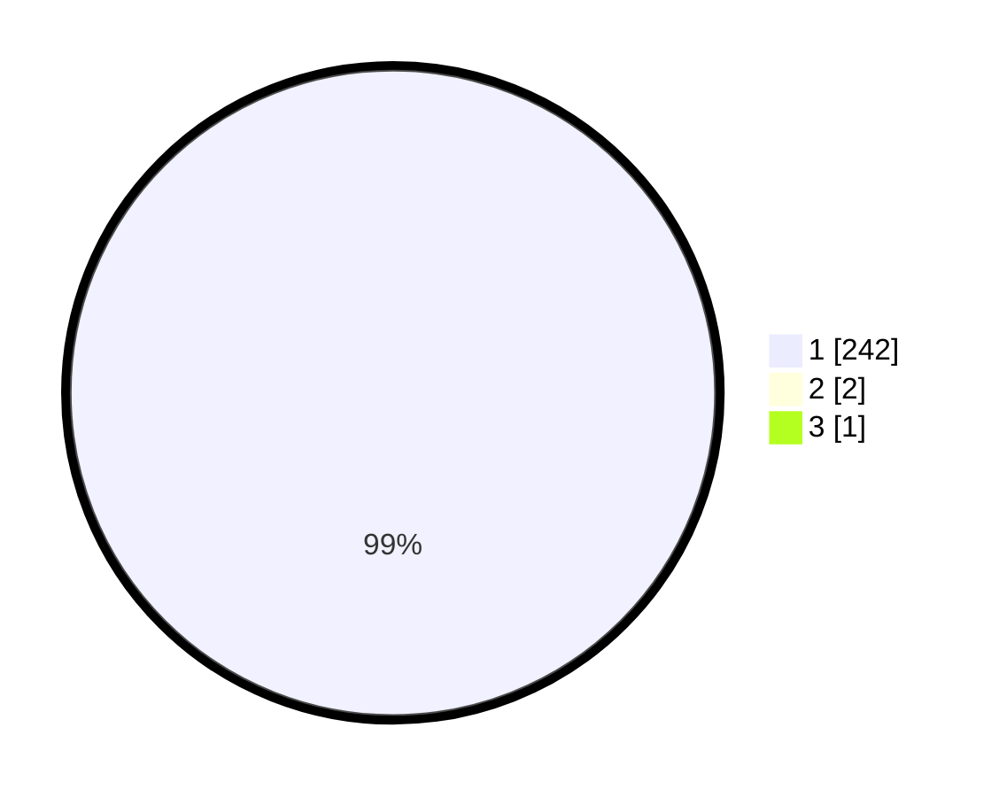

# Hasil

## Grafik

## Tabel

| No. | Nama Paslon    | Suara | Suara (raw) | Persentase |
|:--- |:-------------- | -----:| -----------:| ----------:|
| 1   | ANIES MUHAIMIN | 242   | [242][p-1]  | 98,78      |
| 2   | PRABOWO GIBRAN | 2     | [2][p-2]    | 0,82       |
| 3   | GANJAR MAHFUD  | 1     | [1][p-3]    | 0,41       |

[p-1]: https://github.com/gigit-pemilu/pemilu-2024/blob/main/pilpres/hitung-suara/sub/35-jawa-timur/sub/28-pamekasan/sub/11-batumarmar/sub/2001-bujur-barat/sub/021-tps/sub/paslon-1.txt
[p-2]: https://github.com/gigit-pemilu/pemilu-2024/blob/main/pilpres/hitung-suara/sub/35-jawa-timur/sub/28-pamekasan/sub/11-batumarmar/sub/2001-bujur-barat/sub/021-tps/sub/paslon-2.txt
[p-3]: https://github.com/gigit-pemilu/pemilu-2024/blob/main/pilpres/hitung-suara/sub/35-jawa-timur/sub/28-pamekasan/sub/11-batumarmar/sub/2001-bujur-barat/sub/021-tps/sub/paslon-3.txt

## Foto C Plano

https://sirekap-obj-formc.kpu.go.id/3cba/pemilu/ppwp/35/28/11/20/01/3528112001021-20240214-191933--7751f951-d02d-4c73-a65e-f03359f0ff2d.jpg

https://sirekap-obj-formc.kpu.go.id/3cba/pemilu/ppwp/35/28/11/20/01/3528112001021-20240214-192111--69ddc813-e029-4a88-b773-f79efacea09c.jpg

https://sirekap-obj-formc.kpu.go.id/3cba/pemilu/ppwp/35/28/11/20/01/3528112001021-20240214-192233--096d23bd-3517-485b-962e-f186954c4a69.jpg

## Metadata

| Key        | Value               |
| ---------- | ------------------- |
| Time Stamp | 2024-02-17 16:52:47 |

