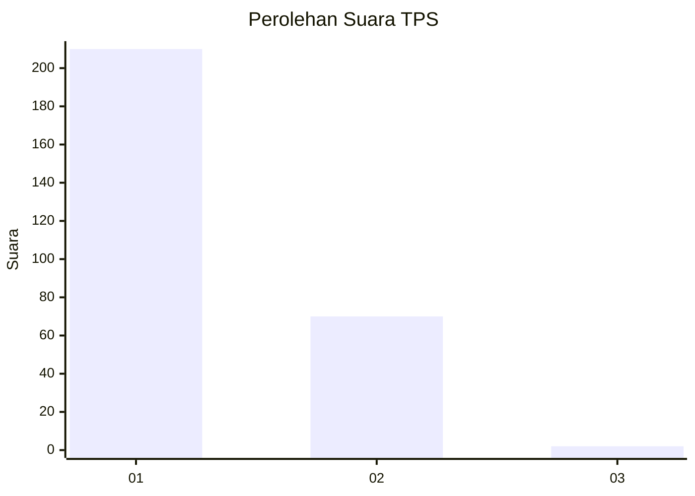
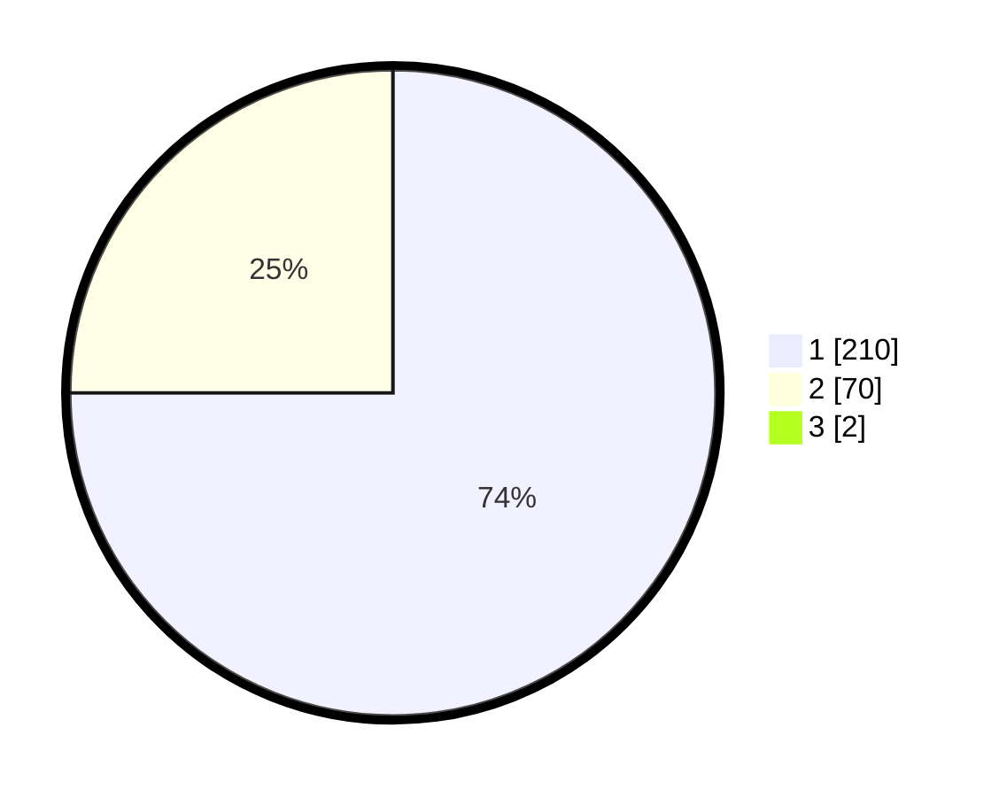

# Hasil

## Grafik

## Tabel

| No. | Nama Paslon    | Suara | Suara (raw) | Persentase |
|:--- |:-------------- | -----:| -----------:| ----------:|
| 1   | ANIES MUHAIMIN | 210   | [210][p-1]  | 74,47      |
| 2   | PRABOWO GIBRAN | 70    | [70][p-2]   | 24,82      |
| 3   | GANJAR MAHFUD  | 2     | [2][p-3]    | 0,71       |

[p-1]: https://github.com/gigit-pemilu/pemilu-2024-35-jawa-timur/blob/main/pilpres/hitung-suara/sub/35-jawa-timur/sub/28-pamekasan/sub/11-batumarmar/sub/2002-pangereman/sub/006-tps/sub/paslon-1.txt
[p-2]: https://github.com/gigit-pemilu/pemilu-2024-35-jawa-timur/blob/main/pilpres/hitung-suara/sub/35-jawa-timur/sub/28-pamekasan/sub/11-batumarmar/sub/2002-pangereman/sub/006-tps/sub/paslon-2.txt
[p-3]: https://github.com/gigit-pemilu/pemilu-2024-35-jawa-timur/blob/main/pilpres/hitung-suara/sub/35-jawa-timur/sub/28-pamekasan/sub/11-batumarmar/sub/2002-pangereman/sub/006-tps/sub/paslon-3.txt

## Foto C Plano

https://sirekap-obj-formc.kpu.go.id/170d/pemilu/ppwp/35/28/11/20/02/3528112002006-20240214-214714--1dc3a676-6384-471d-b154-e9da5aca85e3.jpg

https://sirekap-obj-formc.kpu.go.id/170d/pemilu/ppwp/35/28/11/20/02/3528112002006-20240214-214857--2b08ed76-94d6-459d-8953-baff26bc0a8d.jpg

https://sirekap-obj-formc.kpu.go.id/170d/pemilu/ppwp/35/28/11/20/02/3528112002006-20240214-215046--7a0221db-94bb-4542-975a-a46710cfb324.jpg

## Metadata

| Key        | Value               |
| ---------- | ------------------- |
| Time Stamp | 2024-02-17 16:52:47 |

