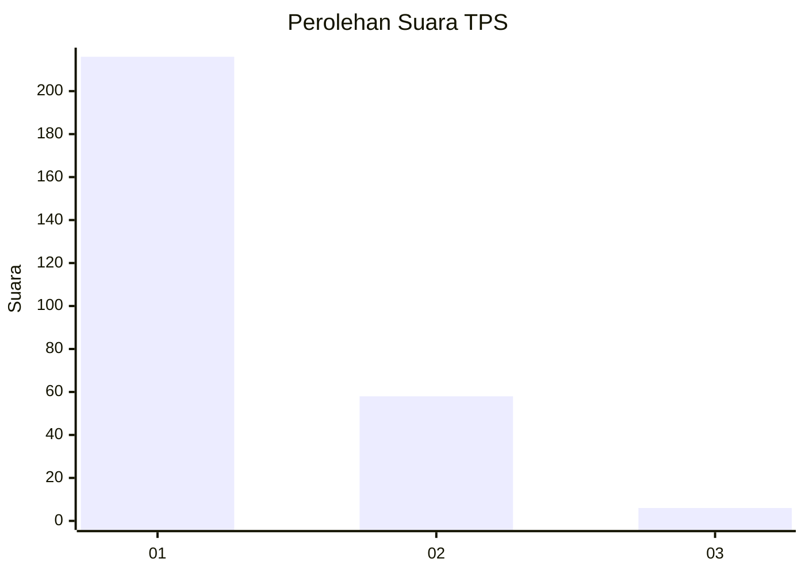
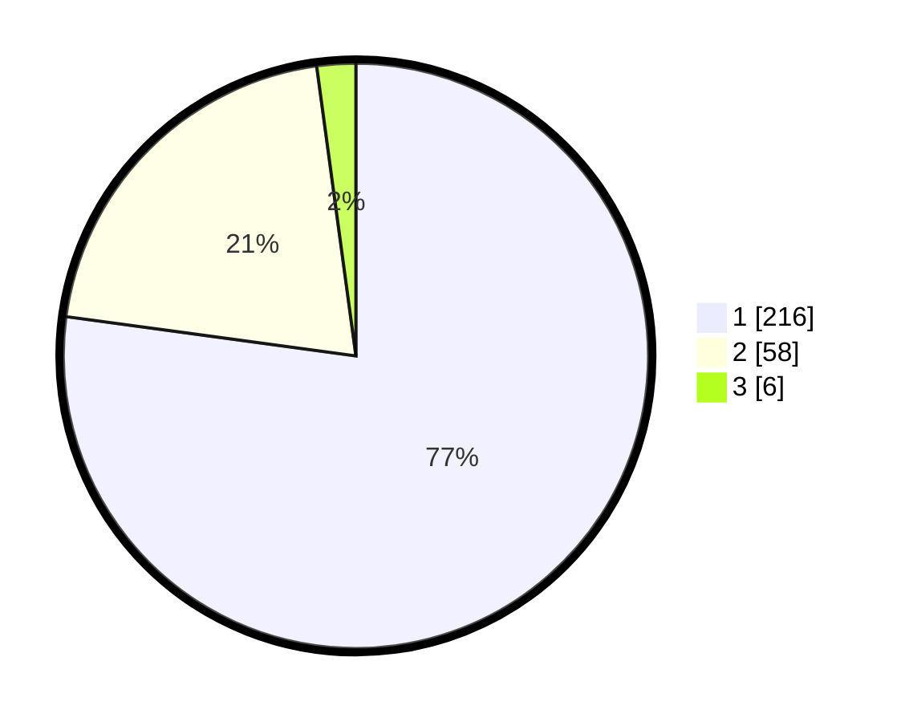

# Hasil

## Grafik

## Tabel

| No. | Nama Paslon    | Suara | Suara (raw) | Persentase |
|:--- |:-------------- | -----:| -----------:| ----------:|
| 1   | ANIES MUHAIMIN | 216   | [216][p-1]  | 77,14      |
| 2   | PRABOWO GIBRAN | 58    | [58][p-2]   | 20,71      |
| 3   | GANJAR MAHFUD  | 6     | [6][p-3]    | 2,14       |

[p-1]: https://github.com/gigit-pemilu/pemilu-2024/blob/main/pilpres/hitung-suara/sub/35-jawa-timur/sub/28-pamekasan/sub/11-batumarmar/sub/2002-pangereman/sub/007-tps/sub/paslon-1.txt
[p-2]: https://github.com/gigit-pemilu/pemilu-2024/blob/main/pilpres/hitung-suara/sub/35-jawa-timur/sub/28-pamekasan/sub/11-batumarmar/sub/2002-pangereman/sub/007-tps/sub/paslon-2.txt
[p-3]: https://github.com/gigit-pemilu/pemilu-2024/blob/main/pilpres/hitung-suara/sub/35-jawa-timur/sub/28-pamekasan/sub/11-batumarmar/sub/2002-pangereman/sub/007-tps/sub/paslon-3.txt

## Foto C Plano

https://sirekap-obj-formc.kpu.go.id/fd93/pemilu/ppwp/35/28/11/20/02/3528112002007-20240214-230945--dacd3048-11b2-4cb7-a64b-8618d6539167.jpg

https://sirekap-obj-formc.kpu.go.id/fd93/pemilu/ppwp/35/28/11/20/02/3528112002007-20240214-231137--b7617383-2b32-4830-a9fe-49855c867f88.jpg

https://sirekap-obj-formc.kpu.go.id/fd93/pemilu/ppwp/35/28/11/20/02/3528112002007-20240214-231259--558ffb1f-47f5-4216-91ad-eb50d0968563.jpg

## Metadata

| Key        | Value               |
| ---------- | ------------------- |
| Time Stamp | 2024-02-24 22:31:28 |

