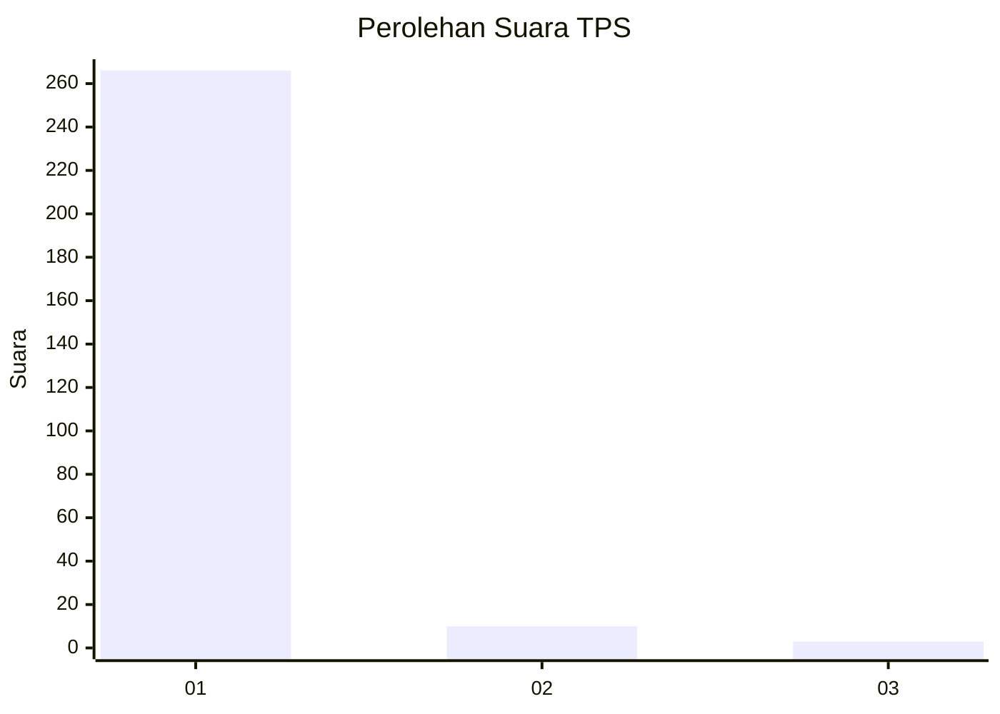
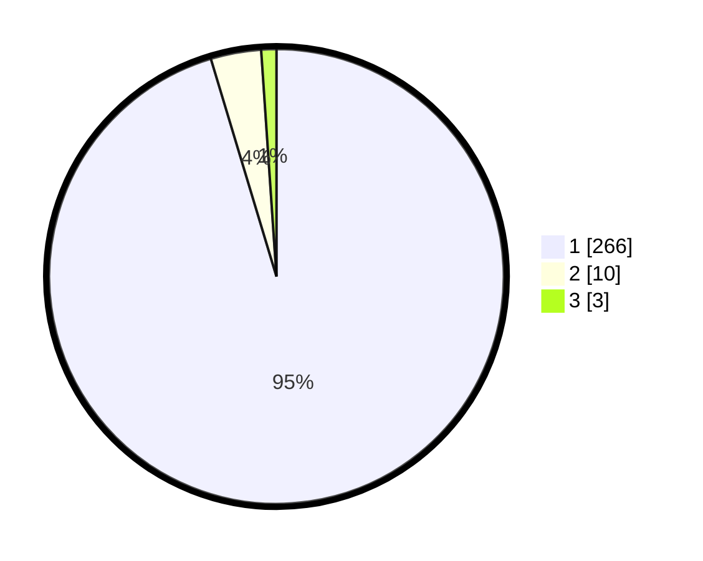

# Hasil

## Grafik

## Tabel

| No. | Nama Paslon    | Suara | Suara (raw) | Persentase |
|:--- |:-------------- | -----:| -----------:| ----------:|
| 1   | ANIES MUHAIMIN | 266   | [266][p-1]  | 95,34      |
| 2   | PRABOWO GIBRAN | 10    | [10][p-2]   | 3,58       |
| 3   | GANJAR MAHFUD  | 3     | [3][p-3]    | 1,08       |

[p-1]: https://github.com/gigit-pemilu/pemilu-2024-35-jawa-timur/blob/main/pilpres/hitung-suara/sub/35-jawa-timur/sub/28-pamekasan/sub/11-batumarmar/sub/2002-pangereman/sub/009-tps/sub/paslon-1.txt
[p-2]: https://github.com/gigit-pemilu/pemilu-2024-35-jawa-timur/blob/main/pilpres/hitung-suara/sub/35-jawa-timur/sub/28-pamekasan/sub/11-batumarmar/sub/2002-pangereman/sub/009-tps/sub/paslon-2.txt
[p-3]: https://github.com/gigit-pemilu/pemilu-2024-35-jawa-timur/blob/main/pilpres/hitung-suara/sub/35-jawa-timur/sub/28-pamekasan/sub/11-batumarmar/sub/2002-pangereman/sub/009-tps/sub/paslon-3.txt

## Foto C Plano

https://sirekap-obj-formc.kpu.go.id/c364/pemilu/ppwp/35/28/11/20/02/3528112002009-20240214-223253--44c2c02d-a700-4cd7-b4b0-7386cbed8dc8.jpg

https://sirekap-obj-formc.kpu.go.id/c364/pemilu/ppwp/35/28/11/20/02/3528112002009-20240214-223357--50a5c6b4-e07c-4856-8a99-ff357ccc18aa.jpg

https://sirekap-obj-formc.kpu.go.id/c364/pemilu/ppwp/35/28/11/20/02/3528112002009-20240214-223430--42155c8d-91c4-4fbc-b146-6261454f2bd6.jpg

## Metadata

| Key        | Value               |
| ---------- | ------------------- |
| Time Stamp | 2024-02-25 15:00:00 |

