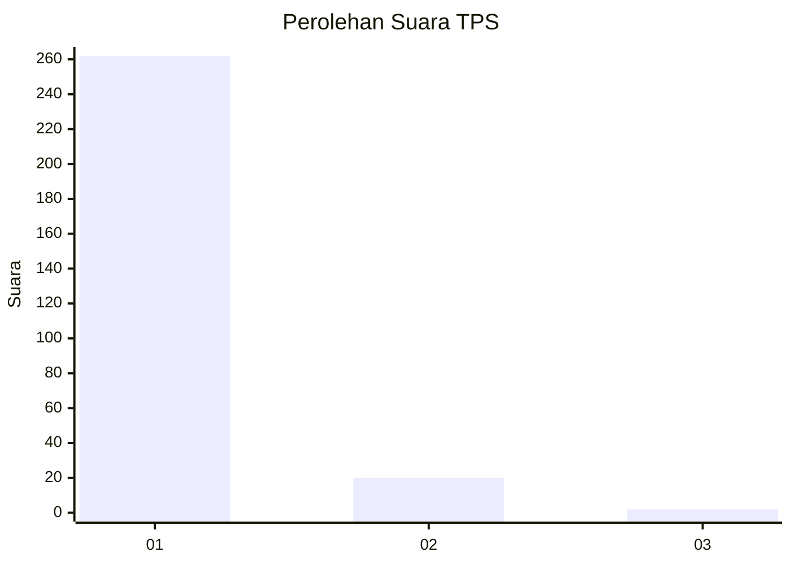
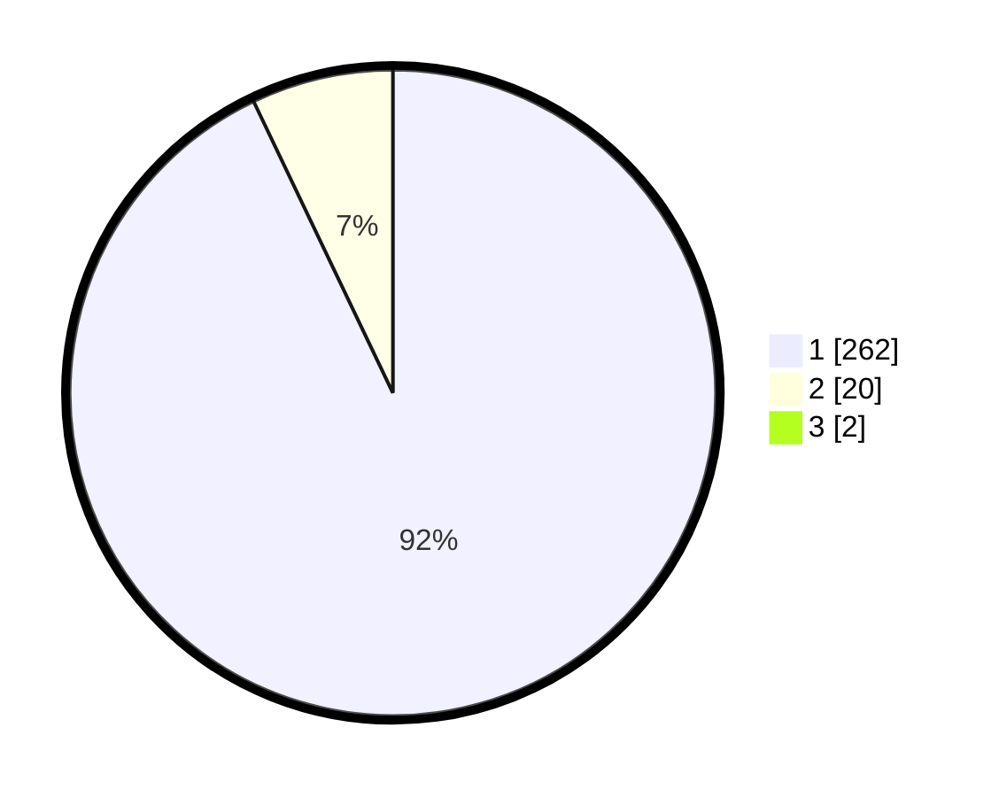

# Hasil

## Grafik

## Tabel

| No. | Nama Paslon    | Suara | Suara (raw) | Persentase |
|:--- |:-------------- | -----:| -----------:| ----------:|
| 1   | ANIES MUHAIMIN | 262   | [262][p-1]  | 92,25      |
| 2   | PRABOWO GIBRAN | 20    | [20][p-2]   | 7,04       |
| 3   | GANJAR MAHFUD  | 2     | [2][p-3]    | 0,70       |

[p-1]: https://github.com/gigit-pemilu/pemilu-2024-35-jawa-timur/blob/main/pilpres/hitung-suara/sub/35-jawa-timur/sub/28-pamekasan/sub/11-batumarmar/sub/2002-pangereman/sub/010-tps/sub/paslon-1.txt
[p-2]: https://github.com/gigit-pemilu/pemilu-2024-35-jawa-timur/blob/main/pilpres/hitung-suara/sub/35-jawa-timur/sub/28-pamekasan/sub/11-batumarmar/sub/2002-pangereman/sub/010-tps/sub/paslon-2.txt
[p-3]: https://github.com/gigit-pemilu/pemilu-2024-35-jawa-timur/blob/main/pilpres/hitung-suara/sub/35-jawa-timur/sub/28-pamekasan/sub/11-batumarmar/sub/2002-pangereman/sub/010-tps/sub/paslon-3.txt

## Foto C Plano

https://sirekap-obj-formc.kpu.go.id/8087/pemilu/ppwp/35/28/11/20/02/3528112002010-20240214-230829--73a040a6-e898-4018-bf97-0d8abb8d974f.jpg

https://sirekap-obj-formc.kpu.go.id/8087/pemilu/ppwp/35/28/11/20/02/3528112002010-20240214-230954--9e27f85e-8666-445f-bb4d-73b4aed12fdf.jpg

https://sirekap-obj-formc.kpu.go.id/8087/pemilu/ppwp/35/28/11/20/02/3528112002010-20240214-231049--3127e1a5-d42d-465e-8a1e-a3d62da80c06.jpg

## Metadata

| Key        | Value               |
| ---------- | ------------------- |
| Time Stamp | 2024-02-25 11:00:00 |

