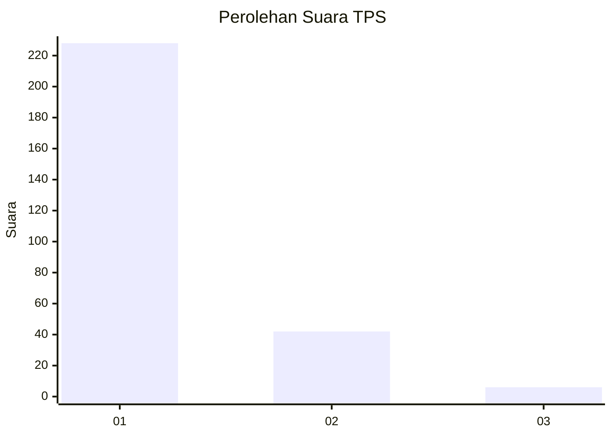
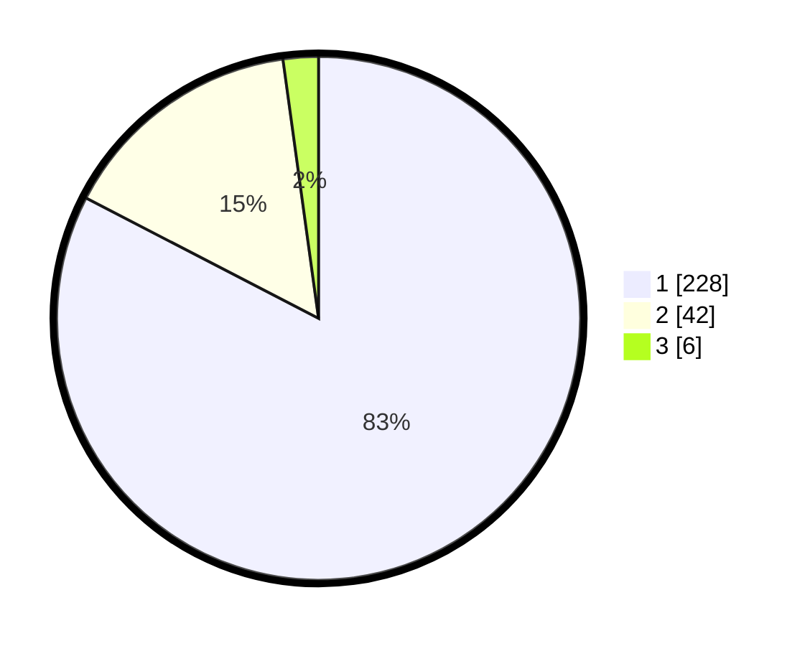

# Hasil

## Grafik

## Tabel

| No. | Nama Paslon    | Suara | Suara (raw) | Persentase |
|:--- |:-------------- | -----:| -----------:| ----------:|
| 1   | ANIES MUHAIMIN | 228   | [228][p-1]  | 82,61      |
| 2   | PRABOWO GIBRAN | 42    | [42][p-2]   | 15,22      |
| 3   | GANJAR MAHFUD  | 6     | [6][p-3]    | 2,17       |

[p-1]: https://github.com/gigit-pemilu/pemilu-2024-35-jawa-timur/blob/main/pilpres/hitung-suara/sub/35-jawa-timur/sub/28-pamekasan/sub/11-batumarmar/sub/2002-pangereman/sub/011-tps/sub/paslon-1.txt
[p-2]: https://github.com/gigit-pemilu/pemilu-2024-35-jawa-timur/blob/main/pilpres/hitung-suara/sub/35-jawa-timur/sub/28-pamekasan/sub/11-batumarmar/sub/2002-pangereman/sub/011-tps/sub/paslon-2.txt
[p-3]: https://github.com/gigit-pemilu/pemilu-2024-35-jawa-timur/blob/main/pilpres/hitung-suara/sub/35-jawa-timur/sub/28-pamekasan/sub/11-batumarmar/sub/2002-pangereman/sub/011-tps/sub/paslon-3.txt

## Foto C Plano

https://sirekap-obj-formc.kpu.go.id/738a/pemilu/ppwp/35/28/11/20/02/3528112002011-20240214-212821--9785d13d-3f45-4274-aa99-e6dd0b29ccfb.jpg

https://sirekap-obj-formc.kpu.go.id/738a/pemilu/ppwp/35/28/11/20/02/3528112002011-20240214-213231--7bf00bb2-5263-4004-84fd-cd4022569fb9.jpg

https://sirekap-obj-formc.kpu.go.id/738a/pemilu/ppwp/35/28/11/20/02/3528112002011-20240214-213856--891dddb9-8398-414c-afdd-62cb8788170d.jpg

## Metadata

| Key        | Value               |
| ---------- | ------------------- |
| Time Stamp | 2024-02-17 16:52:47 |

