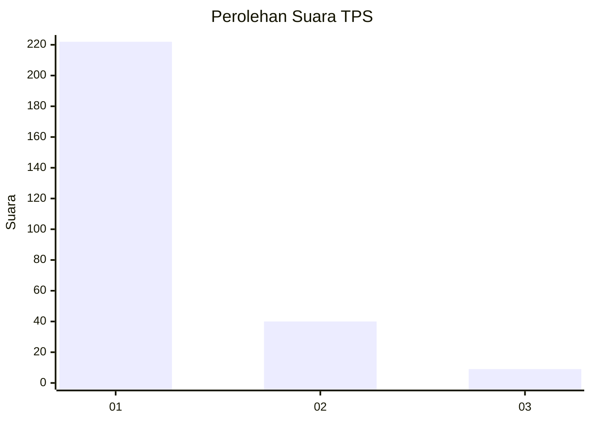
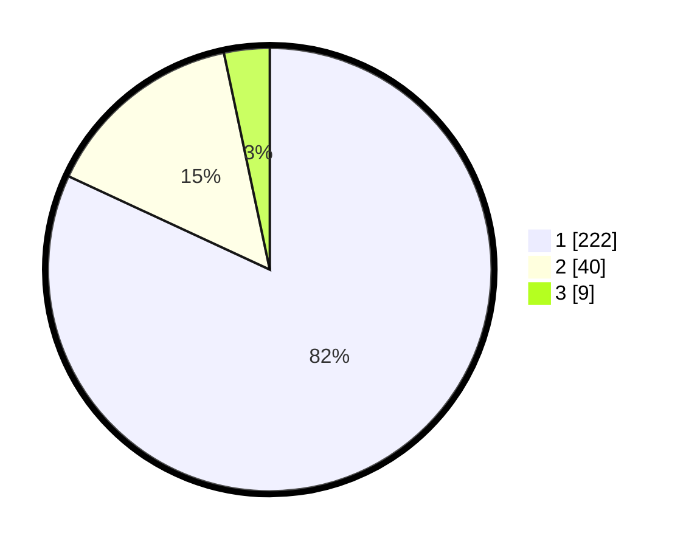

# Hasil

## Grafik

## Tabel

| No. | Nama Paslon    | Suara | Suara (raw) | Persentase |
|:--- |:-------------- | -----:| -----------:| ----------:|
| 1   | ANIES MUHAIMIN | 222   | [222][p-1]  | 81,92      |
| 2   | PRABOWO GIBRAN | 40    | [40][p-2]   | 14,76      |
| 3   | GANJAR MAHFUD  | 9     | [9][p-3]    | 3,32       |

[p-1]: https://github.com/gigit-pemilu/pemilu-2024/blob/main/pilpres/hitung-suara/sub/35-jawa-timur/sub/28-pamekasan/sub/11-batumarmar/sub/2002-pangereman/sub/012-tps/sub/paslon-1.txt
[p-2]: https://github.com/gigit-pemilu/pemilu-2024/blob/main/pilpres/hitung-suara/sub/35-jawa-timur/sub/28-pamekasan/sub/11-batumarmar/sub/2002-pangereman/sub/012-tps/sub/paslon-2.txt
[p-3]: https://github.com/gigit-pemilu/pemilu-2024/blob/main/pilpres/hitung-suara/sub/35-jawa-timur/sub/28-pamekasan/sub/11-batumarmar/sub/2002-pangereman/sub/012-tps/sub/paslon-3.txt

## Foto C Plano

https://sirekap-obj-formc.kpu.go.id/d9ea/pemilu/ppwp/35/28/11/20/02/3528112002012-20240214-230352--2e63445c-4ea8-4478-ab86-5eeb298fbf4a.jpg

https://sirekap-obj-formc.kpu.go.id/d9ea/pemilu/ppwp/35/28/11/20/02/3528112002012-20240214-230603--a11d2d30-9bc4-44e3-ae1a-4f8be98ee211.jpg

https://sirekap-obj-formc.kpu.go.id/d9ea/pemilu/ppwp/35/28/11/20/02/3528112002012-20240214-230739--81d0cf16-f560-4ec0-a4eb-8e32bd3c100f.jpg

## Metadata

| Key        | Value               |
| ---------- | ------------------- |
| Time Stamp | 2024-02-24 22:31:28 |

