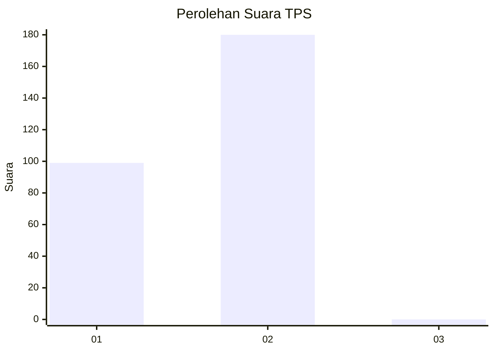
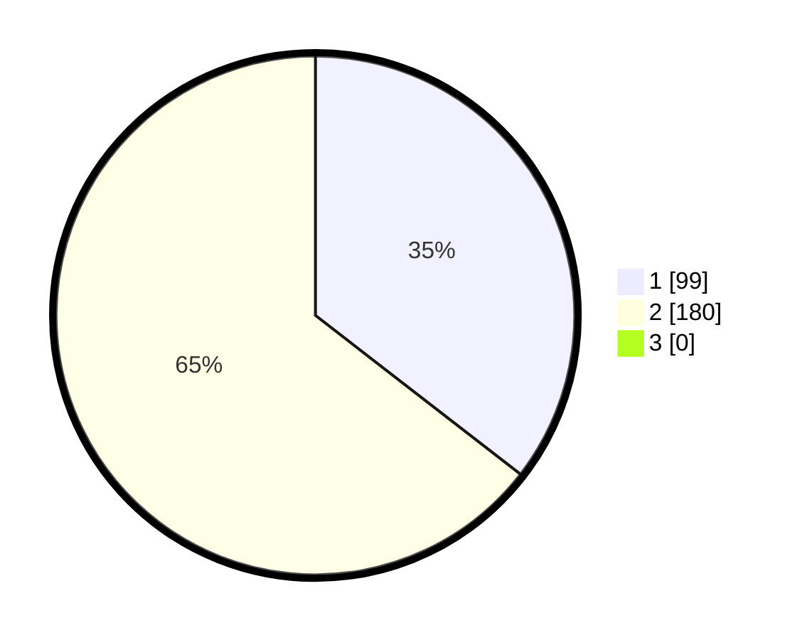

# Hasil

## Grafik

## Tabel

| No. | Nama Paslon    | Suara | Suara (raw) | Persentase |
|:--- |:-------------- | -----:| -----------:| ----------:|
| 1   | ANIES MUHAIMIN | 99    | [99][p-1]   | 35,48      |
| 2   | PRABOWO GIBRAN | 180   | [180][p-2]  | 64,52      |
| 3   | GANJAR MAHFUD  | 0     | [0][p-3]    | 0,00       |

[p-1]: https://github.com/gigit-pemilu/pemilu-2024-35-jawa-timur/blob/main/pilpres/hitung-suara/sub/35-jawa-timur/sub/28-pamekasan/sub/11-batumarmar/sub/2003-bangserreh/sub/001-tps/sub/paslon-1.txt
[p-2]: https://github.com/gigit-pemilu/pemilu-2024-35-jawa-timur/blob/main/pilpres/hitung-suara/sub/35-jawa-timur/sub/28-pamekasan/sub/11-batumarmar/sub/2003-bangserreh/sub/001-tps/sub/paslon-2.txt
[p-3]: https://github.com/gigit-pemilu/pemilu-2024-35-jawa-timur/blob/main/pilpres/hitung-suara/sub/35-jawa-timur/sub/28-pamekasan/sub/11-batumarmar/sub/2003-bangserreh/sub/001-tps/sub/paslon-3.txt

## Foto C Plano

https://sirekap-obj-formc.kpu.go.id/1fa0/pemilu/ppwp/35/28/11/20/03/3528112003001-20240215-110851--d4c0abe1-1559-418b-8e1d-ec623b416354.jpg

https://sirekap-obj-formc.kpu.go.id/1fa0/pemilu/ppwp/35/28/11/20/03/3528112003001-20240215-111115--10212062-c458-4038-94c2-fa38824d3b35.jpg

https://sirekap-obj-formc.kpu.go.id/1fa0/pemilu/ppwp/35/28/11/20/03/3528112003001-20240215-111432--d9f24036-d314-444f-8b79-3e54be4544dd.jpg

## Metadata

| Key        | Value               |
| ---------- | ------------------- |
| Time Stamp | 2024-02-17 16:52:47 |

