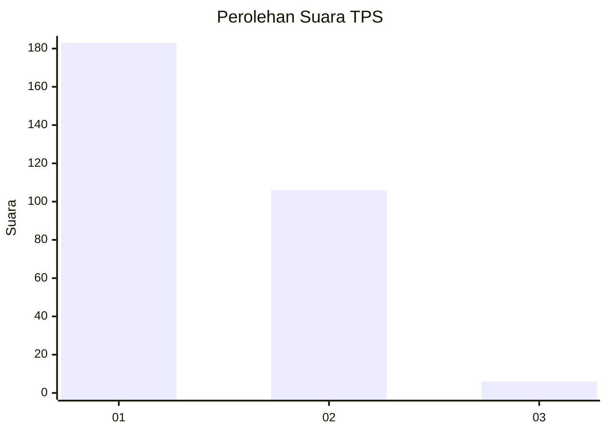
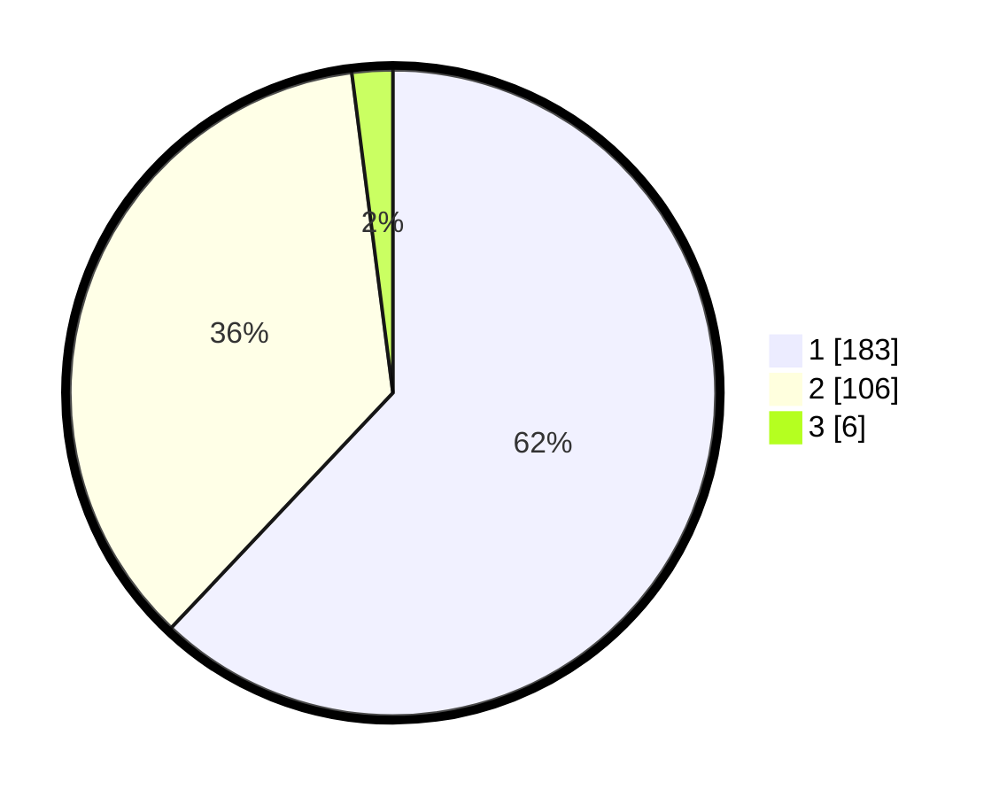

# Hasil

## Grafik

## Tabel

| No. | Nama Paslon    | Suara | Suara (raw) | Persentase |
|:--- |:-------------- | -----:| -----------:| ----------:|
| 1   | ANIES MUHAIMIN | 183   | [183][p-1]  | 62,03      |
| 2   | PRABOWO GIBRAN | 106   | [106][p-2]  | 35,93      |
| 3   | GANJAR MAHFUD  | 6     | [6][p-3]    | 2,03       |

[p-1]: https://github.com/gigit-pemilu/pemilu-2024-35-jawa-timur/blob/main/pilpres/hitung-suara/sub/35-jawa-timur/sub/28-pamekasan/sub/11-batumarmar/sub/2003-bangserreh/sub/003-tps/sub/paslon-1.txt
[p-2]: https://github.com/gigit-pemilu/pemilu-2024-35-jawa-timur/blob/main/pilpres/hitung-suara/sub/35-jawa-timur/sub/28-pamekasan/sub/11-batumarmar/sub/2003-bangserreh/sub/003-tps/sub/paslon-2.txt
[p-3]: https://github.com/gigit-pemilu/pemilu-2024-35-jawa-timur/blob/main/pilpres/hitung-suara/sub/35-jawa-timur/sub/28-pamekasan/sub/11-batumarmar/sub/2003-bangserreh/sub/003-tps/sub/paslon-3.txt

## Foto C Plano

https://sirekap-obj-formc.kpu.go.id/f644/pemilu/ppwp/35/28/11/20/03/3528112003003-20240215-144338--0dabca5b-1b87-4efa-b2f8-605ade702f4c.jpg

https://sirekap-obj-formc.kpu.go.id/f644/pemilu/ppwp/35/28/11/20/03/3528112003003-20240215-144504--9e4b5244-d4fb-4a01-a41f-9de27844c50d.jpg

https://sirekap-obj-formc.kpu.go.id/f644/pemilu/ppwp/35/28/11/20/03/3528112003003-20240215-144616--3f8d30e0-a3f1-470f-b362-5625966120ea.jpg

## Metadata

| Key        | Value               |
| ---------- | ------------------- |
| Time Stamp | 2024-02-17 16:52:47 |

