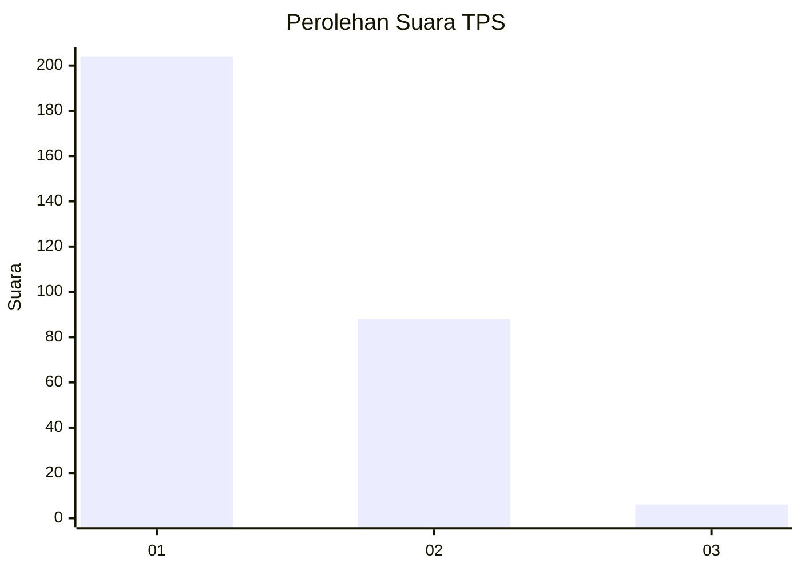
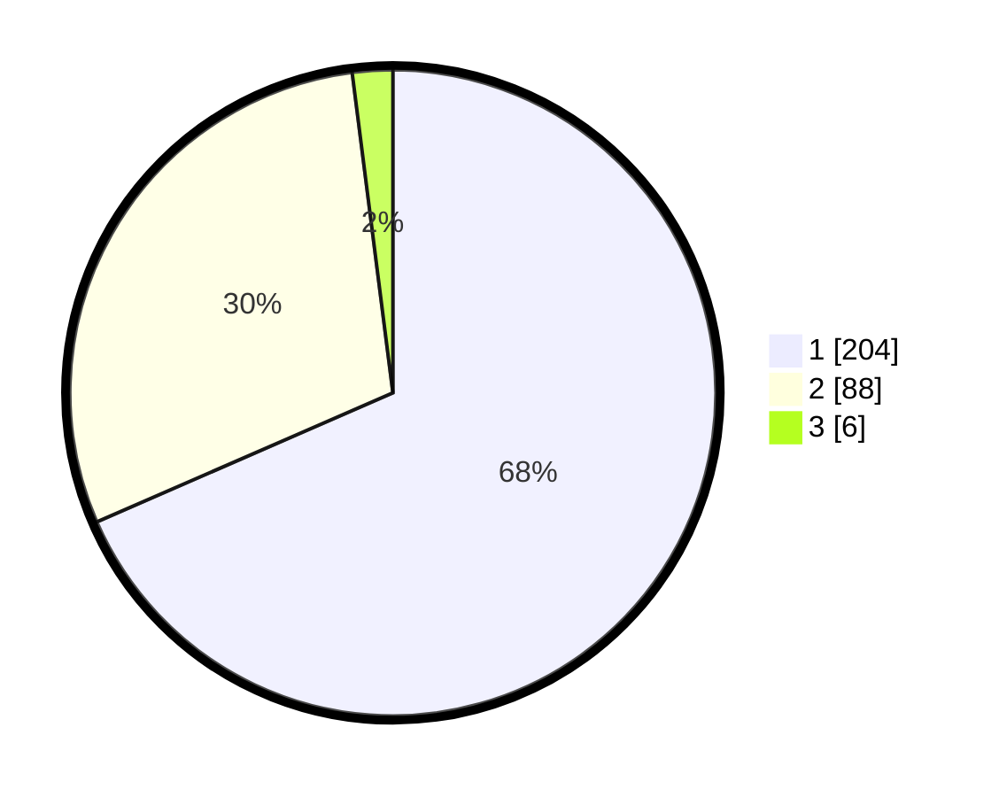

# Hasil

## Grafik

## Tabel

| No. | Nama Paslon    | Suara | Suara (raw) | Persentase |
|:--- |:-------------- | -----:| -----------:| ----------:|
| 1   | ANIES MUHAIMIN | 204   | [204][p-1]  | 68,46      |
| 2   | PRABOWO GIBRAN | 88    | [88][p-2]   | 29,53      |
| 3   | GANJAR MAHFUD  | 6     | [6][p-3]    | 2,01       |

[p-1]: https://github.com/gigit-pemilu/pemilu-2024/blob/main/pilpres/hitung-suara/sub/35-jawa-timur/sub/28-pamekasan/sub/11-batumarmar/sub/2003-bangserreh/sub/004-tps/sub/paslon-1.txt
[p-2]: https://github.com/gigit-pemilu/pemilu-2024/blob/main/pilpres/hitung-suara/sub/35-jawa-timur/sub/28-pamekasan/sub/11-batumarmar/sub/2003-bangserreh/sub/004-tps/sub/paslon-2.txt
[p-3]: https://github.com/gigit-pemilu/pemilu-2024/blob/main/pilpres/hitung-suara/sub/35-jawa-timur/sub/28-pamekasan/sub/11-batumarmar/sub/2003-bangserreh/sub/004-tps/sub/paslon-3.txt

## Foto C Plano

https://sirekap-obj-formc.kpu.go.id/f0d5/pemilu/ppwp/35/28/11/20/03/3528112003004-20240215-113447--04ef1701-eb9d-4d0e-a46d-14d49b852a89.jpg

https://sirekap-obj-formc.kpu.go.id/f0d5/pemilu/ppwp/35/28/11/20/03/3528112003004-20240215-114834--6e824dbc-f356-4a75-94c5-ffad08124801.jpg

https://sirekap-obj-formc.kpu.go.id/f0d5/pemilu/ppwp/35/28/11/20/03/3528112003004-20240215-115330--e0a70b05-68b8-4d01-a8af-5877c64b8fd1.jpg

## Metadata

| Key        | Value               |
| ---------- | ------------------- |
| Time Stamp | 2024-02-17 16:52:47 |

