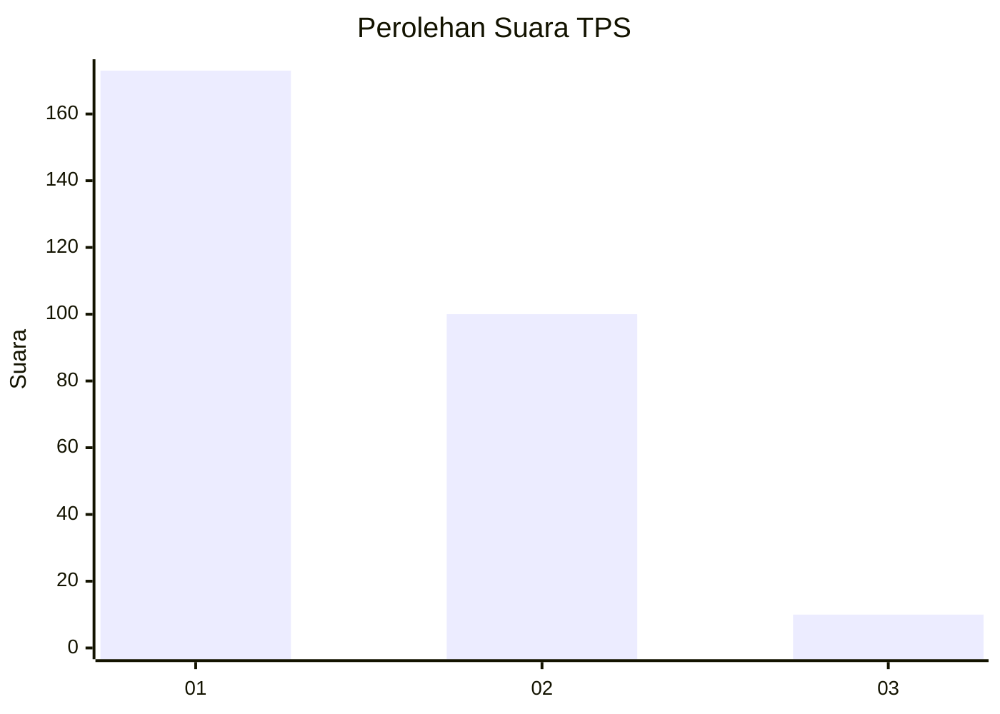
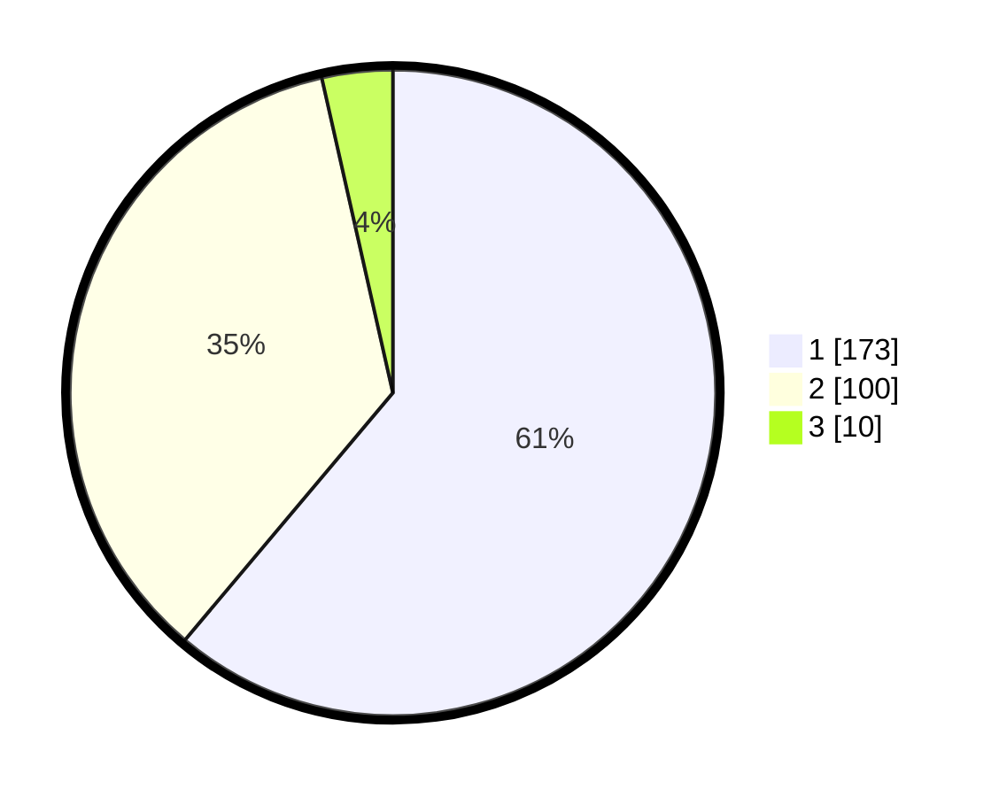

# Hasil

## Grafik

## Tabel

| No. | Nama Paslon    | Suara | Suara (raw) | Persentase |
|:--- |:-------------- | -----:| -----------:| ----------:|
| 1   | ANIES MUHAIMIN | 173   | [173][p-1]  | 61,13      |
| 2   | PRABOWO GIBRAN | 100   | [100][p-2]  | 35,34      |
| 3   | GANJAR MAHFUD  | 10    | [10][p-3]   | 3,53       |

[p-1]: https://github.com/gigit-pemilu/pemilu-2024-35-jawa-timur/blob/main/pilpres/hitung-suara/sub/35-jawa-timur/sub/28-pamekasan/sub/11-batumarmar/sub/2003-bangserreh/sub/005-tps/sub/paslon-1.txt
[p-2]: https://github.com/gigit-pemilu/pemilu-2024-35-jawa-timur/blob/main/pilpres/hitung-suara/sub/35-jawa-timur/sub/28-pamekasan/sub/11-batumarmar/sub/2003-bangserreh/sub/005-tps/sub/paslon-2.txt
[p-3]: https://github.com/gigit-pemilu/pemilu-2024-35-jawa-timur/blob/main/pilpres/hitung-suara/sub/35-jawa-timur/sub/28-pamekasan/sub/11-batumarmar/sub/2003-bangserreh/sub/005-tps/sub/paslon-3.txt

## Foto C Plano

https://sirekap-obj-formc.kpu.go.id/8b09/pemilu/ppwp/35/28/11/20/03/3528112003005-20240215-134739--5f01afe7-2c8a-4b5b-a61a-a1fc875b447f.jpg

https://sirekap-obj-formc.kpu.go.id/8b09/pemilu/ppwp/35/28/11/20/03/3528112003005-20240215-135000--09ec3872-e866-43c9-af14-347ab91bda06.jpg

https://sirekap-obj-formc.kpu.go.id/8b09/pemilu/ppwp/35/28/11/20/03/3528112003005-20240215-135039--9ad9adf9-4f2c-485c-ae45-115579dcddc5.jpg

## Metadata

| Key        | Value               |
| ---------- | ------------------- |
| Time Stamp | 2024-02-17 12:00:00 |

