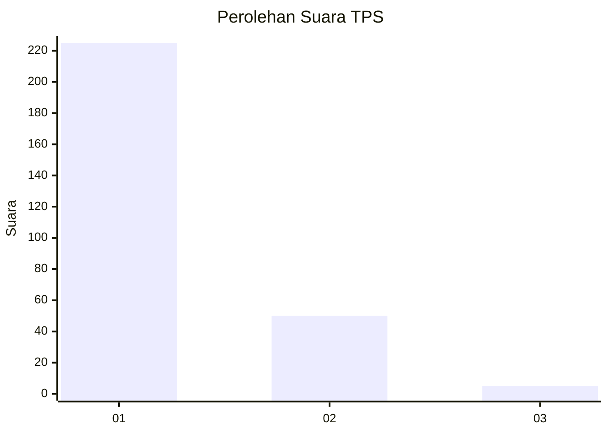
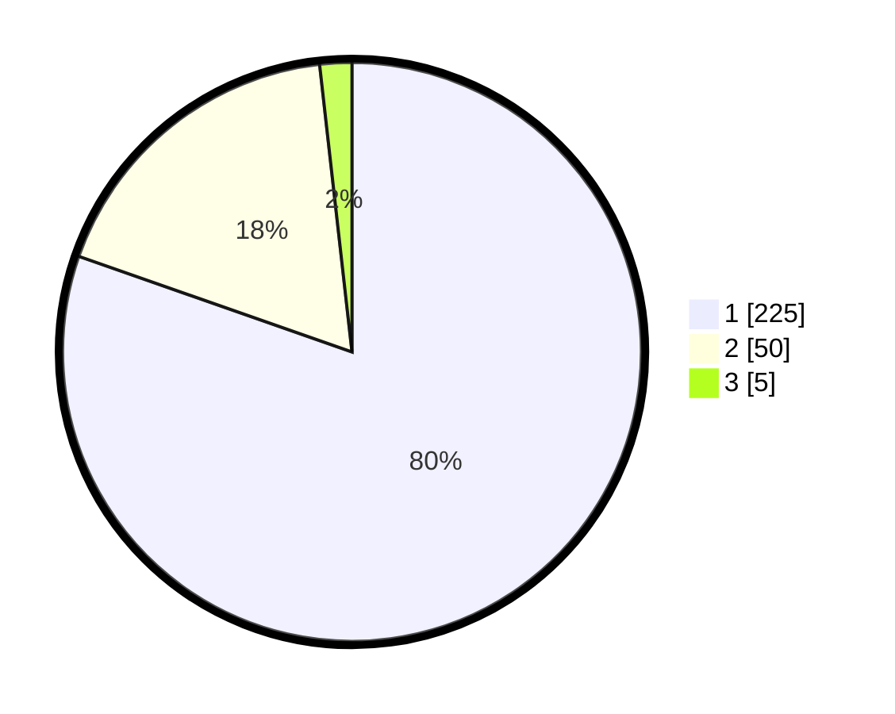

# Hasil

## Grafik

## Tabel

| No. | Nama Paslon    | Suara | Suara (raw) | Persentase |
|:--- |:-------------- | -----:| -----------:| ----------:|
| 1   | ANIES MUHAIMIN | 225   | [225][p-1]  | 80,36      |
| 2   | PRABOWO GIBRAN | 50    | [50][p-2]   | 17,86      |
| 3   | GANJAR MAHFUD  | 5     | [5][p-3]    | 1,79       |

[p-1]: https://github.com/gigit-pemilu/pemilu-2024/blob/main/pilpres/hitung-suara/sub/35-jawa-timur/sub/28-pamekasan/sub/11-batumarmar/sub/2003-bangserreh/sub/006-tps/sub/paslon-1.txt
[p-2]: https://github.com/gigit-pemilu/pemilu-2024/blob/main/pilpres/hitung-suara/sub/35-jawa-timur/sub/28-pamekasan/sub/11-batumarmar/sub/2003-bangserreh/sub/006-tps/sub/paslon-2.txt
[p-3]: https://github.com/gigit-pemilu/pemilu-2024/blob/main/pilpres/hitung-suara/sub/35-jawa-timur/sub/28-pamekasan/sub/11-batumarmar/sub/2003-bangserreh/sub/006-tps/sub/paslon-3.txt

## Foto C Plano

https://sirekap-obj-formc.kpu.go.id/9861/pemilu/ppwp/35/28/11/20/03/3528112003006-20240215-150757--a8c72caf-efa1-4360-965e-0402db0759d6.jpg

https://sirekap-obj-formc.kpu.go.id/9861/pemilu/ppwp/35/28/11/20/03/3528112003006-20240215-142356--09912cf7-f6db-4f94-97a6-9547c523fbc4.jpg

https://sirekap-obj-formc.kpu.go.id/9861/pemilu/ppwp/35/28/11/20/03/3528112003006-20240215-151128--e35c0ea3-c9ba-4da0-b125-81f5d07f810e.jpg

## Metadata

| Key        | Value               |
| ---------- | ------------------- |
| Time Stamp | 2024-02-17 12:00:00 |

