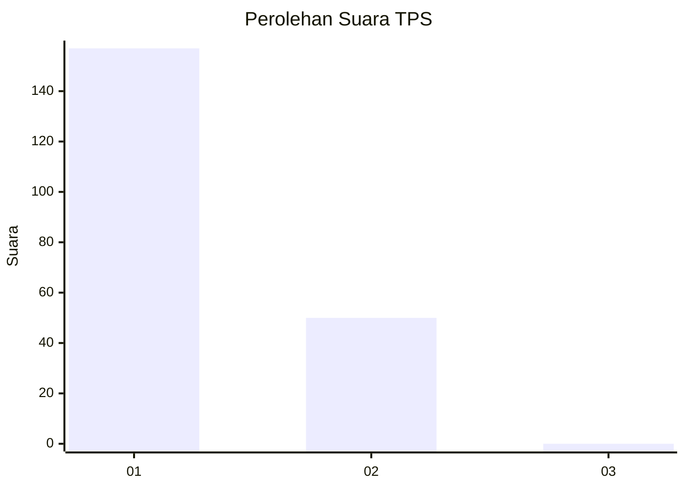
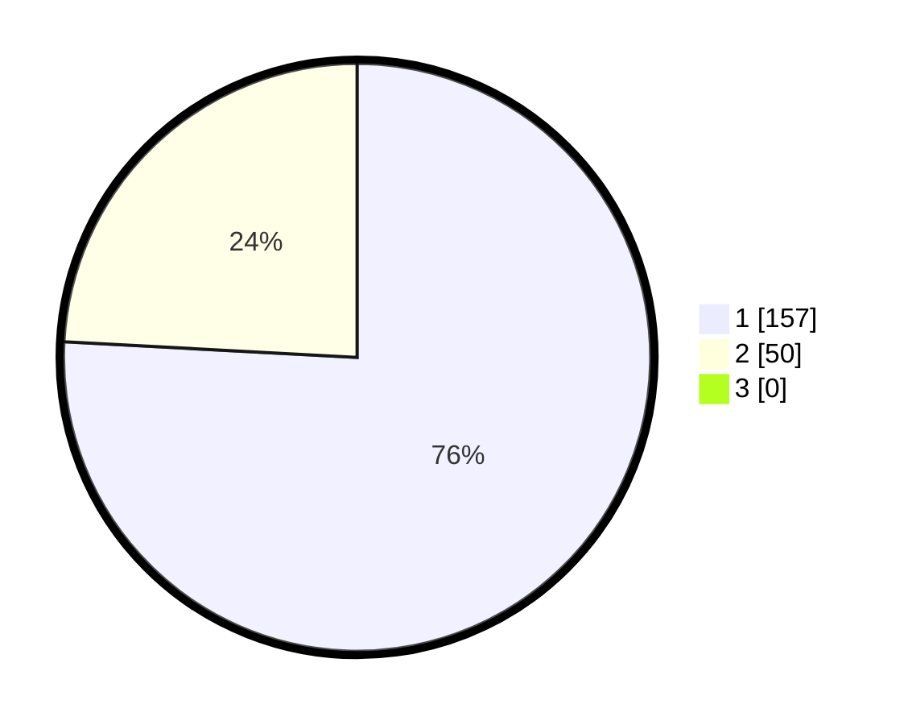

# Hasil

## Grafik

## Tabel

| No. | Nama Paslon    | Suara | Suara (raw) | Persentase |
|:--- |:-------------- | -----:| -----------:| ----------:|
| 1   | ANIES MUHAIMIN | 157   | [157][p-1]  | 75,85      |
| 2   | PRABOWO GIBRAN | 50    | [50][p-2]   | 24,15      |
| 3   | GANJAR MAHFUD  | 0     | [0][p-3]    | 0,00       |

[p-1]: https://github.com/gigit-pemilu/pemilu-2024/blob/main/pilpres/hitung-suara/sub/35-jawa-timur/sub/28-pamekasan/sub/11-batumarmar/sub/2003-bangserreh/sub/007-tps/sub/paslon-1.txt
[p-2]: https://github.com/gigit-pemilu/pemilu-2024/blob/main/pilpres/hitung-suara/sub/35-jawa-timur/sub/28-pamekasan/sub/11-batumarmar/sub/2003-bangserreh/sub/007-tps/sub/paslon-2.txt
[p-3]: https://github.com/gigit-pemilu/pemilu-2024/blob/main/pilpres/hitung-suara/sub/35-jawa-timur/sub/28-pamekasan/sub/11-batumarmar/sub/2003-bangserreh/sub/007-tps/sub/paslon-3.txt

## Foto C Plano

https://sirekap-obj-formc.kpu.go.id/27ef/pemilu/ppwp/35/28/11/20/03/3528112003007-20240215-104111--e3a63ebe-ad71-4b26-9000-e7d12c541dd6.jpg

https://sirekap-obj-formc.kpu.go.id/27ef/pemilu/ppwp/35/28/11/20/03/3528112003007-20240215-104941--1d475c08-24a5-4cf2-9bf8-0543b277762c.jpg

https://sirekap-obj-formc.kpu.go.id/27ef/pemilu/ppwp/35/28/11/20/03/3528112003007-20240215-105148--ee3a3273-0bf9-4ded-a5b4-cb3866c66330.jpg

## Metadata

| Key        | Value               |
| ---------- | ------------------- |
| Time Stamp | 2024-02-17 16:52:47 |

