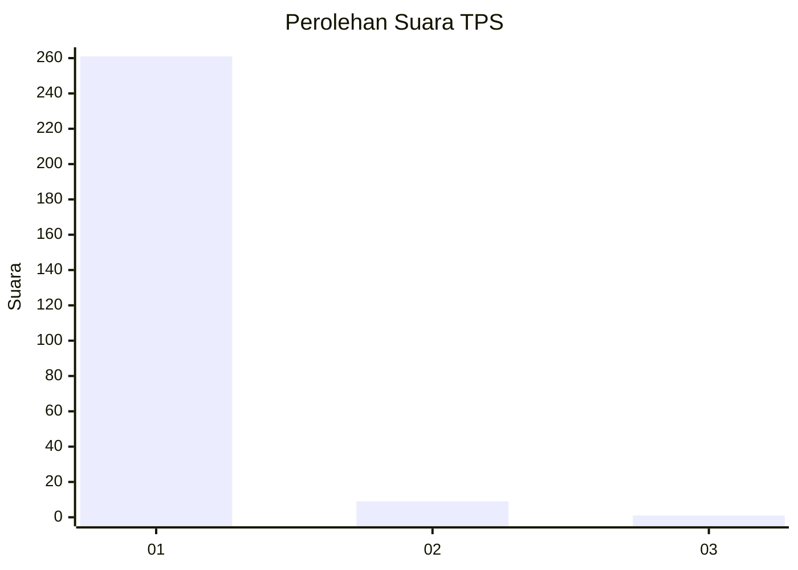
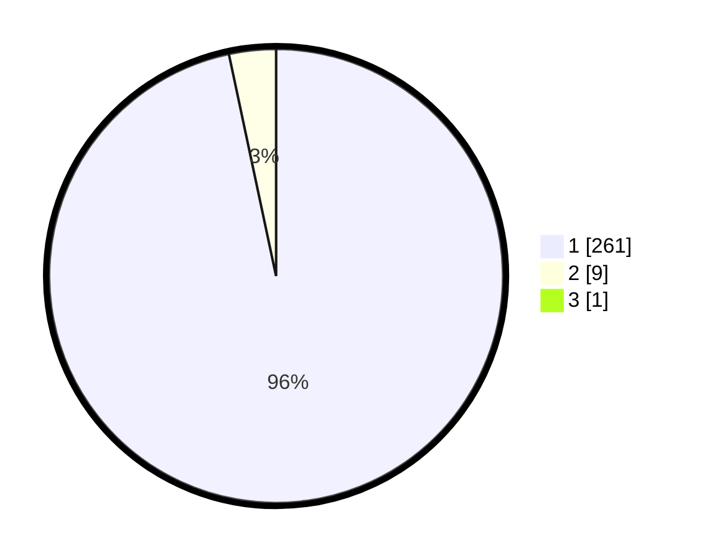

# Hasil

## Grafik

## Tabel

| No. | Nama Paslon    | Suara | Suara (raw) | Persentase |
|:--- |:-------------- | -----:| -----------:| ----------:|
| 1   | ANIES MUHAIMIN | 261   | [261][p-1]  | 96,31      |
| 2   | PRABOWO GIBRAN | 9     | [9][p-2]    | 3,32       |
| 3   | GANJAR MAHFUD  | 1     | [1][p-3]    | 0,37       |

[p-1]: https://github.com/gigit-pemilu/pemilu-2024/blob/main/pilpres/hitung-suara/sub/35-jawa-timur/sub/28-pamekasan/sub/11-batumarmar/sub/2003-bangserreh/sub/008-tps/sub/paslon-1.txt
[p-2]: https://github.com/gigit-pemilu/pemilu-2024/blob/main/pilpres/hitung-suara/sub/35-jawa-timur/sub/28-pamekasan/sub/11-batumarmar/sub/2003-bangserreh/sub/008-tps/sub/paslon-2.txt
[p-3]: https://github.com/gigit-pemilu/pemilu-2024/blob/main/pilpres/hitung-suara/sub/35-jawa-timur/sub/28-pamekasan/sub/11-batumarmar/sub/2003-bangserreh/sub/008-tps/sub/paslon-3.txt

## Foto C Plano

https://sirekap-obj-formc.kpu.go.id/070b/pemilu/ppwp/35/28/11/20/03/3528112003008-20240215-151959--3f58ba24-777f-4b20-b2cc-8b10d6a69759.jpg

https://sirekap-obj-formc.kpu.go.id/070b/pemilu/ppwp/35/28/11/20/03/3528112003008-20240215-152511--1cf9e4c2-b103-4cc0-9bd6-2ee2c6011666.jpg

https://sirekap-obj-formc.kpu.go.id/070b/pemilu/ppwp/35/28/11/20/03/3528112003008-20240215-153705--b8cca32b-6dc0-4a50-8264-f7a4720d4f0b.jpg

## Metadata

| Key        | Value               |
| ---------- | ------------------- |
| Time Stamp | 2024-02-17 16:52:47 |

