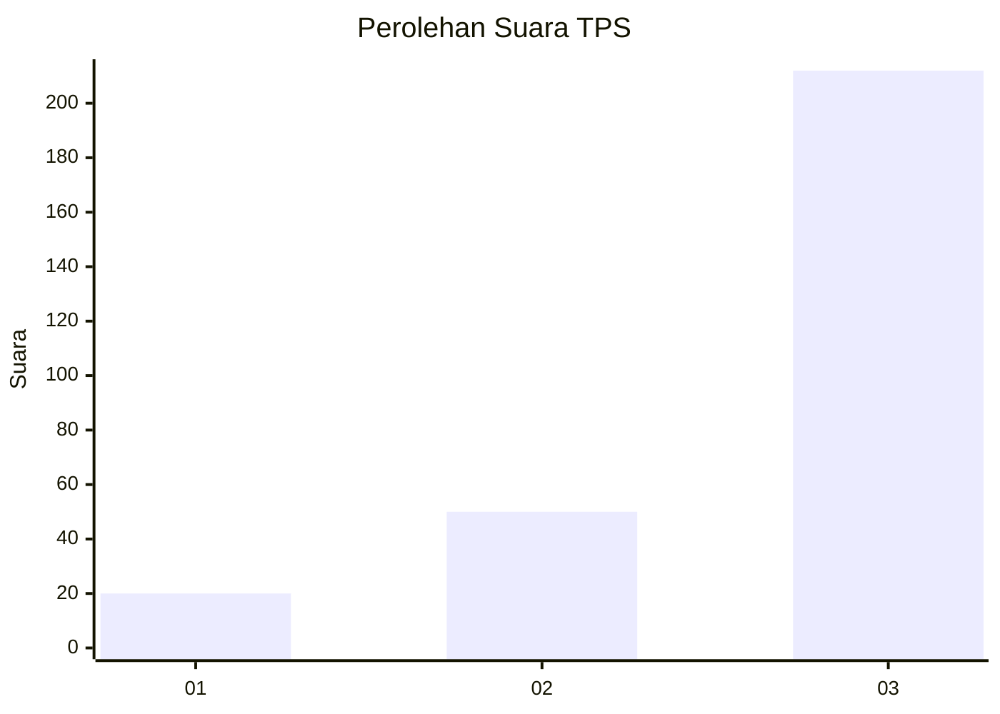
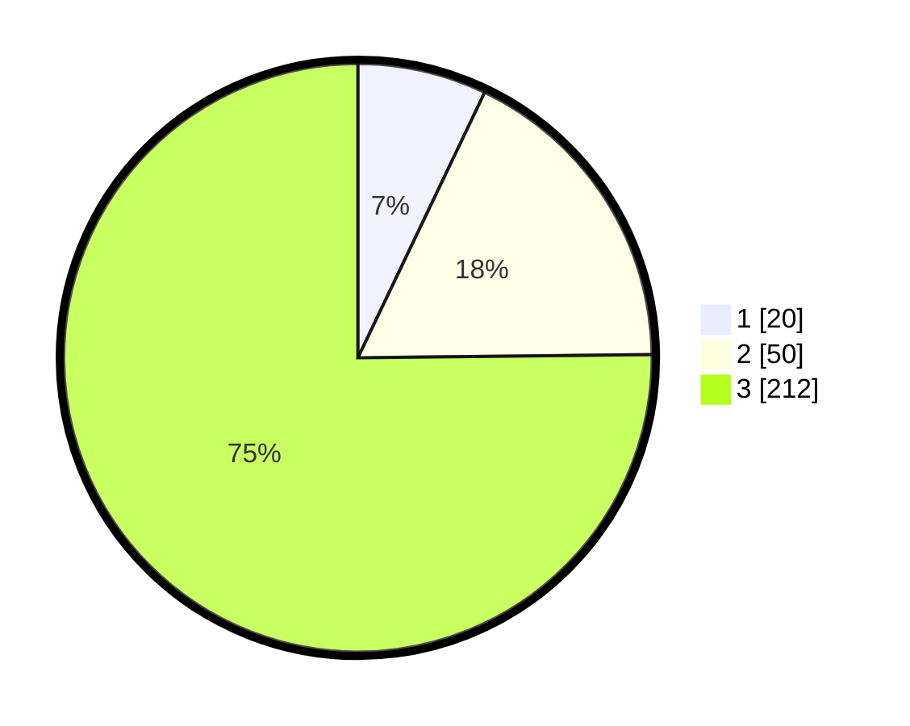

# Hasil

## Grafik

## Tabel

| No. | Nama Paslon    | Suara | Suara (raw) | Persentase |
|:--- |:-------------- | -----:| -----------:| ----------:|
| 1   | ANIES MUHAIMIN | 20    | [20][p-1]   | 7,09       |
| 2   | PRABOWO GIBRAN | 50    | [50][p-2]   | 17,73      |
| 3   | GANJAR MAHFUD  | 212   | [212][p-3]  | 75,18      |

[p-1]: https://github.com/gigit-pemilu/pemilu-2024/blob/main/pilpres/hitung-suara/sub/35-jawa-timur/sub/28-pamekasan/sub/11-batumarmar/sub/2003-bangserreh/sub/009-tps/sub/paslon-1.txt
[p-2]: https://github.com/gigit-pemilu/pemilu-2024/blob/main/pilpres/hitung-suara/sub/35-jawa-timur/sub/28-pamekasan/sub/11-batumarmar/sub/2003-bangserreh/sub/009-tps/sub/paslon-2.txt
[p-3]: https://github.com/gigit-pemilu/pemilu-2024/blob/main/pilpres/hitung-suara/sub/35-jawa-timur/sub/28-pamekasan/sub/11-batumarmar/sub/2003-bangserreh/sub/009-tps/sub/paslon-3.txt

## Foto C Plano

https://sirekap-obj-formc.kpu.go.id/ec53/pemilu/ppwp/35/28/11/20/03/3528112003009-20240215-114845--6b4b484f-8e6e-415c-bf9c-db700e573378.jpg

https://sirekap-obj-formc.kpu.go.id/ec53/pemilu/ppwp/35/28/11/20/03/3528112003009-20240215-114943--5cc84246-bab7-4fde-b695-f6aaefb8eec6.jpg

https://sirekap-obj-formc.kpu.go.id/ec53/pemilu/ppwp/35/28/11/20/03/3528112003009-20240215-115031--12ecc5c6-6fea-4125-8126-8b9a1e01dae2.jpg

## Metadata

| Key        | Value               |
| ---------- | ------------------- |
| Time Stamp | 2024-02-17 16:52:47 |

