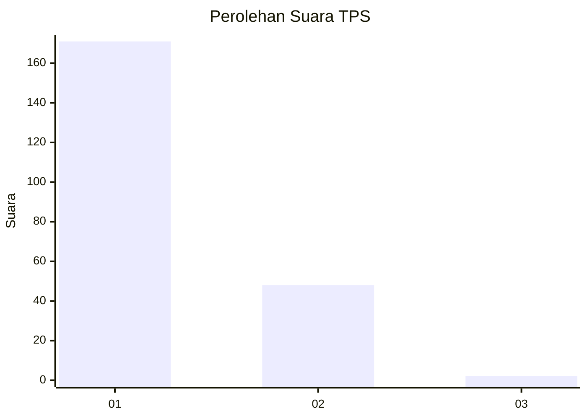
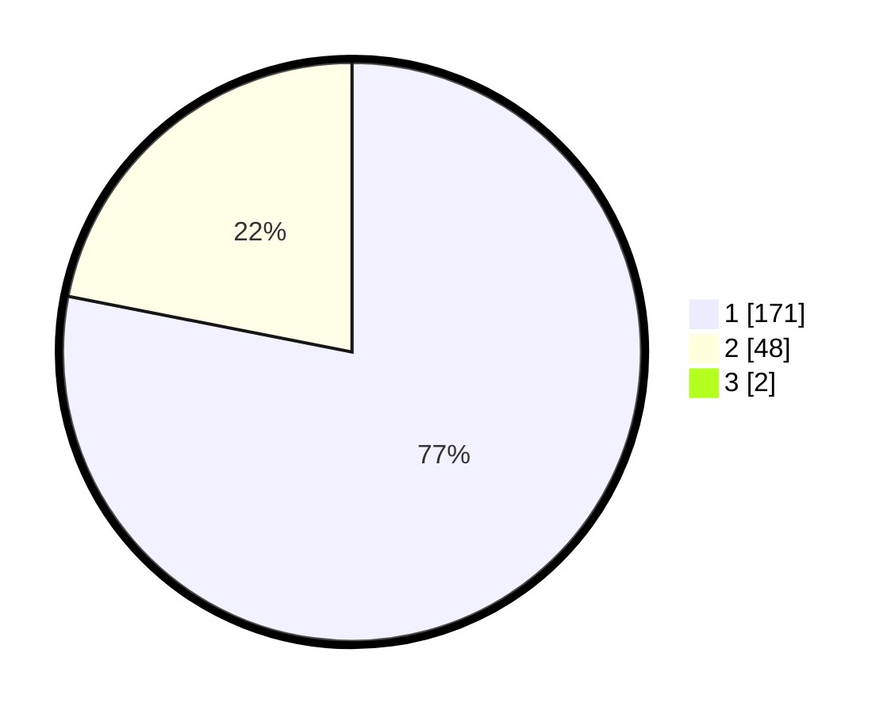

# Hasil

## Grafik

## Tabel

| No. | Nama Paslon    | Suara | Suara (raw) | Persentase |
|:--- |:-------------- | -----:| -----------:| ----------:|
| 1   | ANIES MUHAIMIN | 171   | [171][p-1]  | 77,38      |
| 2   | PRABOWO GIBRAN | 48    | [48][p-2]   | 21,72      |
| 3   | GANJAR MAHFUD  | 2     | [2][p-3]    | 0,90       |

[p-1]: https://github.com/gigit-pemilu/pemilu-2024-35-jawa-timur/blob/main/pilpres/hitung-suara/sub/35-jawa-timur/sub/28-pamekasan/sub/11-batumarmar/sub/2003-bangserreh/sub/012-tps/sub/paslon-1.txt
[p-2]: https://github.com/gigit-pemilu/pemilu-2024-35-jawa-timur/blob/main/pilpres/hitung-suara/sub/35-jawa-timur/sub/28-pamekasan/sub/11-batumarmar/sub/2003-bangserreh/sub/012-tps/sub/paslon-2.txt
[p-3]: https://github.com/gigit-pemilu/pemilu-2024-35-jawa-timur/blob/main/pilpres/hitung-suara/sub/35-jawa-timur/sub/28-pamekasan/sub/11-batumarmar/sub/2003-bangserreh/sub/012-tps/sub/paslon-3.txt

## Foto C Plano

https://sirekap-obj-formc.kpu.go.id/ee7f/pemilu/ppwp/35/28/11/20/03/3528112003012-20240215-123159--01065096-13fb-4552-b085-b0cd0458ff89.jpg

https://sirekap-obj-formc.kpu.go.id/ee7f/pemilu/ppwp/35/28/11/20/03/3528112003012-20240215-123501--cb236315-2d10-403d-9bd0-3e416098cf95.jpg

https://sirekap-obj-formc.kpu.go.id/ee7f/pemilu/ppwp/35/28/11/20/03/3528112003012-20240215-123628--33ab20e2-0afb-4d0c-a0eb-2b61b73a1f39.jpg

## Metadata

| Key        | Value               |
| ---------- | ------------------- |
| Time Stamp | 2024-02-17 12:00:00 |

