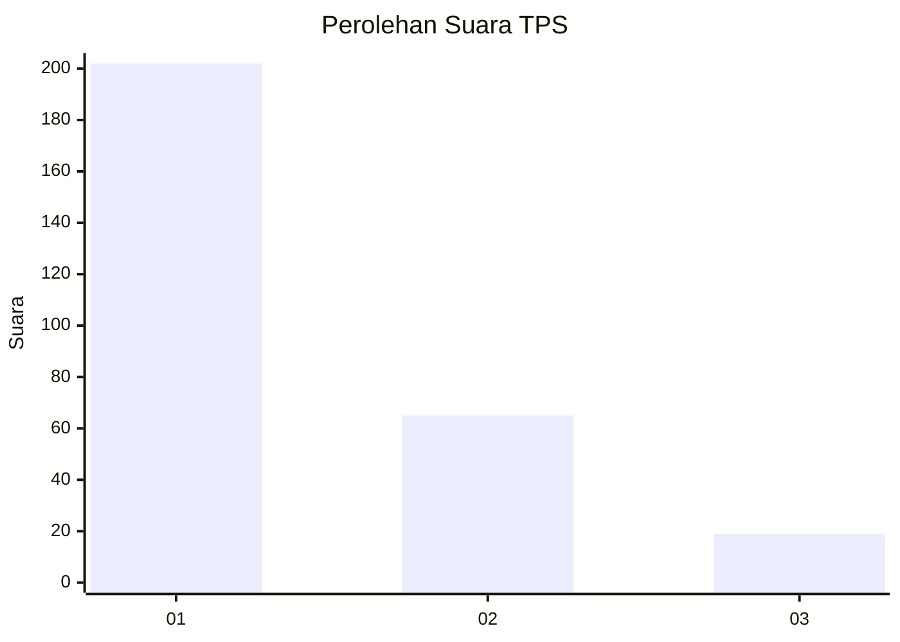
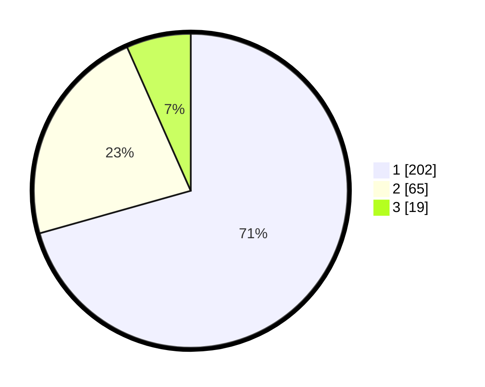

# Hasil

## Grafik

## Tabel

| No. | Nama Paslon    | Suara | Suara (raw) | Persentase |
|:--- |:-------------- | -----:| -----------:| ----------:|
| 1   | ANIES MUHAIMIN | 202   | [202][p-1]  | 70,63      |
| 2   | PRABOWO GIBRAN | 65    | [65][p-2]   | 22,73      |
| 3   | GANJAR MAHFUD  | 19    | [19][p-3]   | 6,64       |

[p-1]: https://github.com/gigit-pemilu/pemilu-2024/blob/main/pilpres/hitung-suara/sub/35-jawa-timur/sub/28-pamekasan/sub/11-batumarmar/sub/2004-lesong-laok/sub/001-tps/sub/paslon-1.txt
[p-2]: https://github.com/gigit-pemilu/pemilu-2024/blob/main/pilpres/hitung-suara/sub/35-jawa-timur/sub/28-pamekasan/sub/11-batumarmar/sub/2004-lesong-laok/sub/001-tps/sub/paslon-2.txt
[p-3]: https://github.com/gigit-pemilu/pemilu-2024/blob/main/pilpres/hitung-suara/sub/35-jawa-timur/sub/28-pamekasan/sub/11-batumarmar/sub/2004-lesong-laok/sub/001-tps/sub/paslon-3.txt

## Foto C Plano

https://sirekap-obj-formc.kpu.go.id/18b3/pemilu/ppwp/35/28/11/20/04/3528112004001-20240214-195223--dbbeaa43-6454-4d0a-bae7-7ecf1cf5fb91.jpg

https://sirekap-obj-formc.kpu.go.id/18b3/pemilu/ppwp/35/28/11/20/04/3528112004001-20240214-185907--bd2662f8-6684-426b-9188-6dcef04cee64.jpg

https://sirekap-obj-formc.kpu.go.id/18b3/pemilu/ppwp/35/28/11/20/04/3528112004001-20240214-185900--7ae5d3a4-eda6-4c9b-864d-1e91c4fda5f5.jpg

## Metadata

| Key        | Value               |
| ---------- | ------------------- |
| Time Stamp | 2024-02-17 16:52:47 |

