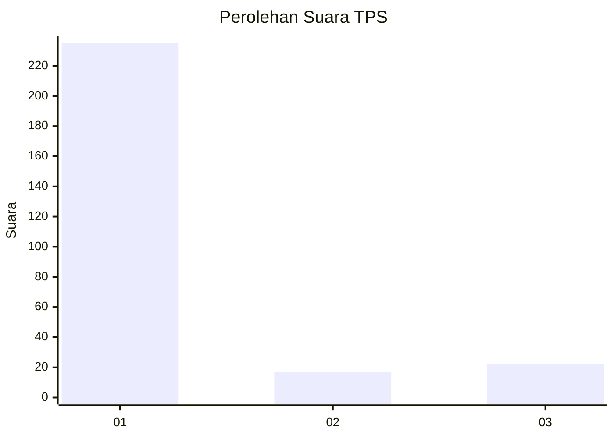
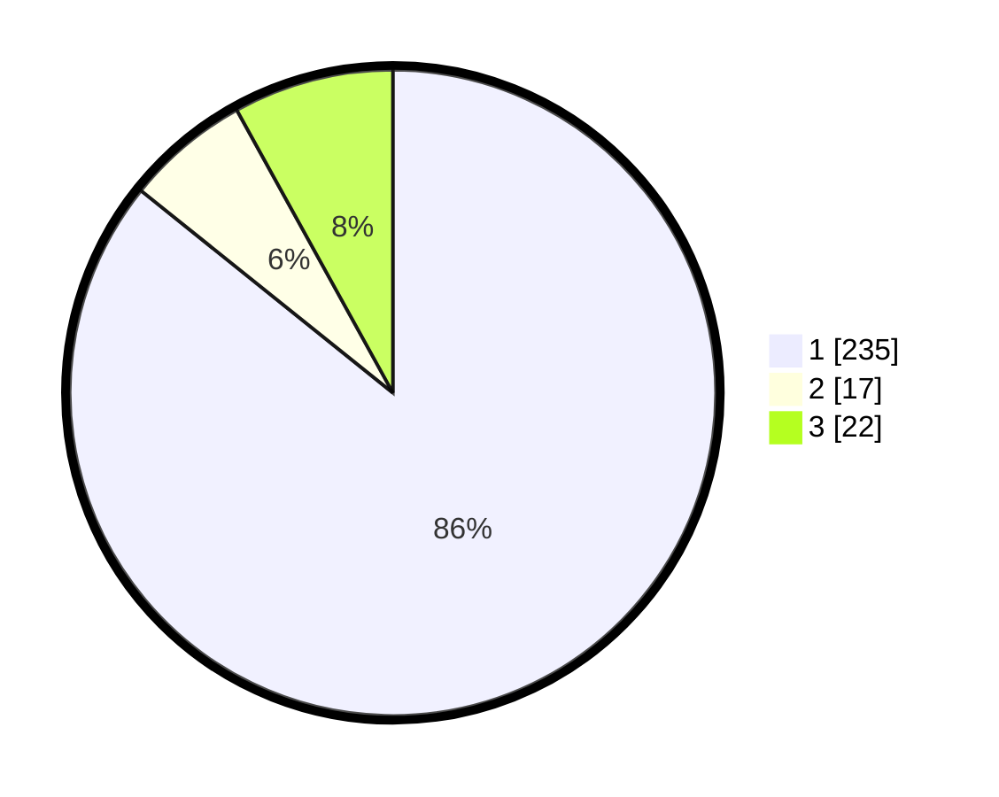

# Hasil

## Grafik

## Tabel

| No. | Nama Paslon    | Suara | Suara (raw) | Persentase |
|:--- |:-------------- | -----:| -----------:| ----------:|
| 1   | ANIES MUHAIMIN | 235   | [235][p-1]  | 85,77      |
| 2   | PRABOWO GIBRAN | 17    | [17][p-2]   | 6,20       |
| 3   | GANJAR MAHFUD  | 22    | [22][p-3]   | 8,03       |

[p-1]: https://github.com/gigit-pemilu/pemilu-2024/blob/main/pilpres/hitung-suara/sub/35-jawa-timur/sub/28-pamekasan/sub/11-batumarmar/sub/2004-lesong-laok/sub/002-tps/sub/paslon-1.txt
[p-2]: https://github.com/gigit-pemilu/pemilu-2024/blob/main/pilpres/hitung-suara/sub/35-jawa-timur/sub/28-pamekasan/sub/11-batumarmar/sub/2004-lesong-laok/sub/002-tps/sub/paslon-2.txt
[p-3]: https://github.com/gigit-pemilu/pemilu-2024/blob/main/pilpres/hitung-suara/sub/35-jawa-timur/sub/28-pamekasan/sub/11-batumarmar/sub/2004-lesong-laok/sub/002-tps/sub/paslon-3.txt

## Foto C Plano

https://sirekap-obj-formc.kpu.go.id/6b03/pemilu/ppwp/35/28/11/20/04/3528112004002-20240215-051719--27a5f1c9-46f7-46ce-957a-64306d831100.jpg

https://sirekap-obj-formc.kpu.go.id/6b03/pemilu/ppwp/35/28/11/20/04/3528112004002-20240215-052148--28607125-798f-4d97-962f-ac8c42d68f7a.jpg

https://sirekap-obj-formc.kpu.go.id/6b03/pemilu/ppwp/35/28/11/20/04/3528112004002-20240215-052518--74e270f9-0edb-42c4-98cd-f61051fc4fed.jpg

## Metadata

| Key        | Value               |
| ---------- | ------------------- |
| Time Stamp | 2024-02-17 16:52:47 |

