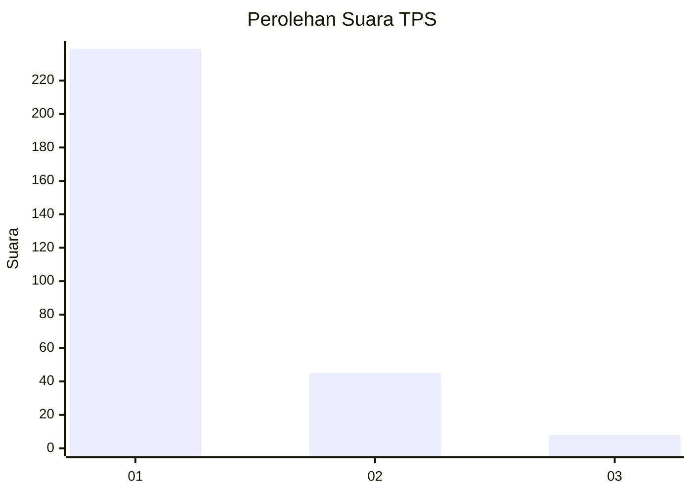
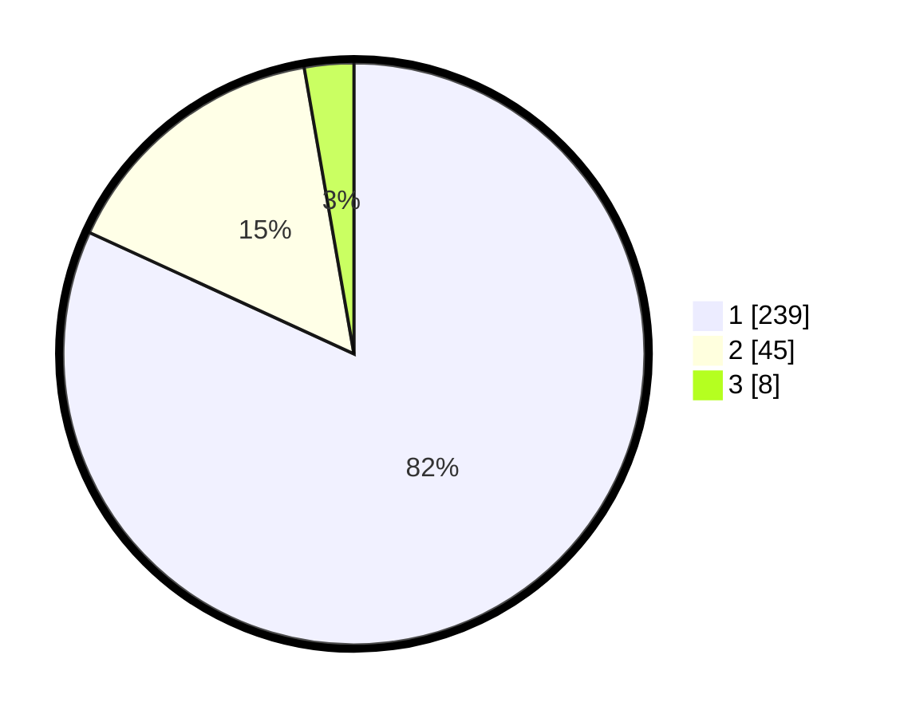

# Hasil

## Grafik

## Tabel

| No. | Nama Paslon    | Suara | Suara (raw) | Persentase |
|:--- |:-------------- | -----:| -----------:| ----------:|
| 1   | ANIES MUHAIMIN | 239   | [239][p-1]  | 81,85      |
| 2   | PRABOWO GIBRAN | 45    | [45][p-2]   | 15,41      |
| 3   | GANJAR MAHFUD  | 8     | [8][p-3]    | 2,74       |

[p-1]: https://github.com/gigit-pemilu/pemilu-2024-35-jawa-timur/blob/main/pilpres/hitung-suara/sub/35-jawa-timur/sub/28-pamekasan/sub/11-batumarmar/sub/2005-ponjanan-barat/sub/002-tps/sub/paslon-1.txt
[p-2]: https://github.com/gigit-pemilu/pemilu-2024-35-jawa-timur/blob/main/pilpres/hitung-suara/sub/35-jawa-timur/sub/28-pamekasan/sub/11-batumarmar/sub/2005-ponjanan-barat/sub/002-tps/sub/paslon-2.txt
[p-3]: https://github.com/gigit-pemilu/pemilu-2024-35-jawa-timur/blob/main/pilpres/hitung-suara/sub/35-jawa-timur/sub/28-pamekasan/sub/11-batumarmar/sub/2005-ponjanan-barat/sub/002-tps/sub/paslon-3.txt

## Foto C Plano

https://sirekap-obj-formc.kpu.go.id/50f7/pemilu/ppwp/35/28/11/20/05/3528112005002-20240215-083640--2c7b938c-8372-4c32-abd4-d726765830cd.jpg

https://sirekap-obj-formc.kpu.go.id/50f7/pemilu/ppwp/35/28/11/20/05/3528112005002-20240215-084046--d2195046-9c9f-4a4c-90e3-cd06b92a0678.jpg

https://sirekap-obj-formc.kpu.go.id/50f7/pemilu/ppwp/35/28/11/20/05/3528112005002-20240215-084245--a824c1d4-682c-41cb-913f-faaab103417c.jpg

## Metadata

| Key        | Value               |
| ---------- | ------------------- |
| Time Stamp | 2024-02-17 17:00:04 |

