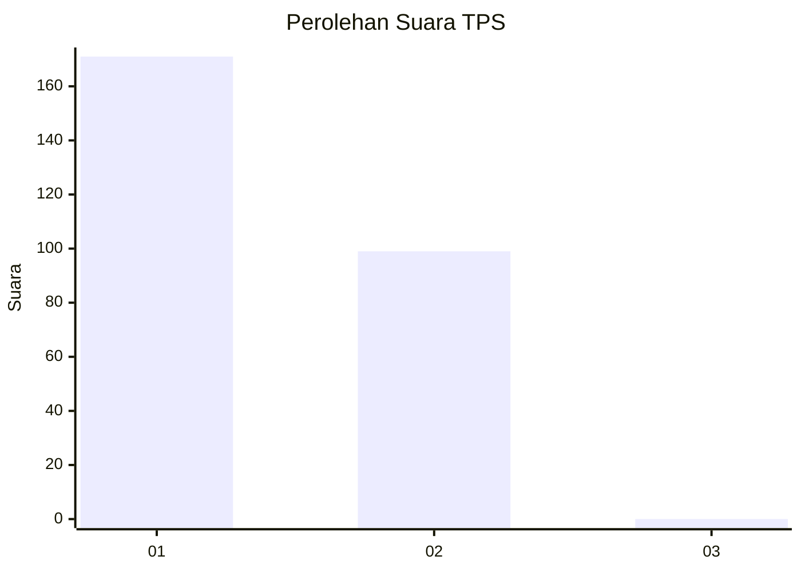
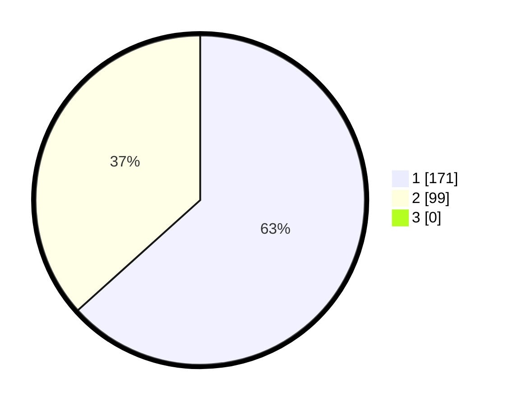

# Hasil

## Grafik

## Tabel

| No. | Nama Paslon    | Suara | Suara (raw) | Persentase |
|:--- |:-------------- | -----:| -----------:| ----------:|
| 1   | ANIES MUHAIMIN | 171   | [171][p-1]  | 63,33      |
| 2   | PRABOWO GIBRAN | 99    | [99][p-2]   | 36,67      |
| 3   | GANJAR MAHFUD  | 0     | [0][p-3]    | 0,00       |

[p-1]: https://github.com/gigit-pemilu/pemilu-2024-35-jawa-timur/blob/main/pilpres/hitung-suara/sub/35-jawa-timur/sub/28-pamekasan/sub/11-batumarmar/sub/2005-ponjanan-barat/sub/003-tps/sub/paslon-1.txt
[p-2]: https://github.com/gigit-pemilu/pemilu-2024-35-jawa-timur/blob/main/pilpres/hitung-suara/sub/35-jawa-timur/sub/28-pamekasan/sub/11-batumarmar/sub/2005-ponjanan-barat/sub/003-tps/sub/paslon-2.txt
[p-3]: https://github.com/gigit-pemilu/pemilu-2024-35-jawa-timur/blob/main/pilpres/hitung-suara/sub/35-jawa-timur/sub/28-pamekasan/sub/11-batumarmar/sub/2005-ponjanan-barat/sub/003-tps/sub/paslon-3.txt

## Foto C Plano

https://sirekap-obj-formc.kpu.go.id/d60d/pemilu/ppwp/35/28/11/20/05/3528112005003-20240215-103156--2ab7b6e8-6377-4887-ac9a-2141df83bac6.jpg

https://sirekap-obj-formc.kpu.go.id/d60d/pemilu/ppwp/35/28/11/20/05/3528112005003-20240215-103216--158c0adf-5bb6-49f3-aa06-c715740b5325.jpg

https://sirekap-obj-formc.kpu.go.id/d60d/pemilu/ppwp/35/28/11/20/05/3528112005003-20240215-103227--384deecf-199b-4384-ba2a-50f4e500c719.jpg

## Metadata

| Key        | Value               |
| ---------- | ------------------- |
| Time Stamp | 2024-02-17 17:00:04 |

