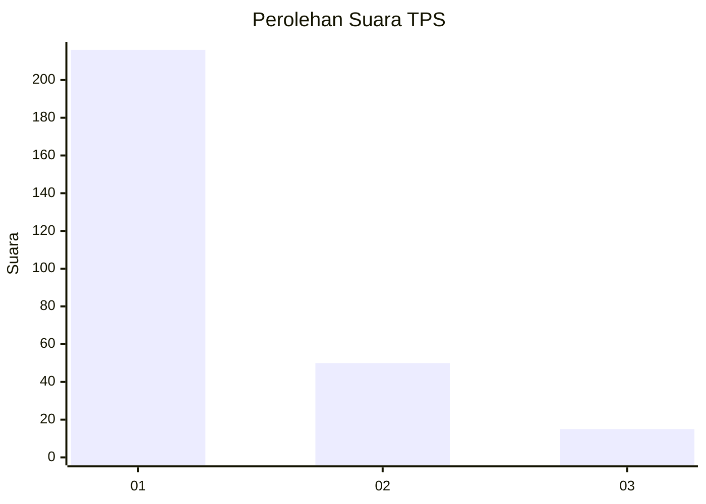
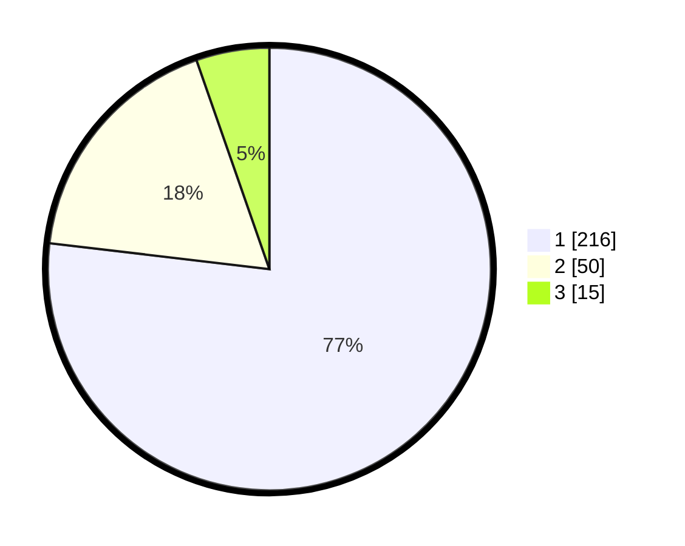

# Hasil

## Grafik

## Tabel

| No. | Nama Paslon    | Suara | Suara (raw) | Persentase |
|:--- |:-------------- | -----:| -----------:| ----------:|
| 1   | ANIES MUHAIMIN | 216   | [216][p-1]  | 76,87      |
| 2   | PRABOWO GIBRAN | 50    | [50][p-2]   | 17,79      |
| 3   | GANJAR MAHFUD  | 15    | [15][p-3]   | 5,34       |

[p-1]: https://github.com/gigit-pemilu/pemilu-2024/blob/main/pilpres/hitung-suara/sub/35-jawa-timur/sub/28-pamekasan/sub/11-batumarmar/sub/2005-ponjanan-barat/sub/004-tps/sub/paslon-1.txt
[p-2]: https://github.com/gigit-pemilu/pemilu-2024/blob/main/pilpres/hitung-suara/sub/35-jawa-timur/sub/28-pamekasan/sub/11-batumarmar/sub/2005-ponjanan-barat/sub/004-tps/sub/paslon-2.txt
[p-3]: https://github.com/gigit-pemilu/pemilu-2024/blob/main/pilpres/hitung-suara/sub/35-jawa-timur/sub/28-pamekasan/sub/11-batumarmar/sub/2005-ponjanan-barat/sub/004-tps/sub/paslon-3.txt

## Foto C Plano

https://sirekap-obj-formc.kpu.go.id/2580/pemilu/ppwp/35/28/11/20/05/3528112005004-20240215-094603--18f52c0b-8aed-4b30-9b49-c6ce53efb307.jpg

https://sirekap-obj-formc.kpu.go.id/2580/pemilu/ppwp/35/28/11/20/05/3528112005004-20240215-094631--6a5ae8df-da5d-4fc5-966a-a9ff7203c0e6.jpg

https://sirekap-obj-formc.kpu.go.id/2580/pemilu/ppwp/35/28/11/20/05/3528112005004-20240215-094706--5e6f0bc0-662b-4309-952c-87ebb254047e.jpg

## Metadata

| Key        | Value               |
| ---------- | ------------------- |
| Time Stamp | 2024-02-17 17:00:04 |

