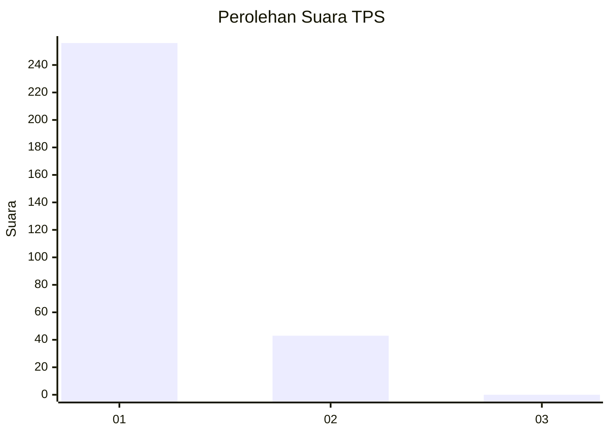
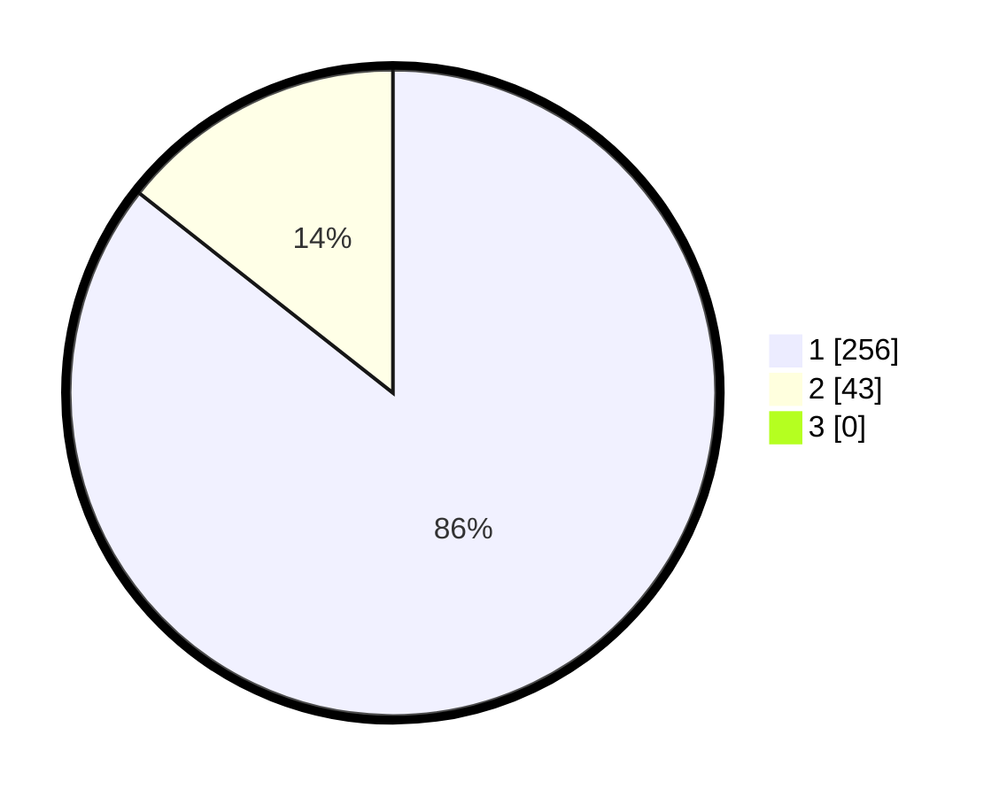

# Hasil

## Grafik

## Tabel

| No. | Nama Paslon    | Suara | Suara (raw) | Persentase |
|:--- |:-------------- | -----:| -----------:| ----------:|
| 1   | ANIES MUHAIMIN | 256   | [256][p-1]  | 85,62      |
| 2   | PRABOWO GIBRAN | 43    | [43][p-2]   | 14,38      |
| 3   | GANJAR MAHFUD  | 0     | [0][p-3]    | 0,00       |

[p-1]: https://github.com/gigit-pemilu/pemilu-2024/blob/main/pilpres/hitung-suara/sub/35-jawa-timur/sub/28-pamekasan/sub/11-batumarmar/sub/2005-ponjanan-barat/sub/005-tps/sub/paslon-1.txt
[p-2]: https://github.com/gigit-pemilu/pemilu-2024/blob/main/pilpres/hitung-suara/sub/35-jawa-timur/sub/28-pamekasan/sub/11-batumarmar/sub/2005-ponjanan-barat/sub/005-tps/sub/paslon-2.txt
[p-3]: https://github.com/gigit-pemilu/pemilu-2024/blob/main/pilpres/hitung-suara/sub/35-jawa-timur/sub/28-pamekasan/sub/11-batumarmar/sub/2005-ponjanan-barat/sub/005-tps/sub/paslon-3.txt

## Foto C Plano

https://sirekap-obj-formc.kpu.go.id/3cc1/pemilu/ppwp/35/28/11/20/05/3528112005005-20240215-090903--6d48b3ea-aceb-4e4a-99dc-05c5008c4bd1.jpg

https://sirekap-obj-formc.kpu.go.id/3cc1/pemilu/ppwp/35/28/11/20/05/3528112005005-20240215-093237--ffc46749-efeb-4238-aa23-dbd2591456ee.jpg

https://sirekap-obj-formc.kpu.go.id/3cc1/pemilu/ppwp/35/28/11/20/05/3528112005005-20240215-093518--761b66cc-bcee-479b-8141-60c72682e267.jpg

## Metadata

| Key        | Value               |
| ---------- | ------------------- |
| Time Stamp | 2024-02-17 17:00:04 |

