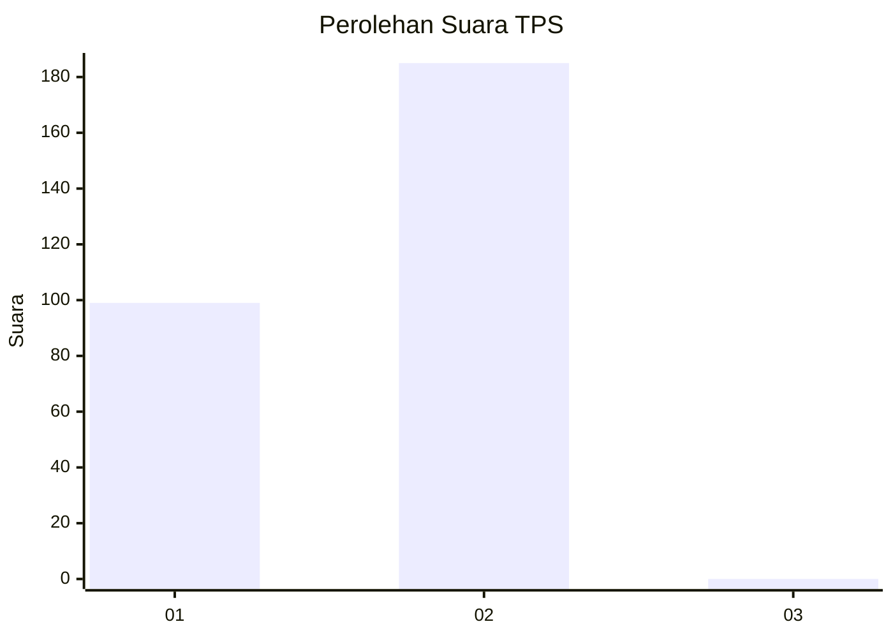
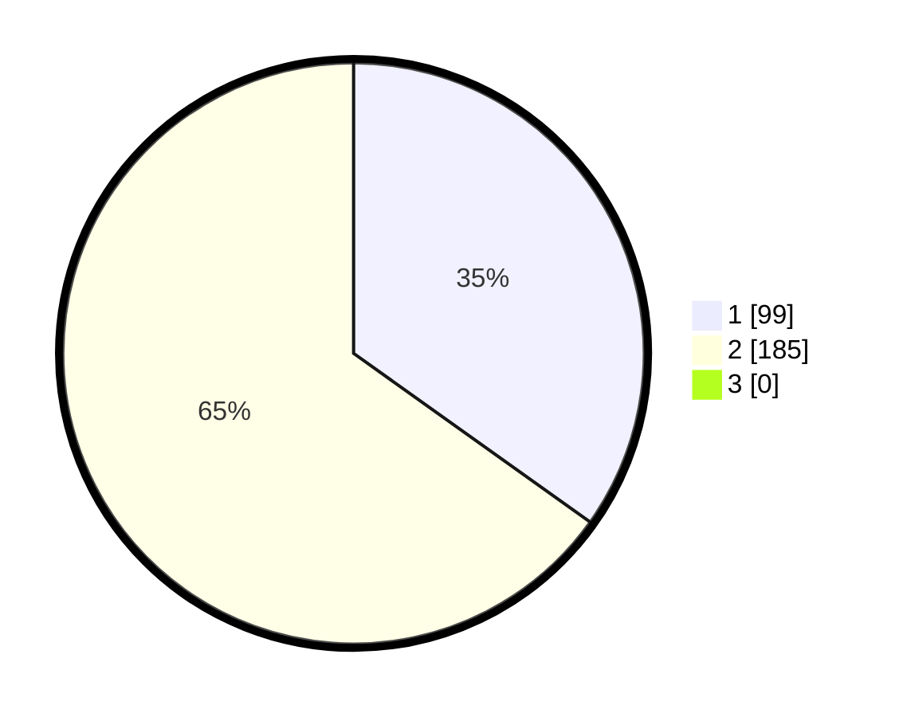

# Hasil

## Grafik

## Tabel

| No. | Nama Paslon    | Suara | Suara (raw) | Persentase |
|:--- |:-------------- | -----:| -----------:| ----------:|
| 1   | ANIES MUHAIMIN | 99    | [99][p-1]   | 34,86      |
| 2   | PRABOWO GIBRAN | 185   | [185][p-2]  | 65,14      |
| 3   | GANJAR MAHFUD  | 0     | [0][p-3]    | 0,00       |

[p-1]: https://github.com/gigit-pemilu/pemilu-2024-35-jawa-timur/blob/main/pilpres/hitung-suara/sub/35-jawa-timur/sub/28-pamekasan/sub/11-batumarmar/sub/2005-ponjanan-barat/sub/006-tps/sub/paslon-1.txt
[p-2]: https://github.com/gigit-pemilu/pemilu-2024-35-jawa-timur/blob/main/pilpres/hitung-suara/sub/35-jawa-timur/sub/28-pamekasan/sub/11-batumarmar/sub/2005-ponjanan-barat/sub/006-tps/sub/paslon-2.txt
[p-3]: https://github.com/gigit-pemilu/pemilu-2024-35-jawa-timur/blob/main/pilpres/hitung-suara/sub/35-jawa-timur/sub/28-pamekasan/sub/11-batumarmar/sub/2005-ponjanan-barat/sub/006-tps/sub/paslon-3.txt

## Foto C Plano

https://sirekap-obj-formc.kpu.go.id/12e9/pemilu/ppwp/35/28/11/20/05/3528112005006-20240215-091235--a8d50b0e-d1c0-4289-b310-7f4de42d6d42.jpg

https://sirekap-obj-formc.kpu.go.id/12e9/pemilu/ppwp/35/28/11/20/05/3528112005006-20240215-104155--d9a45a14-cc40-4137-bcb5-cae6fbb8db8b.jpg

https://sirekap-obj-formc.kpu.go.id/12e9/pemilu/ppwp/35/28/11/20/05/3528112005006-20240215-104417--b3740381-ff5a-4aa0-b9da-35677564e5a4.jpg

## Metadata

| Key        | Value               |
| ---------- | ------------------- |
| Time Stamp | 2024-02-17 17:00:04 |

