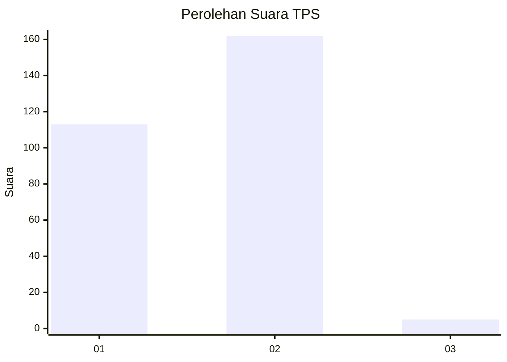
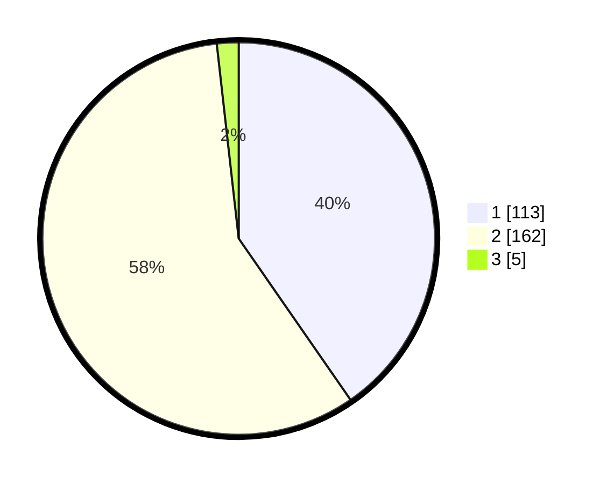

# Hasil

## Grafik

## Tabel

| No. | Nama Paslon    | Suara | Suara (raw) | Persentase |
|:--- |:-------------- | -----:| -----------:| ----------:|
| 1   | ANIES MUHAIMIN | 113   | [113][p-1]  | 40,36      |
| 2   | PRABOWO GIBRAN | 162   | [162][p-2]  | 57,86      |
| 3   | GANJAR MAHFUD  | 5     | [5][p-3]    | 1,79       |

[p-1]: https://github.com/gigit-pemilu/pemilu-2024/blob/main/pilpres/hitung-suara/sub/35-jawa-timur/sub/28-pamekasan/sub/11-batumarmar/sub/2005-ponjanan-barat/sub/007-tps/sub/paslon-1.txt
[p-2]: https://github.com/gigit-pemilu/pemilu-2024/blob/main/pilpres/hitung-suara/sub/35-jawa-timur/sub/28-pamekasan/sub/11-batumarmar/sub/2005-ponjanan-barat/sub/007-tps/sub/paslon-2.txt
[p-3]: https://github.com/gigit-pemilu/pemilu-2024/blob/main/pilpres/hitung-suara/sub/35-jawa-timur/sub/28-pamekasan/sub/11-batumarmar/sub/2005-ponjanan-barat/sub/007-tps/sub/paslon-3.txt

## Foto C Plano

https://sirekap-obj-formc.kpu.go.id/c648/pemilu/ppwp/35/28/11/20/05/3528112005007-20240215-083838--5cfdb39b-5848-4e62-9d5d-bc741e89a8c0.jpg

https://sirekap-obj-formc.kpu.go.id/c648/pemilu/ppwp/35/28/11/20/05/3528112005007-20240215-084350--e4468f71-5930-4fa2-9b1e-db7c95b78319.jpg

https://sirekap-obj-formc.kpu.go.id/c648/pemilu/ppwp/35/28/11/20/05/3528112005007-20240215-084558--20d8ae14-4176-4771-835c-ef8861f389df.jpg

## Metadata

| Key        | Value               |
| ---------- | ------------------- |
| Time Stamp | 2024-02-17 17:00:04 |

