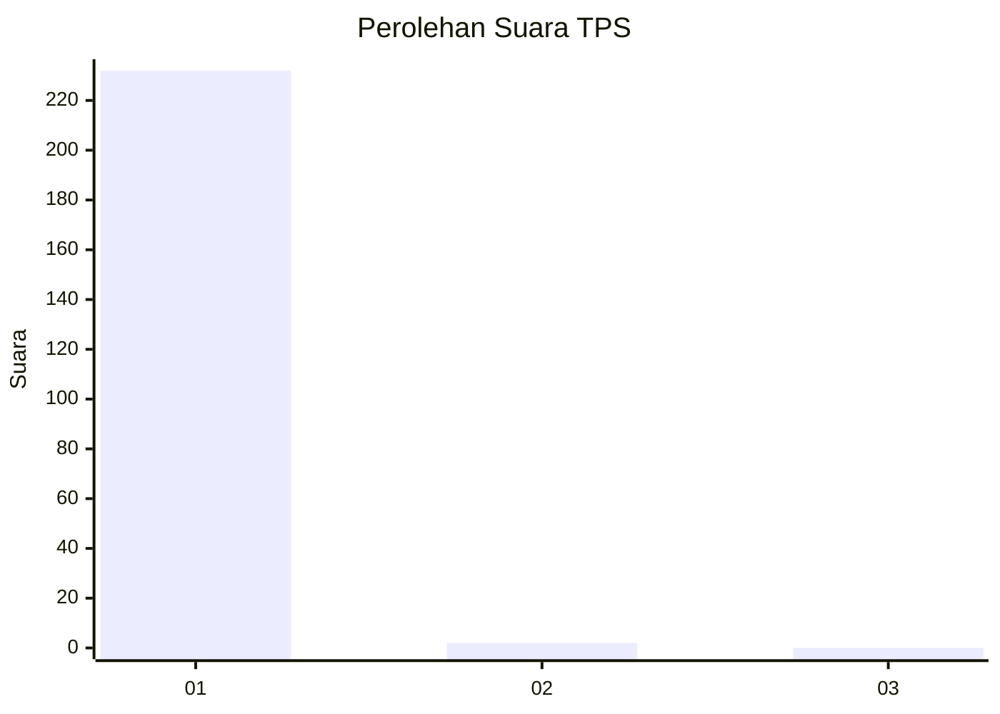
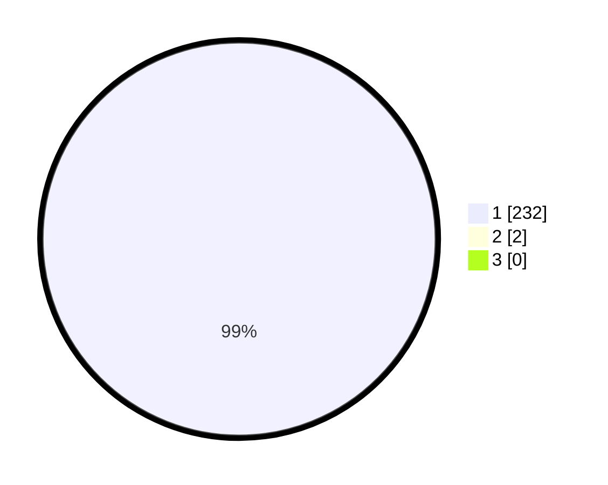

# Hasil

## Grafik

## Tabel

| No. | Nama Paslon    | Suara | Suara (raw) | Persentase |
|:--- |:-------------- | -----:| -----------:| ----------:|
| 1   | ANIES MUHAIMIN | 232   | [232][p-1]  | 99,15      |
| 2   | PRABOWO GIBRAN | 2     | [2][p-2]    | 0,85       |
| 3   | GANJAR MAHFUD  | 0     | [0][p-3]    | 0,00       |

[p-1]: https://github.com/gigit-pemilu/pemilu-2024-35-jawa-timur/blob/main/pilpres/hitung-suara/sub/35-jawa-timur/sub/28-pamekasan/sub/11-batumarmar/sub/2005-ponjanan-barat/sub/008-tps/sub/paslon-1.txt
[p-2]: https://github.com/gigit-pemilu/pemilu-2024-35-jawa-timur/blob/main/pilpres/hitung-suara/sub/35-jawa-timur/sub/28-pamekasan/sub/11-batumarmar/sub/2005-ponjanan-barat/sub/008-tps/sub/paslon-2.txt
[p-3]: https://github.com/gigit-pemilu/pemilu-2024-35-jawa-timur/blob/main/pilpres/hitung-suara/sub/35-jawa-timur/sub/28-pamekasan/sub/11-batumarmar/sub/2005-ponjanan-barat/sub/008-tps/sub/paslon-3.txt

## Foto C Plano

https://sirekap-obj-formc.kpu.go.id/243f/pemilu/ppwp/35/28/11/20/05/3528112005008-20240215-104915--d04c81ee-dc5f-4ea8-ae6f-5465b0d9ee2a.jpg

https://sirekap-obj-formc.kpu.go.id/243f/pemilu/ppwp/35/28/11/20/05/3528112005008-20240215-105115--35eb290f-c934-48bf-aba0-ae00a1d6e276.jpg

https://sirekap-obj-formc.kpu.go.id/243f/pemilu/ppwp/35/28/11/20/05/3528112005008-20240215-105245--a82e171a-0785-4509-ae5c-8bb93ec2dd53.jpg

## Metadata

| Key        | Value               |
| ---------- | ------------------- |
| Time Stamp | 2024-02-17 12:00:00 |

