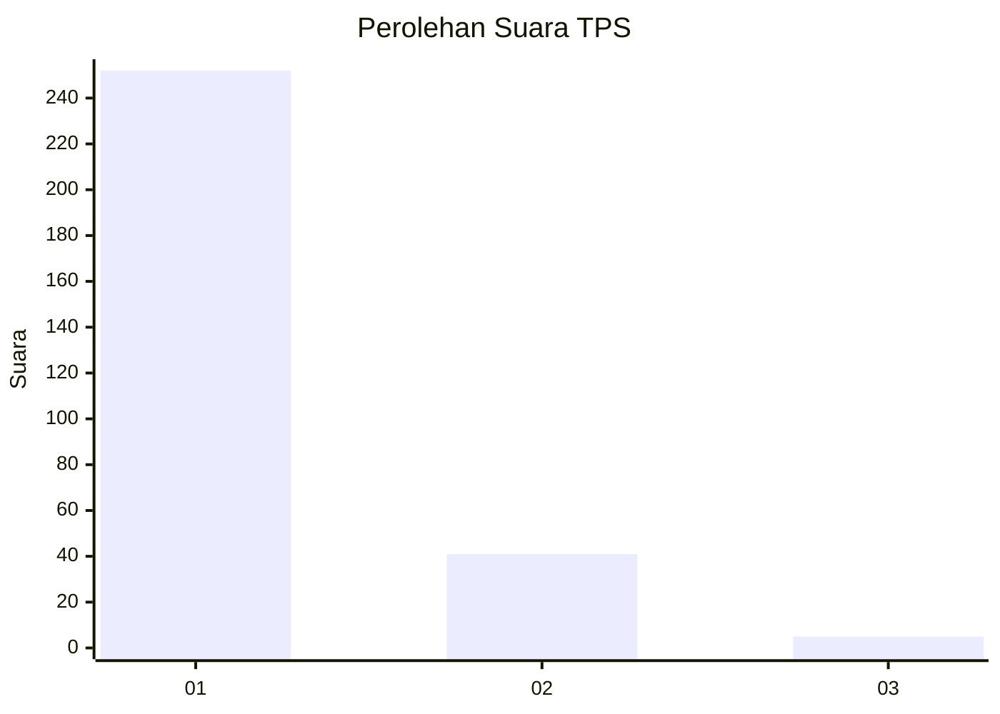
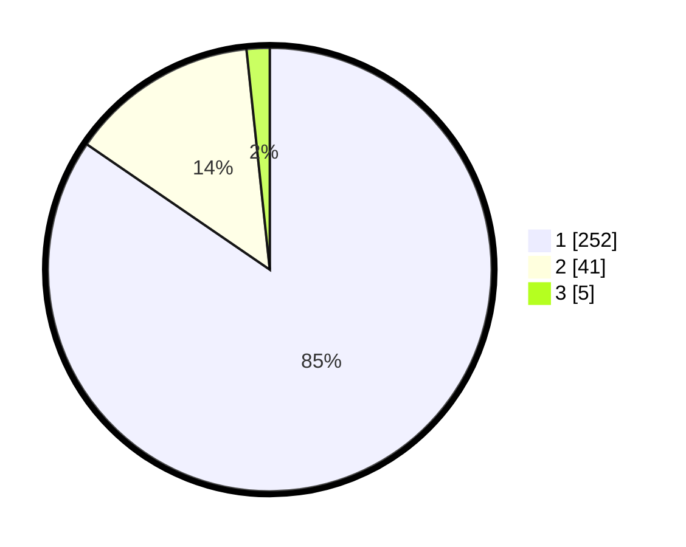

# Hasil

## Grafik

## Tabel

| No. | Nama Paslon    | Suara | Suara (raw) | Persentase |
|:--- |:-------------- | -----:| -----------:| ----------:|
| 1   | ANIES MUHAIMIN | 252   | [252][p-1]  | 84,56      |
| 2   | PRABOWO GIBRAN | 41    | [41][p-2]   | 13,76      |
| 3   | GANJAR MAHFUD  | 5     | [5][p-3]    | 1,68       |

[p-1]: https://github.com/gigit-pemilu/pemilu-2024-35-jawa-timur/blob/main/pilpres/hitung-suara/sub/35-jawa-timur/sub/28-pamekasan/sub/11-batumarmar/sub/2006-ponjanan-timur/sub/006-tps/sub/paslon-1.txt
[p-2]: https://github.com/gigit-pemilu/pemilu-2024-35-jawa-timur/blob/main/pilpres/hitung-suara/sub/35-jawa-timur/sub/28-pamekasan/sub/11-batumarmar/sub/2006-ponjanan-timur/sub/006-tps/sub/paslon-2.txt
[p-3]: https://github.com/gigit-pemilu/pemilu-2024-35-jawa-timur/blob/main/pilpres/hitung-suara/sub/35-jawa-timur/sub/28-pamekasan/sub/11-batumarmar/sub/2006-ponjanan-timur/sub/006-tps/sub/paslon-3.txt

## Foto C Plano

https://sirekap-obj-formc.kpu.go.id/6c7c/pemilu/ppwp/35/28/11/20/06/3528112006006-20240214-211015--09a06834-79e6-41ce-bdff-0d2e8fde03a0.jpg

https://sirekap-obj-formc.kpu.go.id/6c7c/pemilu/ppwp/35/28/11/20/06/3528112006006-20240214-211114--01e42463-65f1-403a-9a72-22794ae9bc3a.jpg

https://sirekap-obj-formc.kpu.go.id/6c7c/pemilu/ppwp/35/28/11/20/06/3528112006006-20240214-211220--2caa35da-50c3-4534-91fa-bdc977de003e.jpg

## Metadata

| Key        | Value               |
| ---------- | ------------------- |
| Time Stamp | 2024-02-17 12:00:00 |

