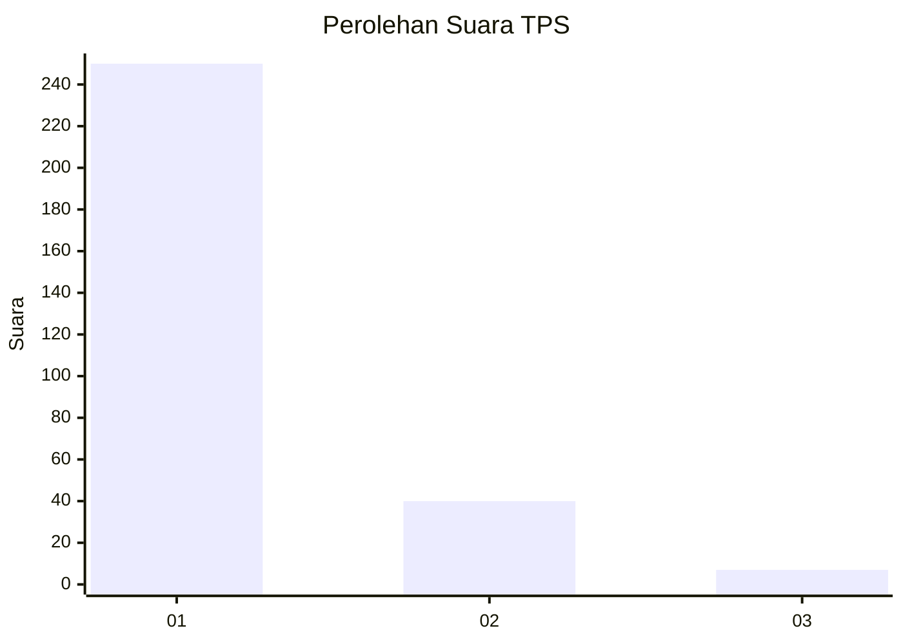
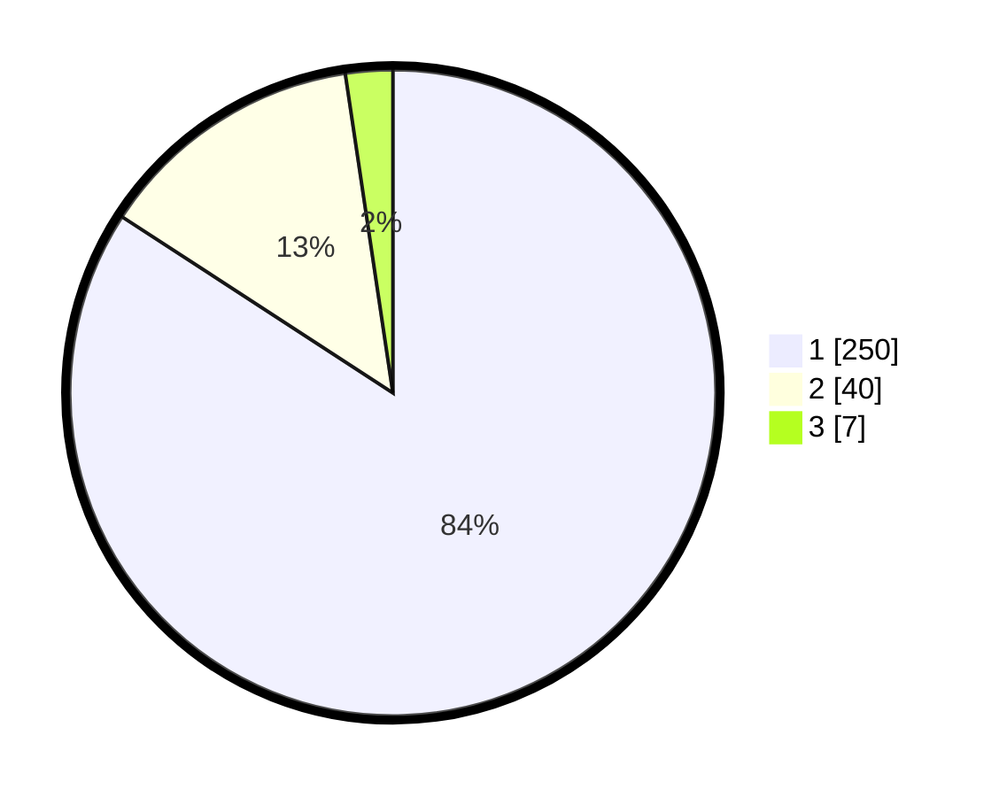

# Hasil

## Grafik

## Tabel

| No. | Nama Paslon    | Suara | Suara (raw) | Persentase |
|:--- |:-------------- | -----:| -----------:| ----------:|
| 1   | ANIES MUHAIMIN | 250   | [250][p-1]  | 84,18      |
| 2   | PRABOWO GIBRAN | 40    | [40][p-2]   | 13,47      |
| 3   | GANJAR MAHFUD  | 7     | [7][p-3]    | 2,36       |

[p-1]: https://github.com/gigit-pemilu/pemilu-2024/blob/main/pilpres/hitung-suara/sub/35-jawa-timur/sub/28-pamekasan/sub/11-batumarmar/sub/2006-ponjanan-timur/sub/007-tps/sub/paslon-1.txt
[p-2]: https://github.com/gigit-pemilu/pemilu-2024/blob/main/pilpres/hitung-suara/sub/35-jawa-timur/sub/28-pamekasan/sub/11-batumarmar/sub/2006-ponjanan-timur/sub/007-tps/sub/paslon-2.txt
[p-3]: https://github.com/gigit-pemilu/pemilu-2024/blob/main/pilpres/hitung-suara/sub/35-jawa-timur/sub/28-pamekasan/sub/11-batumarmar/sub/2006-ponjanan-timur/sub/007-tps/sub/paslon-3.txt

## Foto C Plano

https://sirekap-obj-formc.kpu.go.id/8cab/pemilu/ppwp/35/28/11/20/06/3528112006007-20240215-102621--2fdc6228-8a1f-4771-bef0-e60099c5c07e.jpg

https://sirekap-obj-formc.kpu.go.id/8cab/pemilu/ppwp/35/28/11/20/06/3528112006007-20240215-094037--8477840b-630d-4828-bb41-2f395cdeb456.jpg

https://sirekap-obj-formc.kpu.go.id/8cab/pemilu/ppwp/35/28/11/20/06/3528112006007-20240215-094341--8108b081-95e2-4de2-b130-d6777dcad315.jpg

## Metadata

| Key        | Value               |
| ---------- | ------------------- |
| Time Stamp | 2024-02-17 17:00:04 |

