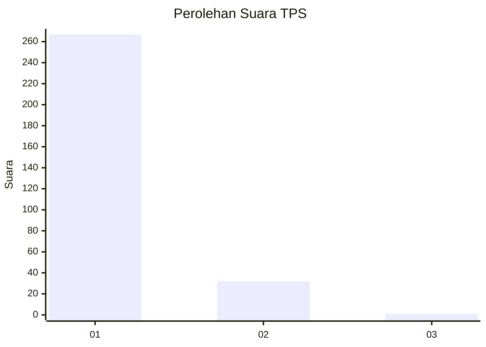
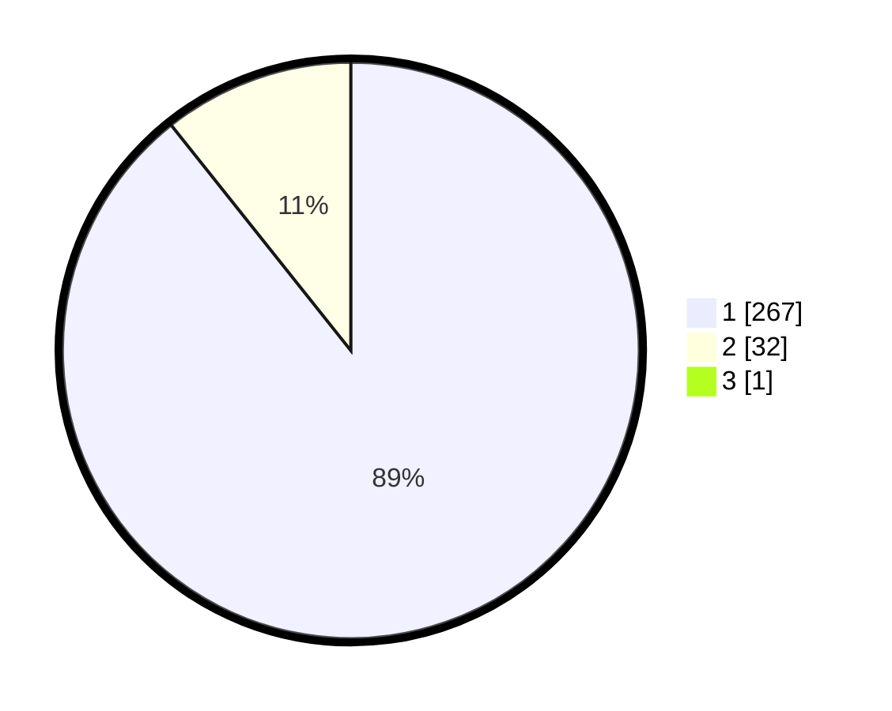

# Hasil

## Grafik

## Tabel

| No. | Nama Paslon    | Suara | Suara (raw) | Persentase |
|:--- |:-------------- | -----:| -----------:| ----------:|
| 1   | ANIES MUHAIMIN | 267   | [267][p-1]  | 89,00      |
| 2   | PRABOWO GIBRAN | 32    | [32][p-2]   | 10,67      |
| 3   | GANJAR MAHFUD  | 1     | [1][p-3]    | 0,33       |

[p-1]: https://github.com/gigit-pemilu/pemilu-2024-35-jawa-timur/blob/main/pilpres/hitung-suara/sub/35-jawa-timur/sub/28-pamekasan/sub/11-batumarmar/sub/2006-ponjanan-timur/sub/008-tps/sub/paslon-1.txt
[p-2]: https://github.com/gigit-pemilu/pemilu-2024-35-jawa-timur/blob/main/pilpres/hitung-suara/sub/35-jawa-timur/sub/28-pamekasan/sub/11-batumarmar/sub/2006-ponjanan-timur/sub/008-tps/sub/paslon-2.txt
[p-3]: https://github.com/gigit-pemilu/pemilu-2024-35-jawa-timur/blob/main/pilpres/hitung-suara/sub/35-jawa-timur/sub/28-pamekasan/sub/11-batumarmar/sub/2006-ponjanan-timur/sub/008-tps/sub/paslon-3.txt

## Foto C Plano

https://sirekap-obj-formc.kpu.go.id/ca70/pemilu/ppwp/35/28/11/20/06/3528112006008-20240214-230717--547c5ff8-8dae-4645-b32d-a2301d368186.jpg

https://sirekap-obj-formc.kpu.go.id/ca70/pemilu/ppwp/35/28/11/20/06/3528112006008-20240214-230813--39648021-0bc5-41b6-845b-d61abb80dcb0.jpg

https://sirekap-obj-formc.kpu.go.id/ca70/pemilu/ppwp/35/28/11/20/06/3528112006008-20240214-230902--289efa30-d653-466e-a783-54b673da0ee1.jpg

## Metadata

| Key        | Value               |
| ---------- | ------------------- |
| Time Stamp | 2024-02-17 17:00:04 |

