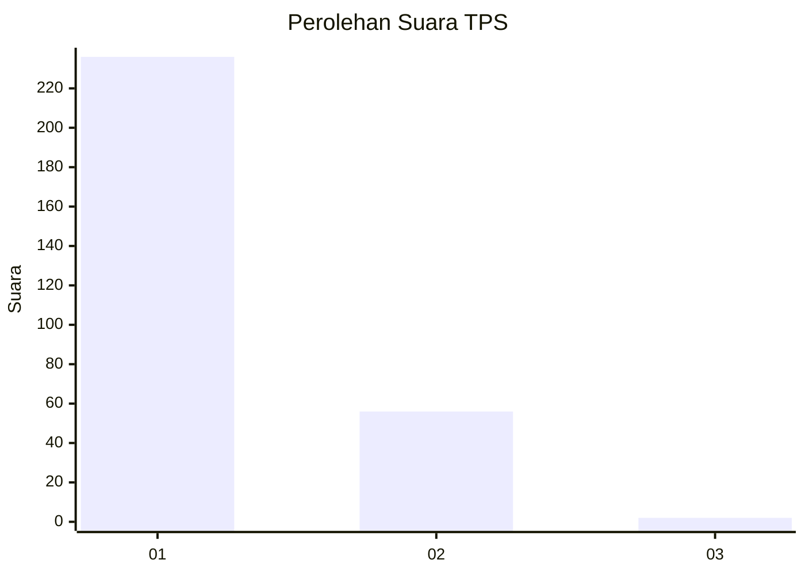
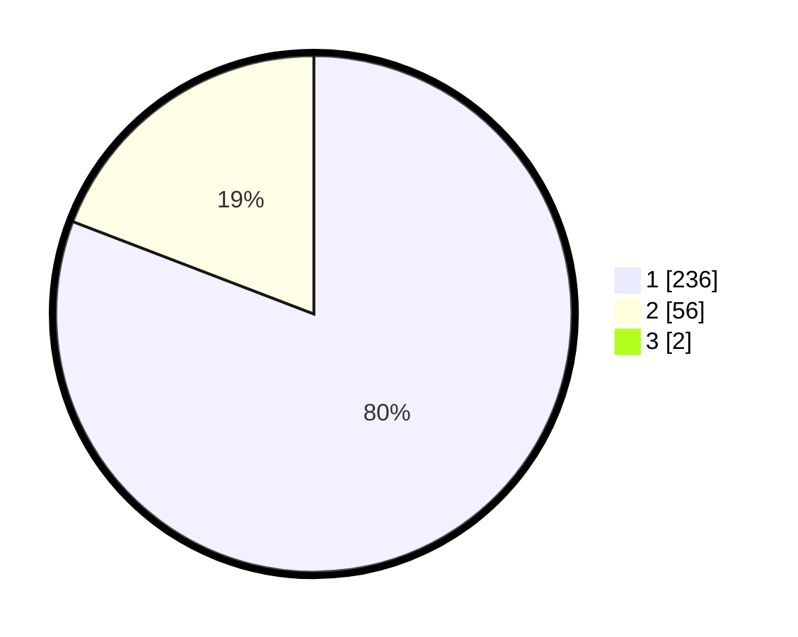

# Hasil

## Grafik

## Tabel

| No. | Nama Paslon    | Suara | Suara (raw) | Persentase |
|:--- |:-------------- | -----:| -----------:| ----------:|
| 1   | ANIES MUHAIMIN | 236   | [236][p-1]  | 80,27      |
| 2   | PRABOWO GIBRAN | 56    | [56][p-2]   | 19,05      |
| 3   | GANJAR MAHFUD  | 2     | [2][p-3]    | 0,68       |

[p-1]: https://github.com/gigit-pemilu/pemilu-2024/blob/main/pilpres/hitung-suara/sub/35-jawa-timur/sub/28-pamekasan/sub/11-batumarmar/sub/2006-ponjanan-timur/sub/009-tps/sub/paslon-1.txt
[p-2]: https://github.com/gigit-pemilu/pemilu-2024/blob/main/pilpres/hitung-suara/sub/35-jawa-timur/sub/28-pamekasan/sub/11-batumarmar/sub/2006-ponjanan-timur/sub/009-tps/sub/paslon-2.txt
[p-3]: https://github.com/gigit-pemilu/pemilu-2024/blob/main/pilpres/hitung-suara/sub/35-jawa-timur/sub/28-pamekasan/sub/11-batumarmar/sub/2006-ponjanan-timur/sub/009-tps/sub/paslon-3.txt

## Foto C Plano

https://sirekap-obj-formc.kpu.go.id/1584/pemilu/ppwp/35/28/11/20/06/3528112006009-20240215-063954--9d25efe2-96d8-43bb-88b1-429e5528f794.jpg

https://sirekap-obj-formc.kpu.go.id/1584/pemilu/ppwp/35/28/11/20/06/3528112006009-20240215-064058--1356a32d-d516-45cf-a69d-9a07a246bbbc.jpg

https://sirekap-obj-formc.kpu.go.id/1584/pemilu/ppwp/35/28/11/20/06/3528112006009-20240215-064218--8cbdb250-4a83-44dc-9881-52fcc8707578.jpg

## Metadata

| Key        | Value               |
| ---------- | ------------------- |
| Time Stamp | 2024-02-17 17:00:04 |

