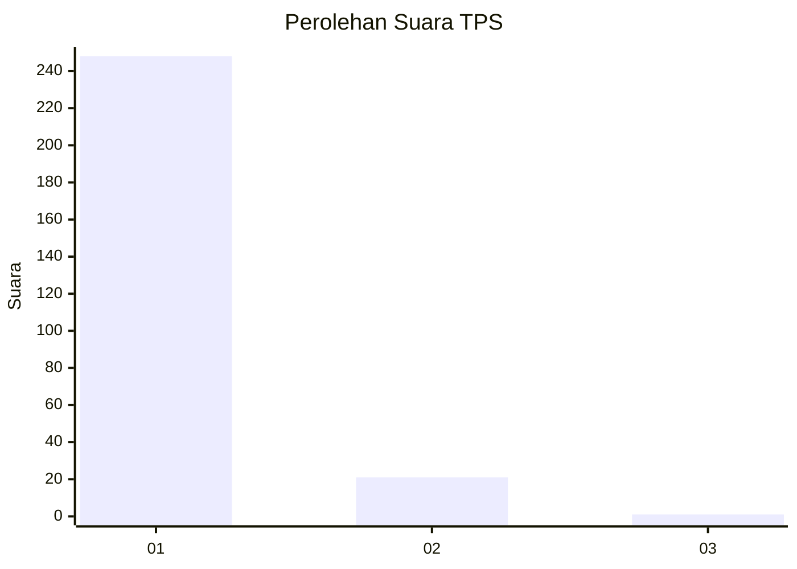
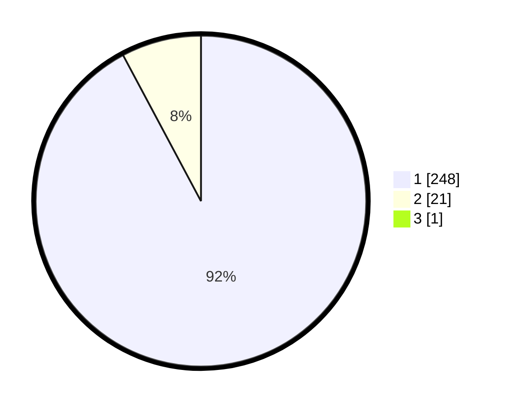

# Hasil

## Grafik

## Tabel

| No. | Nama Paslon    | Suara | Suara (raw) | Persentase |
|:--- |:-------------- | -----:| -----------:| ----------:|
| 1   | ANIES MUHAIMIN | 248   | [248][p-1]  | 91,85      |
| 2   | PRABOWO GIBRAN | 21    | [21][p-2]   | 7,78       |
| 3   | GANJAR MAHFUD  | 1     | [1][p-3]    | 0,37       |

[p-1]: https://github.com/gigit-pemilu/pemilu-2024-35-jawa-timur/blob/main/pilpres/hitung-suara/sub/35-jawa-timur/sub/28-pamekasan/sub/11-batumarmar/sub/2006-ponjanan-timur/sub/012-tps/sub/paslon-1.txt
[p-2]: https://github.com/gigit-pemilu/pemilu-2024-35-jawa-timur/blob/main/pilpres/hitung-suara/sub/35-jawa-timur/sub/28-pamekasan/sub/11-batumarmar/sub/2006-ponjanan-timur/sub/012-tps/sub/paslon-2.txt
[p-3]: https://github.com/gigit-pemilu/pemilu-2024-35-jawa-timur/blob/main/pilpres/hitung-suara/sub/35-jawa-timur/sub/28-pamekasan/sub/11-batumarmar/sub/2006-ponjanan-timur/sub/012-tps/sub/paslon-3.txt

## Foto C Plano

https://sirekap-obj-formc.kpu.go.id/6bcb/pemilu/ppwp/35/28/11/20/06/3528112006012-20240214-211434--ebc0ede4-d879-471a-8fe0-53aa2377a511.jpg

https://sirekap-obj-formc.kpu.go.id/6bcb/pemilu/ppwp/35/28/11/20/06/3528112006012-20240214-211510--6b14adf6-9b86-44ff-8e2b-f71b2c8e7169.jpg

https://sirekap-obj-formc.kpu.go.id/6bcb/pemilu/ppwp/35/28/11/20/06/3528112006012-20240214-211554--e0208ddd-77c9-48ae-ae0c-00e775b15b19.jpg

## Metadata

| Key        | Value               |
| ---------- | ------------------- |
| Time Stamp | 2024-02-17 12:00:00 |

