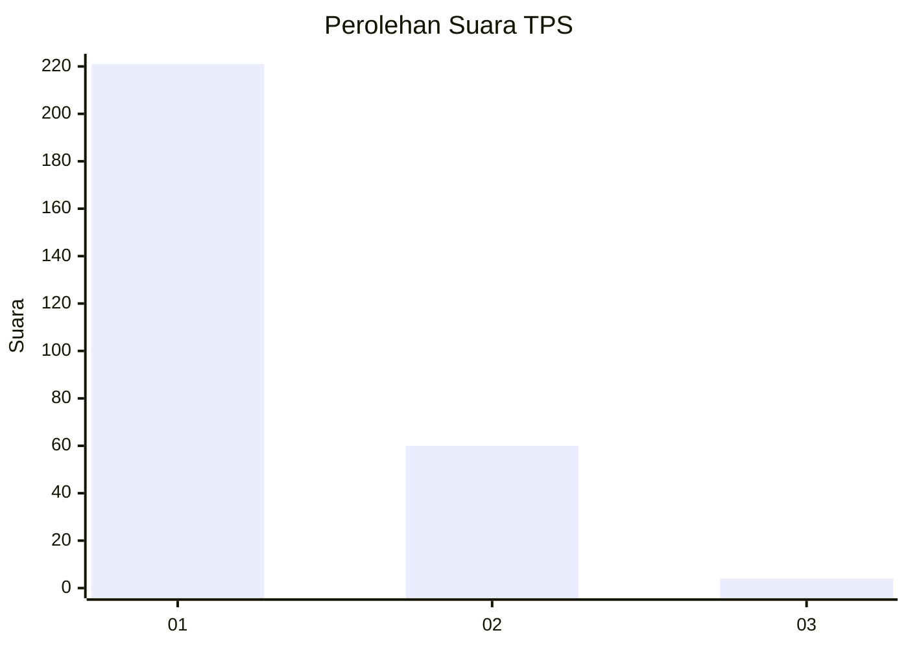
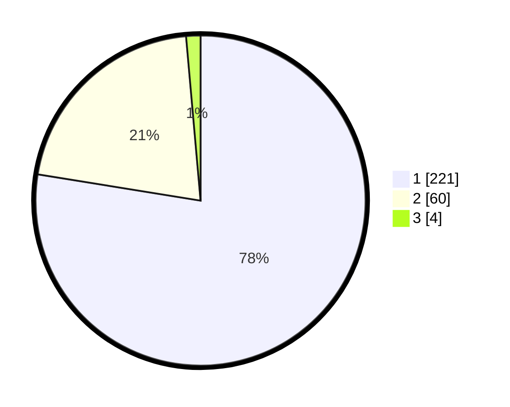

# Hasil

## Grafik

## Tabel

| No. | Nama Paslon    | Suara | Suara (raw) | Persentase |
|:--- |:-------------- | -----:| -----------:| ----------:|
| 1   | ANIES MUHAIMIN | 221   | [221][p-1]  | 77,54      |
| 2   | PRABOWO GIBRAN | 60    | [60][p-2]   | 21,05      |
| 3   | GANJAR MAHFUD  | 4     | [4][p-3]    | 1,40       |

[p-1]: https://github.com/gigit-pemilu/pemilu-2024-35-jawa-timur/blob/main/pilpres/hitung-suara/sub/35-jawa-timur/sub/28-pamekasan/sub/11-batumarmar/sub/2006-ponjanan-timur/sub/014-tps/sub/paslon-1.txt
[p-2]: https://github.com/gigit-pemilu/pemilu-2024-35-jawa-timur/blob/main/pilpres/hitung-suara/sub/35-jawa-timur/sub/28-pamekasan/sub/11-batumarmar/sub/2006-ponjanan-timur/sub/014-tps/sub/paslon-2.txt
[p-3]: https://github.com/gigit-pemilu/pemilu-2024-35-jawa-timur/blob/main/pilpres/hitung-suara/sub/35-jawa-timur/sub/28-pamekasan/sub/11-batumarmar/sub/2006-ponjanan-timur/sub/014-tps/sub/paslon-3.txt

## Foto C Plano

https://sirekap-obj-formc.kpu.go.id/27e8/pemilu/ppwp/35/28/11/20/06/3528112006014-20240214-232508--583749bd-10b8-4c55-88bd-624c9221b052.jpg

https://sirekap-obj-formc.kpu.go.id/27e8/pemilu/ppwp/35/28/11/20/06/3528112006014-20240214-232620--1918fdf0-8d29-4537-b26e-e9949714f911.jpg

https://sirekap-obj-formc.kpu.go.id/27e8/pemilu/ppwp/35/28/11/20/06/3528112006014-20240214-232854--8cfc0b7d-1c70-4aa0-81a9-4c2081a1a8d5.jpg

## Metadata

| Key        | Value               |
| ---------- | ------------------- |
| Time Stamp | 2024-02-17 17:00:04 |

