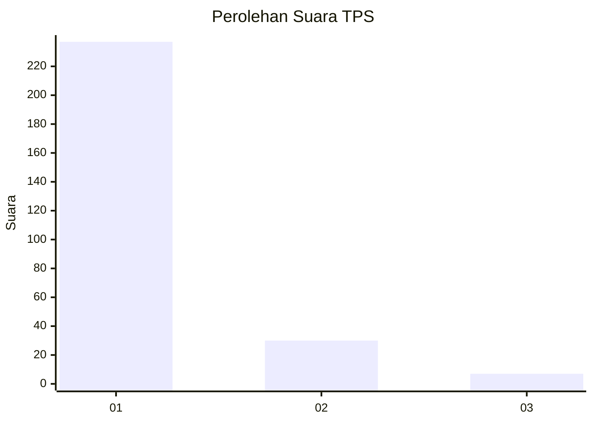
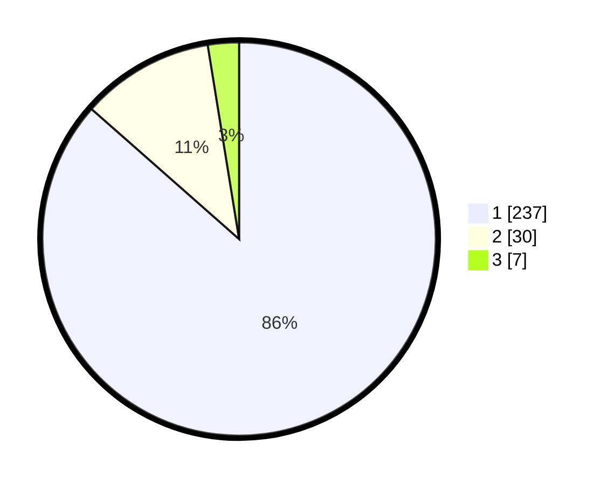

# Hasil

## Grafik

## Tabel

| No. | Nama Paslon    | Suara | Suara (raw) | Persentase |
|:--- |:-------------- | -----:| -----------:| ----------:|
| 1   | ANIES MUHAIMIN | 237   | [237][p-1]  | 86,50      |
| 2   | PRABOWO GIBRAN | 30    | [30][p-2]   | 10,95      |
| 3   | GANJAR MAHFUD  | 7     | [7][p-3]    | 2,55       |

[p-1]: https://github.com/gigit-pemilu/pemilu-2024/blob/main/pilpres/hitung-suara/sub/35-jawa-timur/sub/28-pamekasan/sub/11-batumarmar/sub/2006-ponjanan-timur/sub/016-tps/sub/paslon-1.txt
[p-2]: https://github.com/gigit-pemilu/pemilu-2024/blob/main/pilpres/hitung-suara/sub/35-jawa-timur/sub/28-pamekasan/sub/11-batumarmar/sub/2006-ponjanan-timur/sub/016-tps/sub/paslon-2.txt
[p-3]: https://github.com/gigit-pemilu/pemilu-2024/blob/main/pilpres/hitung-suara/sub/35-jawa-timur/sub/28-pamekasan/sub/11-batumarmar/sub/2006-ponjanan-timur/sub/016-tps/sub/paslon-3.txt

## Foto C Plano

https://sirekap-obj-formc.kpu.go.id/478e/pemilu/ppwp/35/28/11/20/06/3528112006016-20240214-213206--145fbbf3-237d-45d7-8d50-1f99d1eb9ee9.jpg

https://sirekap-obj-formc.kpu.go.id/478e/pemilu/ppwp/35/28/11/20/06/3528112006016-20240214-233803--b53fab39-c36d-49db-a526-5b952d101085.jpg

https://sirekap-obj-formc.kpu.go.id/478e/pemilu/ppwp/35/28/11/20/06/3528112006016-20240214-233931--f30b6622-92d8-4849-b2a3-65c53e433a62.jpg

## Metadata

| Key        | Value               |
| ---------- | ------------------- |
| Time Stamp | 2024-02-16 12:51:22 |

