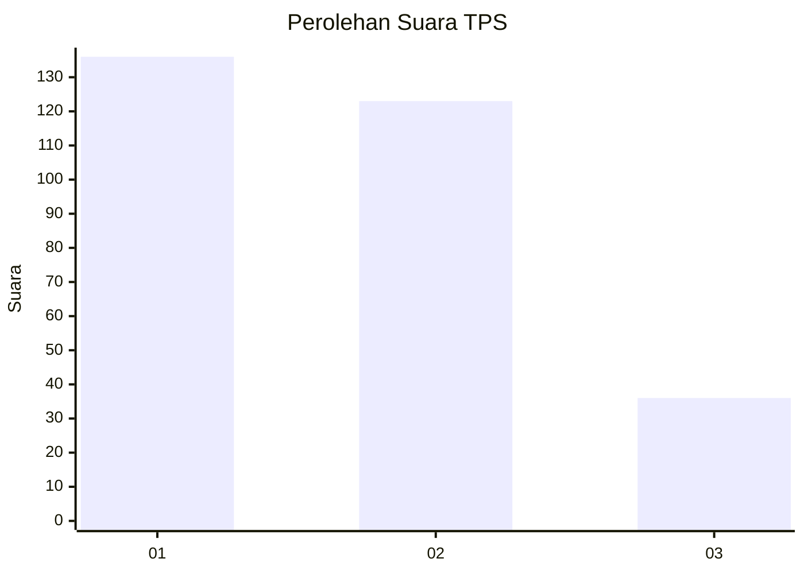
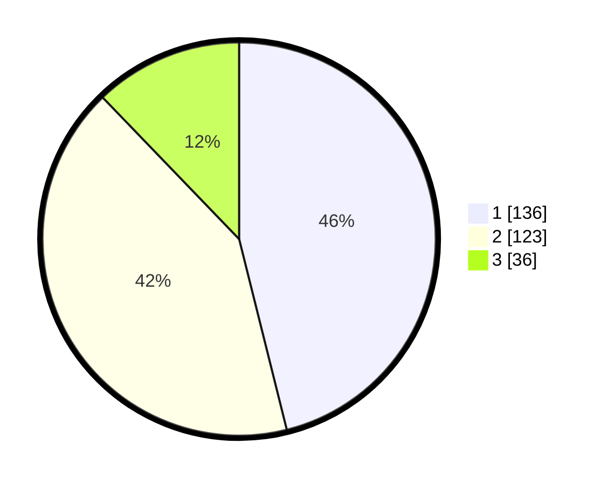

# Hasil

## Grafik

## Tabel

| No. | Nama Paslon    | Suara | Suara (raw) | Persentase |
|:--- |:-------------- | -----:| -----------:| ----------:|
| 1   | ANIES MUHAIMIN | 136   | [136][p-1]  | 46,10      |
| 2   | PRABOWO GIBRAN | 123   | [123][p-2]  | 41,69      |
| 3   | GANJAR MAHFUD  | 36    | [36][p-3]   | 12,20      |

[p-1]: https://github.com/gigit-pemilu/pemilu-2024-35-jawa-timur/blob/main/pilpres/hitung-suara/sub/35-jawa-timur/sub/28-pamekasan/sub/11-batumarmar/sub/2007-kapong/sub/001-tps/sub/paslon-1.txt
[p-2]: https://github.com/gigit-pemilu/pemilu-2024-35-jawa-timur/blob/main/pilpres/hitung-suara/sub/35-jawa-timur/sub/28-pamekasan/sub/11-batumarmar/sub/2007-kapong/sub/001-tps/sub/paslon-2.txt
[p-3]: https://github.com/gigit-pemilu/pemilu-2024-35-jawa-timur/blob/main/pilpres/hitung-suara/sub/35-jawa-timur/sub/28-pamekasan/sub/11-batumarmar/sub/2007-kapong/sub/001-tps/sub/paslon-3.txt

## Foto C Plano

https://sirekap-obj-formc.kpu.go.id/8cd2/pemilu/ppwp/35/28/11/20/07/3528112007001-20240214-212655--3f15063a-8925-4b2f-88a7-a97c851dd523.jpg

https://sirekap-obj-formc.kpu.go.id/8cd2/pemilu/ppwp/35/28/11/20/07/3528112007001-20240214-212346--cc7d048b-6708-4e16-b584-bf785eae5144.jpg

https://sirekap-obj-formc.kpu.go.id/8cd2/pemilu/ppwp/35/28/11/20/07/3528112007001-20240215-021807--f4647b06-7386-4611-a882-857874bf9c37.jpg

## Metadata

| Key        | Value               |
| ---------- | ------------------- |
| Time Stamp | 2024-02-17 17:00:04 |

